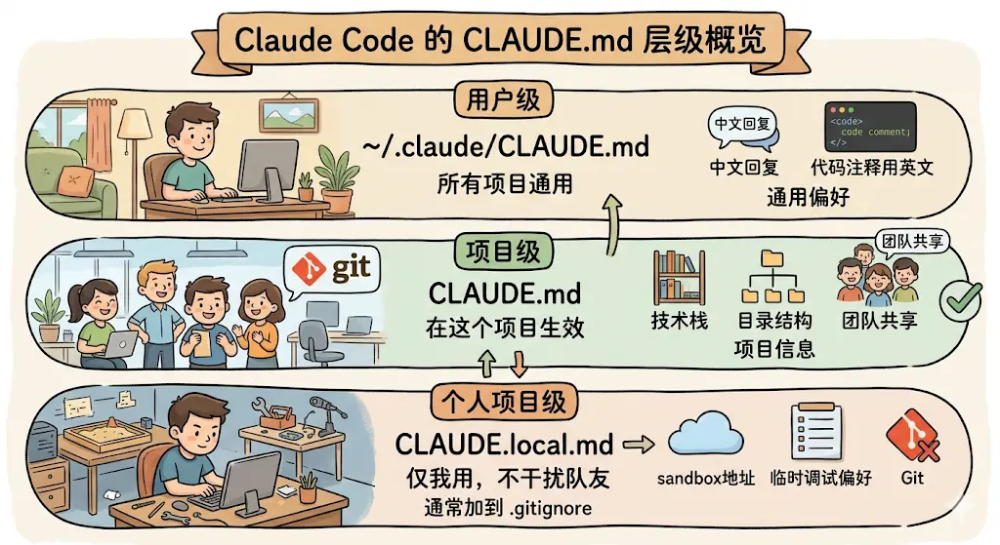
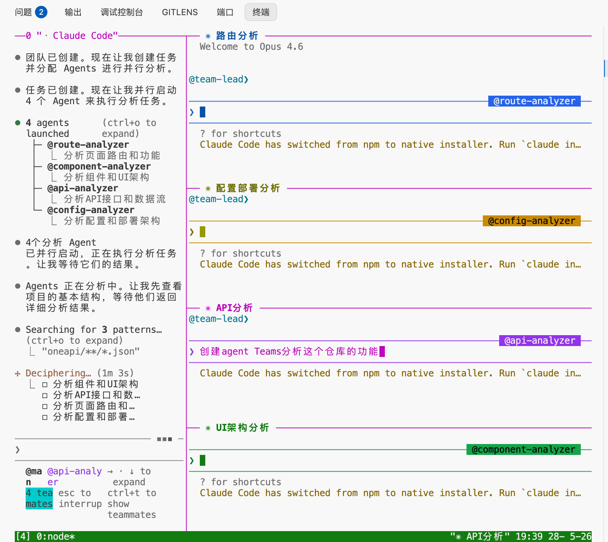
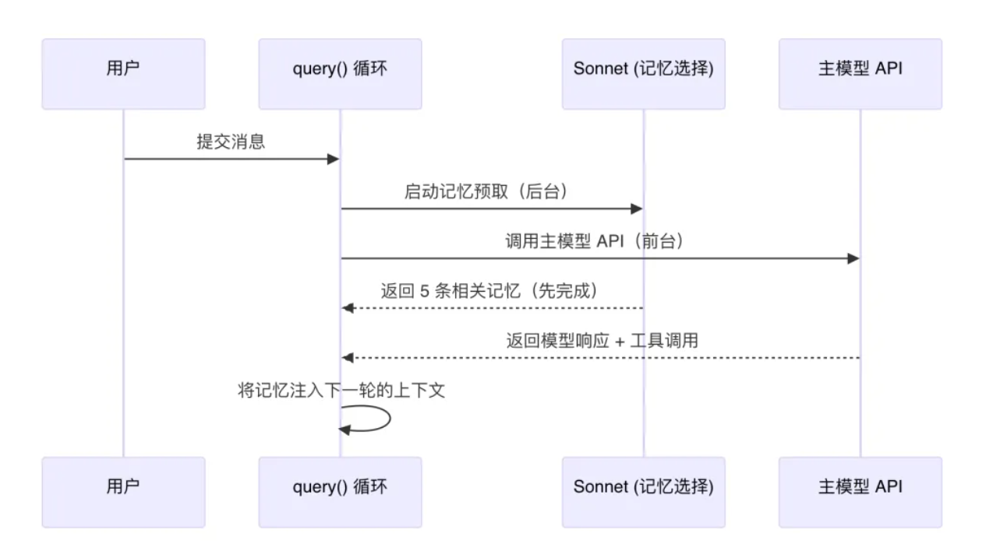

## 工作模式
cc有三种工作模式，通过shift+tab键切换
## ultrathink
- 在提示词中加入urltrathink，临时开启
- 使用/effort指令调节等级
## 上下文满了如何处理
1. compact指令压缩会话：适用于后续任务与之前会话有关联的场景
2. clear指令清空会话：适用于后续新的任务
## 子agent
- 想要让cluade在某个领域做得更好，使用skills,它会给cluade装上一个专业技能包
- 想让claude用独立视角去完成一个任务（比如审查代码，编写测试用例，查文档）使用子代理

## 代码回滚
Claude 一旦开始跑偏，立刻 Esc+Esc 回滚，别让它一路错下去。早回滚，少返工。如果是大改动，改之前先 git commit 一份「存档」
## skills
两种类型的skill:
1. 知识型：告诉claude这个项目中的事情怎么做？(API规范，项目约定，编码规范等)
2. 工作流型：告诉claude遇到这种任务按照什么步骤执行（代码审核流程，修复bug流程等）
## Hooks vs CLAUDE.md
CLAUDE.md是建议，Hooks是强制执行，因为经过上下文压缩之后，CLUADE.md偶尔会被claude忘记，而hooks是clade code在平台层面的机制，在特定生命周期节点触发shell脚本，claude无法跳过忽略。

## Agent Teams
*注意split panes通过tmux的模式只能在mac，linux上进行，windows不支持...*

- 编辑~/.cluade/settings.json文件：
```json
//开启agent teams
"CLAUDE CODE EXPERIMENTAL AGENT TEAMS":"1"
//设置split panes，分屏模式
"teammateMode":"tmux"
```
- 安装tmux：`brew install tmux`
- 终端输入tmux，进入后输入claude

分屏模式示意图：


## claude code记忆系统设计哲学
1. 记住该记得，不记能推导的。把记忆控制在有价值的范围内，claude code把记忆分成了四类：
```typescript
export const MEMORY_TYPES = [
  'user',      // 用户画像：角色、偏好、知识水平
  'feedback',  // 行为反馈：该做什么、不该做什么
  'project',   // 项目动态：在做什么、截止日期、协作信息
  'reference', // 外部指针：哪里能找到什么信息
] as const
```
2. 存索引，按需加载详情。MEMORY.md只存记忆文件的索引。MEMORY.md（不超过200行，25kB） 索引始终被加载到 System Prompt 里
3. Sonnet小模型负责并行预取和选择记忆，Opus管做决策，加上陈旧度检测机制，实现零延迟，低成本，高可靠


## 上下文窗口管理
从上到下压缩价值是递增的，claude code的策略：先用代价最小的手段，实在不行再升级
1. 大结果存磁盘：如果单个工具的结果超过50KB，就把完整内容写入磁盘中，消息中只留一个2KB的预览摘要。除了单个工具的限制，还有一个消息级别的总量控制：同一个消息中所有工具结果总大小不能超过200kb，如果超过了，系统就会挑最大的那几个结果存磁盘，直到大小符合要求
2. 砍掉远古消息：对话开头的那几轮内容，比如用户最初的探索性提问、模型早期的试探性回答，cc直接砍掉了，这是代价最低的做法，不需要额外调用大模型来生成摘要
3. 裁剪老的工具输出：比如30分钟前读取的一个文件，内容可能已经被修改了。可以裁剪的工具结果都是可以重新获取的工具，比如bash命令，读文件，搜索网页等，但是子Agent的输出，	任务状态，这类工具的结果永远不会被裁剪，因为是不可重复的。具体裁剪逻辑是「保留最近 N 个，清理其余的

被裁剪的工具会做一个标记：
```javascript
export const TIME_BASED_MC_CLEARED_MESSAGE =
  '[Old tool result content cleared]'
```

这样模型看到这个标记之后知道这里原来有内容但是被清理了，这样后续如果还需要这些信息，它可以自己决定是否重新执行

4. 读时投影：在调用大模型API的时候，动态计算一个压缩视图给模型看(不会像前三层一样直接修改原消息)。它的触发有两层阈值：
	- 90%上下文窗口：主动开始分段压缩旧消息
	- 95%上下文窗口：紧急压缩更多内容
如果读时投影已经将上下文压缩到阈值以下，全局摘要就不会触发了
5. 全局摘要：前面四层不够用时触发，以200k token的模型为例子：有效窗口大约是180kb（预留20kb给输出），减去13kb缓存区，当上下文达到167Kb token时触发

	1. 生成摘要：把整段对话总结成一段结构化摘要：claude code使用了一个精心设计的prompt要求模型从多个维度总结：用户主要请求和意图，关键技术概要，涉及的文件和代码片段，遇到的错误和修复方案、问题解决过程、用户的所有消息、待完成的任务、当前工作状态、建议的下一步
	2. 替换旧消息：。把压缩边界之前的所有消息删掉，替换为刚才生成的摘要。同时插入一条边界标记消息，记录压缩前的 Token 数，方便后续追踪。
	3. 压缩后恢复，这是整个流程中最关键的一步（为什么要恢复？因为压缩之后大模型失忆了，它不记得刚刚读取过的文件内容了）。系统会从文件状态缓存中找出最近访问的文件，按照最后访问的时候排序挑出最近五个、总计不超过50K token的文件内容重新注入，同时恢复活跃的Skill(不超过25k token),如果有进行中的plan也会恢复plan文件

	这里还有一个兜底机制，如果全局摘要连续三次失败之后，系统就会放弃，不会无限重试（熔断器模式）