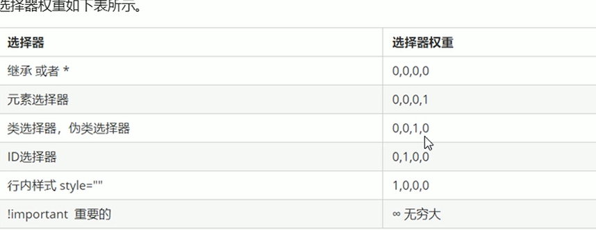
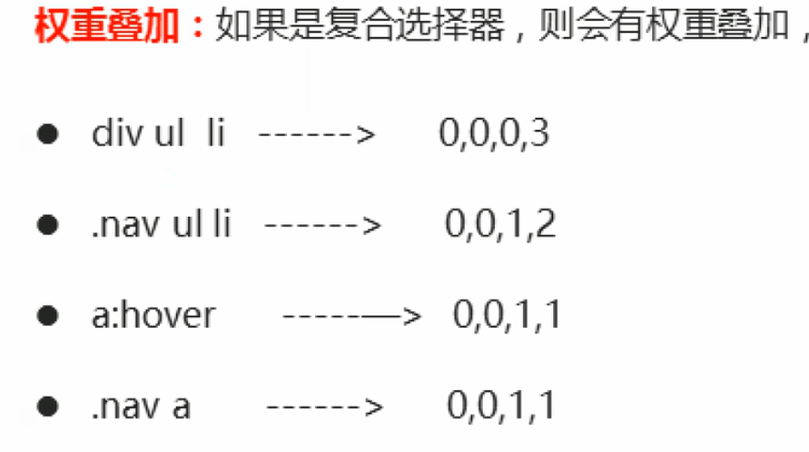

## css三大特性
- 层叠性
- 继承性
- 优先级

### 层叠性
多个CSS规则可以作用于同一个元素，当规则冲突时，按照选择器优先级和源代码顺序进行"层叠"合并，最终决定应用哪些样式。层叠性就是主要解决样式冲突

### 继承性
子承父业，(text-,font-,line-这些开头的样式可以继承，以及color属性，很多其他属性还是不能够继承的)例如
```html
.demo{
    color:red;
    font-size:1.2em;
}
<div class="demo">
<p>sb</p>
</div>
<!--p标签就会继承div的样式-->
```
### 优先级

#### 权重的叠加
权重的叠加没有进位的问题
