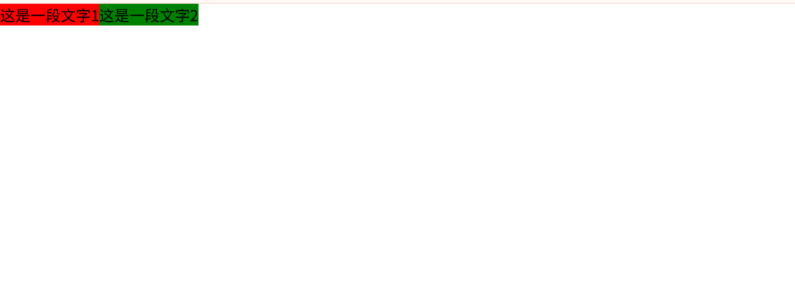
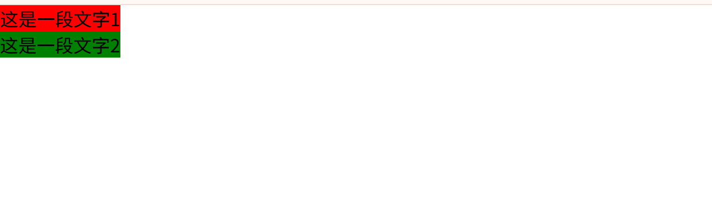
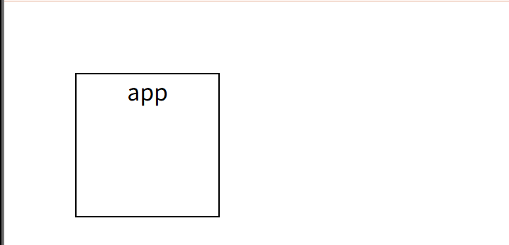

## css文档流
css中有三种基本的定位机制：普通流，浮动流，定位流

文档流：可以理解为元素的一种状态，处于这种状态下的元素具有一些特性。说白了，标准文档流就是一个“默认”状态，即元素排版布局过程中，元素会自动从左往右，从上往下的流式排列。并最终窗体自上而下分成一行行，并在每行中从左至右的顺序排放元素。

### 浮动

```html
<style>
		* {
			margin: 0px;
			padding: 0px;
		}

		.float1 {
			float: left;
			background-color: red;
		}

		.float2 {
			float: left;
			background-color: green;
		}
	</style>
		<div class="float1">
		这是一段文字1
	</div>
	<div class="float2">
		这是一段文字2
	</div>
```
浮动元素脱离文档流之后默认会贴靠，如何让不同的浮动元素不贴靠：清除浮动实现，如下是主要方式：

1. 给需要清除浮动的元素添加clear属性
```css
	.float2 {
		float: left;
		background-color: green;
		/* 不允许左边出现浮动元素 */
		clear: left;
	}
```
2. 隔墙法：在两个浮动元素之间添加一个clear:both(不允许元素左右存在浮动元素)的元素
```html
	<div class="float1">
		这是一段文字1
	</div>
	<div style="clear:both;"></div>
	<div class="float2">
		这是一段文字2
	</div>
```
3. 给浮动元素的父元素添加高度（注意：父元素的高度要大于浮动元素的高度）
4. 给浮动元素的父元素设置overflow:hidden
```html
<style>
		.app1 {
			overflow: hidden;
		}

		.app2 {
			overflow: hidden;
		}

		.float1 {
			float: left;
			background-color: red;
		}

		.float2 {
			float: left;
			background-color: green;
		}
	</style>

	<div class="app1">
		<div class="float1">
			这是一段文字1
		</div>
	</div>
	<div class="app2">
		<div class="float2">
			这是一段文字2
		</div>
	</div>
```
4. 最流行的方式：通过给浮动元素添加伪元素，以及设置伪元素的一系列属性
```html
	<style>
		* {
			margin: 0px;
			padding: 0px;
		}

		.float1 {
			float: left;
			background-color: red;
		}

		.app1::after {
			content: "";
			display: block;
			clear: both;
		}

		.float2 {
			float: left;
			background-color: green;
		}
	</style>
		<div class="app1">
		<div class="float1">这是一段文字1</div>
	</div>
	<div class="float2">这是一段文字2</div>
```
### 相对定位
#### 静态定位
position:static 静态定位就是我们的标准流，静态定位是HTML元素的默认值，静态定位的元素不会受到top、bottom、left、right的影响
#### relative相对定位
所谓相对定位，就是相对自己原来位置进行定位，相对定位的最大特定就是不脱离标准流，相对于自己原来的位置上进行一定的偏移

```html
	<style>
		* {
			margin: 0px;
			padding: 0px;
		}

		.app {
			width: 100px;
			height: 100px;
			border: 1px solid #000;
			/* 相对自己原来的位置向左偏移了50px */
			left: 50px;
			top: 50px;
			position: relative;
			text-align: center;
		}
	</style>
	<body>
	<div class="app">
		app
	</div>
</body>
```
#### absolute绝对定位
绝对定位就是相对离自己最近的，并且定了位的元素进行偏移，使用了绝对定位后的盒子，会脱离标准流，display会变成block
- 绝对定位的参考点永远是离自己最近的，并且定了位的父级元素的左上角（子绝父相）

#### fixed固定定位
固定定位可以看作是一种特殊的绝对定位，所以也会脱离标准流，固定定位的特定是相对于浏览器窗口进行定位的，固定定位在PC端经常用于显示在页面中位置固定不变的页面header,以及移动端中位置固定不变的header和footer

#### sticky粘性定位
css3中新增的一种定位方式:sticky
- 父元素不能够设置为overflow:hidden或者overflow:auto的属性(这里的父元素可以是嵌套的)
- 如果父元素没有设置定位（position:relative|absolute|fixed），则相对于viewport进行定位，否则以定位的父元素为参考点
- 设置阀值：必须指定top、bottom、left以及right其中之一，才能使粘性定位生效，否则其行为与相对定位相同
- 父元素的高度不能够低于sticky元素的高度

### 脱离文档流
Q: 脱离文档流就不占据空间了吗？

A: 可以这么说。更准确地一点说，是一个元素脱离文档流（out of normal flow）之后，其他的元素在定位的时候会当做没看见它，两者位置重叠都是可以的。

元素脱离文档流后的变化：
1. 块元素
- 若一个块元素脱离文档流，它下面的，处于文档流中的兄弟元素会上移；
- 多个块元素可以在同一行（比如都设置浮动）；
- 块元素被内容撑开，也就是说，width的默认值不是父元素的width。

2. 内联元素
可以设置width和height（变成了块元素）。

总结：脱离文档流，也就是将元素从普通的布局排版中拿走，不占据位置（悬空了），其他盒子在定位的时候，会当做脱离文档流的元素不存在而进行定位。需要注意的是，使用float脱离文档流时，其他盒子会无视这个元素，但其他盒子内的文本依然会为这个元素让出位置，环绕在周围。而对于使用position脱离文档流的元素，其他盒子与其他盒子内的文本都会无视它