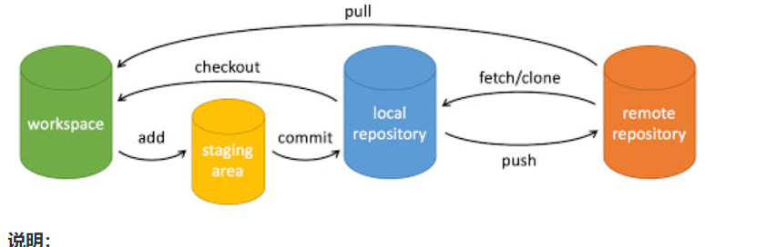

## git流程图

git pull = git fetch + git merge(从安全性角度出发，应该选择后者)，比如你只想要查看一下远程分支的更新，而不是立即合并可以使用后者
## 查看用户信息
- git config user.name 查看用户名
- git config user.email  查看邮箱

## git仓库相关
- git remote remove origin(移除仓库)
- git remote add origin 仓库地址(绑定远程仓库,注意可以绑定多个远程仓库)

## 日志相关
- git status:用于显示工作目录和暂存区的状态。具体来说，它会列出在工作目录中已跟踪文件的状态（例如，哪些文件已被修改、哪些文件是新添加的、哪些文件已被删除），以及暂存区中已暂存（staged）的更改。
- git log可以查看当前分支的提交记录以及**commit id**,这个commit id很重要，可以用来回滚
- git diff命令：查看分支之间的差异
    - git diff A...B
    - git diff A..B

## 分支相关
- git branch branchName(在本地创建一个命名为branchName的分支）
- git branch(查看当前自己所在的分支本地分支)
- git branch -a(查看服务器的所有分支以及自己所在的分支，远程分支颜色为红色)
- git branch -D branchName删除本地分支
- git push origin -d branchName删除远程分支
- git branch -M main//作用就是将当前默认的分支重命名为main
- git checkout -b 分支名称//基于当前的本地分支，新建一个本地分支
- git checkout -b 分支1 分支2//基于分支2，创建本地分支1
- git checkout -track origin/branchName(切换为远程服务器上的命名为branchName的远程分支)
- git checkout 分支名称//切换分支
- git pull origin master先将远程仓库中的信息同步到本地仓库中
- git push origin master 将本地版本库推送到远程服务器，
origin是远程主机，master表示是远程服务器上的master分支和本地分支重名的简写，分支名是可以修改的

## git Stash命令
我们可能需要先处理一些紧急的事情，但当前的工作尚未完成，如果我们直接提交代码会将未完成的代码也一并提交，这时就可以使用 git stash 命令保存当前的修改而不提交，待紧急事情处理完毕后再使用 git stash pop 恢复之前的修改继续开发。

- git stash list:查看stash栈
- git stash pop (数字可选)
- git stash save "注释":压栈 
- git stash:压栈
## 回滚代码相关
- 参考*不小心commit或者不小心push了怎么办*
- git reset HEAD 文件目录：将暂存区中的文件回退到更改状态

## 合并分支
git merge origin/远程分支名称
**多人合并开发时**
先切换到主分支master上，为了保证不会错过别人推送到master分支上的改动，要先pull一下master分支，然后将自己的分支dev-xx合并到master分支上。
## 不小心commit或者不小心push了怎么办
1. git reset --soft HEAD~1(这个数字1可以替换成其他数字，2,3,4...)(除了加上数字还可以加上commit id)
2 git reset HEAD~1(这个数字1可以替换成其他数字，2,3,4...)(除了加上数字还可以加上commit id)
区别：加了--soft回到到保留更改且留在暂存区，而没有加的其实是--mixed的简写形式，它会回退到工作区
**还有加上--hard的用法：谨慎使用，比如你回退到上上个版本的commit id，那你上一个版本的代码丢失**

## 如果遇到git命令进程崩溃怎么办
删除.git目录下的index.lock文件
## 如何使用git命令创建一个远程
创建一个本地分支后，提交完代码之后，执行git push origin 本地分支名称，就可以创建一个和当前本地分支名称相同的远程分支了。
## git hub搜索技巧
```
python in:description 豆瓣  created:>2016-04-29 stars:>10
第一个python表示要搜索的名称
```
## tips
- 必须使用git init命令创建仓库，执行git add . 和git commit（提交成功后）,再使用git branch命令，才显示出本地分支：因为git的分支必须指向一个commit，没有任何commit就没有任何分支