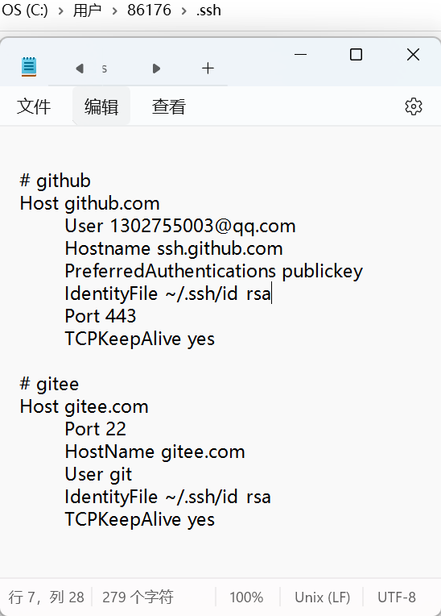

## 查看当前git协议模式
- git remote -v
> 如果是https则打印https地址，如果是ssh，则打印ssh地址
- 实现ssh和https的切换：
1. 切换到ssh`git remote set-url origin git@github.com:JustWantToHappy/studyJS.git`
2. 切换到https:`git remote set-url origin https://github.com/JustWantToHappy/studyJS.git`
## git clone、git push出现超时问题
配置代理，找到.ssh文件下的config并做配置

- 后续克隆新的项目时使用git clone ssh地址
- 如果之前的项目是使用https克隆下来的，后续可以使用如下命令切换到ssh:git remote set-url origin git@github.com:facebook/react.git,之后使用git clone、git push命令就都是正常的了
## https方式访问github被墙了
设置代理：Git 的所有 HTTPS 请求走 Clash 的 HTTP 代理端口
1. git config --global http.proxy http://127.0.0.1:7890
2. git config --global https.proxy http://127.0.0.1:7890
取消代理：
1. git config --global --unset http.proxy
2. git config --global --unset https.proxy

## 检测ssh是否连接成功
- ssh -T git@github.com
ssh模式下，排查问题如果无法解决，可重新生成公钥密钥，去github配置好公钥重新来一次