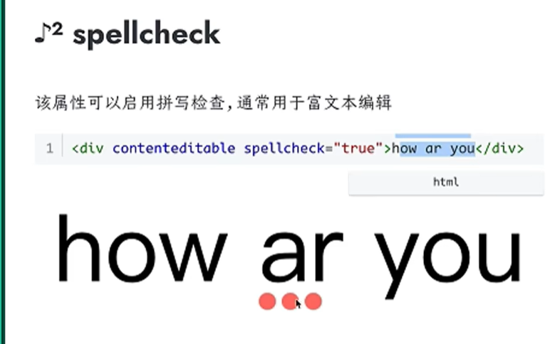

## draggable
- true:表示元素可以被拖动
- false:表示元素不可以被拖动<br/>
*如果该属性没有设值，则默认值为auto,表示使用浏览器定义的默认行为*<br>
*如果设置为true,则可以使用drag对应的一系列事件* 

## inputmode
在移动端，inputmode影响到的是弹出的键盘布局
```html
<input type="text" inputmode="url">
<input type="text" inputmode="email">
<input type="text" inputmode="search">
<input type="text" inputmode="tel">
<input type="text" inputmode="tel">
```

## poster
用于设置视频的预览图(视频播放器预览的图片)，如果没有设置此属性，那么默认会使用视频的第一帧来作为视频的封面。
```html
<video src="sb.mp4" poster="cover.png"/>
```

## mutiple
通常用于文件选择和下拉列表
当用于文件选择的时候，可选择多个文件
当用于下拉框的时候，可选中多个选项。
## accessKey
可以为元素设置快捷键，当按下快捷键后，可以聚焦元素
```html
<!--按下键盘Alt +b的时候就会聚焦元素-->
<input type="text" accessKey="b">
```
## tabindex
用户可以使用tab键切换聚焦的元素，默认情况下，切换的顺序和元素顺序一直，如果希望不一直，就可以通过tabindex属性进行手动干预。
```html
<input type="text" tabindex="3">
<input type="text" tabindex="2">
<input type="text" tabindex="1">
```

## download
通常用于超链接中，使用了该属性之后，打开链接会触发浏览器的下载行为，而不是显示链接的内容
```html
<a href="dog.jpg" download>下载图片</a>
<!--哈可以更改下载时候默认的文件名-->
<a href="dog.jpg" download="puppy.jpg">下载图片</a>
```

## dir
该属性可以用于设置内部文字的排版方向
```html
<p dir="rtl">从右往左</p>
```



## tranlate
用translate可以指定某个元素的内容是否应该触翻译
```html
<!--开启翻译-->
<div translate="yes">
how old are you?
</div>
<!--关闭翻译-->
<div translate="no">
    how old are you?
</div>
```