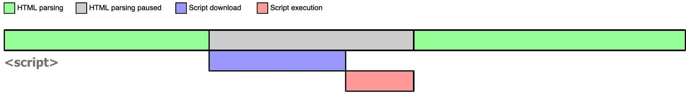
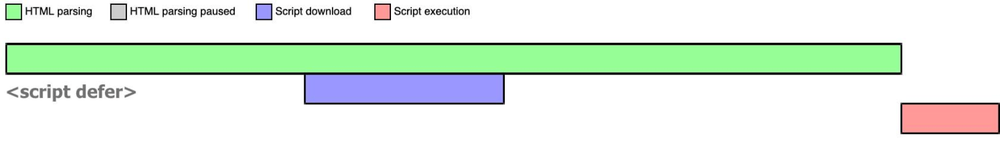
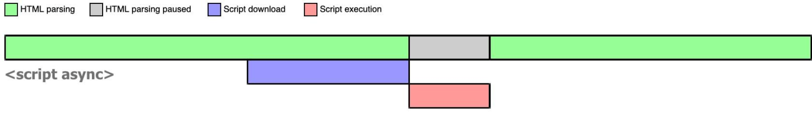

## 普通的script标签:
浏览器在解析 HTML 的时候，如果遇到一个没有任何属性的 script 标签，就会暂停解析，先发送网络请求获取该 JS 脚本的代码内容，然后让 JS 引擎执行该代码，当代码执行完毕后恢复解析。


## defer
- 标记位defer的script标签会在DOMContentLoaded事件执行之前执行。
- 当浏览器遇到带有 defer 属性的 script 时，获取该脚本的网络请求也是异步的，不会阻塞浏览器解析 HTML，一旦网络请求回来之后，如果此时 HTML 还没有解析完，浏览器不会暂停解析并执行 JS 代码，而是等待 HTML 解析完毕再执行 JS 代码，图示如下

- 如果存在多个 defer script 标签，浏览器（IE9及以下除外）会保证它们按照在 HTML 中出现的顺序执行，不会破坏 JS 脚本之间的依赖关系。

## async
当浏览器遇到带有 async 属性的 script 时，请求该脚本的网络请求是异步的，开始不会阻塞浏览器解析 HTML，一旦网络请求回来之后，如果此时 HTML 还没有解析完，浏览器会暂停解析，先让 JS 引擎执行代码，执行完毕后再进行解析

## preload

```html
<!--预加载css用法-->
<link rel="preload" href="./main.css" as="style" />
<link rel="stylesheet" href="./main.css" />
```

```html
<!--预加载js用法-->
<head>
  <link rel="preload" href="./main.js" as="script" />
</head>
<script>
  const mainJs = document.createElement("script");

  function loadJs(url) {
    document.head.appendChild(url);
  }
  loadJs("./main.js");
</script>
```

## prefetch

> prelaod和prefetch都用于link标签的href属性，它们的下载并不会影响到DOM树的解析，同时不同于defer，下载之后并不会去执行，(比如vue打包之后将打包后的文件使用link标签引入，这些资源在首页可能用不到，但是在其他页面就可能会使用到)preload和prefetch的区别主要在于preload的优先级是高于prefetch，可以使用preload和prefetch去下载一些图片，js，css都行。
