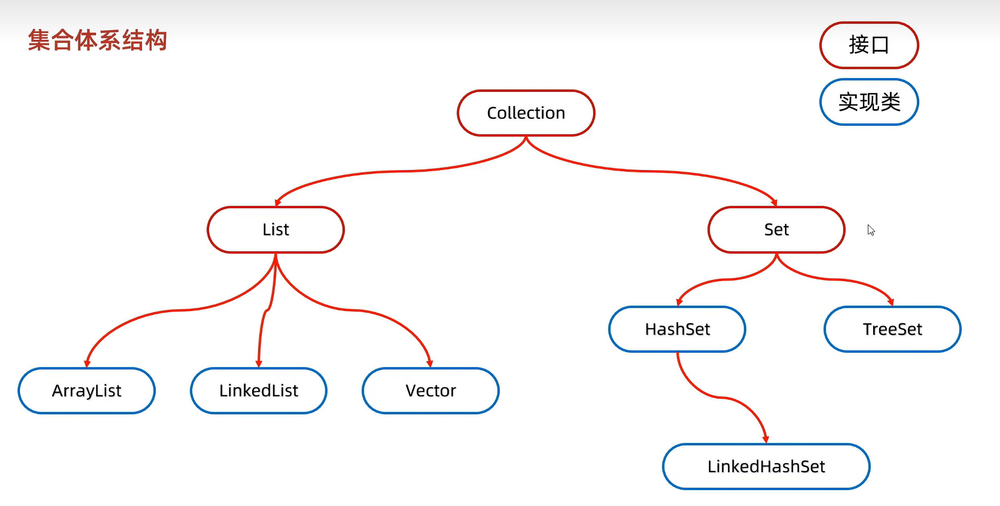
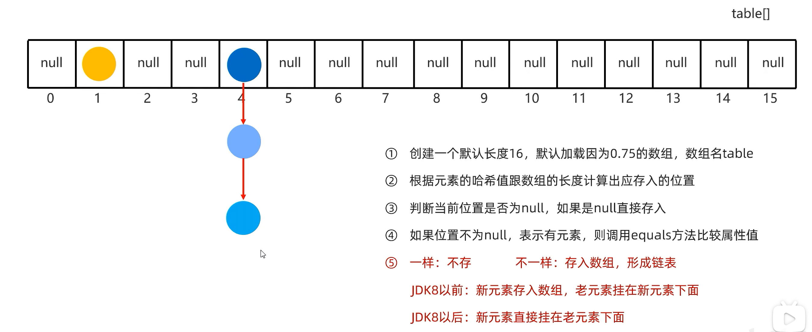

## API

目前JDK中提供的各种功能的java类

## String类

- java.lang包中的String类，无需导包
- String对象在创建之后无法变更

```java
        char chrs[]={'a','b','c','d'};
        System.out.println(new String(chrs));//abcd
        byte chrs1[]={97,98,99,100};
        System.out.println(new String(chrs));//将字节转换为ascii码：abcd
```

### 字符串的一些常用方法

```java
        String a="abc";//记录的是串池中对象的地址
        String b=new String("abc");//记录的是堆中对象的地址
        System.out.println(a==b);//false
```

- 如果想要比较内容如何处理？

```java
System.out.println(a.equals(b));//true
```

- 判断字符是否是大写字母or小写字母的技巧：

```java
String a="aAz";
char c=a.charAt(index);
//char类型的变量在参与计算的时候自动类型提升为int 查询ascii码
if(c>='a'&&c<='z'){
    System.out.println("是小写字母");
}
```

- replace方法：用于替换敏感信息为*非常有用

```java
String str = "hello world";
String newStr = str.replace('l', 'x');
System.out.println(newStr); // hexxo worxd

```

### 字符串拼接的底层原理

1. 无变量参与的拼接

```java
String str="a"+"b"+"c";//等同于String str="abc"，编译层会优化
```

2. 有变量参与的拼接
   jdk8之前，底层使用的是StringBuilder

```java
String s1="a";
String s2=s1+"b";//等同于new StringBuilder().append(s1).append("b").toString();这里至少创建了两个对象，一个StringBuilder以及toString()方法也会创建一个对象
String s3=s2+"c";//与上面保持一致
```

jdk8的拼接底层

```java
String s1="a";
String s2=s1+"b";//创建一个字符串数组，预估长度为2，将字符串放入数组后拼接成字符串对象
String s3=s2+"c";//与上面保持一致
```

最终结论：不要使用+拼接字符串变量，浪费内存空间

### StringBuilder

StringBuilder可以看做一个容器，创建之后里面的内容是可以发生变化的

```java
//为什么使用StringBuilder
String s1=a+b+d;//这里每次都会创建新的字符串对象
//创建一个空白可变字符串对象，不含有任何内容
StringBuilder sb=new StringBuilder();
//根据字符串内容，来创建可变对象字符串
StringBuilder sb1=new StringBuilder("abc");
//打印结果是字符串,而不是对象地址，因为toString方法被重写了
System.out.println(sb1);
//添加数据，可以添加任意类型
sb1.append("123");
sb1.append(true);
sb1.append(2.3);
//反转
sb1.reverse();
System.out.println(sb1);//输出容器中反转后的内容
```

#### StringBuilder底层原理

初始化一个默认容量16的数组，比如容量不够，比如我们放入了a-z26个英文字母之后，StringBuilder就会扩容：老容量*2+2=34，如果我们放入的字符串长度为36，超过了34，那就默认以最终的字符串长度为准，也就是扩容到36

### StringJoiner

是一个容器，内容可发生变化，JDK8出现

```java
			int arr[]=new int[]{1,2,3};
			//将数组拼接成字符串，第一个参数是分隔符号，第二个字符串参数是拼接字符串的开始，第三个字符串参数是拼接字符串的结束
			StringJoiner sj=new StringJoiner(",","[","]");
			for(int i=0;i<arr.length;i++){
					sj.add(arr[i]+"");
			}
			System.out.println(sj.toString());//[1,2,3]
```
## 泛型
jdk5引入的新特性，可以在编译阶段约束操作的数据类型，并进行检查
- 泛型只支持引用数据类型
- 统一了数据类型，把运行期间的问题提前到了编译阶段，避免了强制类型转换可能出现的异常，因为在编译阶段类型就能确认下来
- 如果不写泛型，默认就是Object类型
- 指定泛型的具体类型之后，传递数据的时候，可以传入该类类型或者其子类类型(不建议传入子类类型)

```java
//泛型类
class Demo<T>{
    public T name;
    
    public T getName(){
        return this.name;
    }
    
    public void setName(T name){
        this.name = name;
    }
}
//泛型方法
class Demo{
    public <T> void sayHello(T a){
        T t=a;
    }
}
//可变参数
class Demo{
    public Demo(){
        print("1","2","3");
    }
    //支持传入多个参数，e是个数组
    public static<T> void print(T ...e){
        for(T t:e){
            System.out.print(t);
        }
    }
}
//泛型接口
interface Inter<T>{}
```
### 泛型的通配符
1. ?可以表示不确定的类型
2. 可以进行类型的限定：? extends E：表示可以传递E或者E的子类型，? super E：表示可以传递E或者E的父类类型
3. 使用场景：如果某个类型不确定同时只能传递某个继承体系的，就可以使用泛型的通配符了
```java
public class App {
    public static void main(String[] args)  {
        ArrayList<G> list1=new  ArrayList<>();
        ArrayList<F> list2=new  ArrayList<>();
        add(list1);
        add(list2);
    }
    public static void add(ArrayList<? extends G> list){}
    //也可以使用下面这种方式进行类型约束
//    public static<T extends G> void add(ArrayList<T> list) {}
}

class G{ }
class F extends G{}
```

## 集合
- 单列集合：Collection
	- List系列集合：添加的元素是有序的、可重复的、有索引的
	- Set系列集合：添加的元素是无序、不重复的、无索引的

- 双列集合：Map

### Collection
#### Collction的基本方法
Collection是单列集合的祖宗接口，它的功能是全部单列即可都可以继承使用的
- public boolean add(E e)
- public void clear()
- public boolean remove(E e)
- public boolean contains(Object obj)：判断集合是否包含当前的对象
- public boolean isEmpty()
- public int size()

```java
  Collection<String> collection=new ArrayList<String>();
	boolean b=collection.add("a");
	//往List系列集合中添加元素永远返回值为true，如果往Set系列集合中添加元素可能返回为false,因为元素不能够重复
	collection.add("b");
	System.out.println(collection);//[a,b]
	System.out.println(b);//true
	//底层是通过Object.equals方法判断对象是否相同的，如果集合存储的是自定义对象，需要重写equals方法
	//为什么String和Integer不需要重写equals方法，这是因为jdk已经重写了这两个类的equals方法，比如字符串就是比较的每个字符内容是否相同
	System.out.println(collection.contains("a"));//true
```
#### Collection的遍历方式
1. 迭代器遍历：迭代器在java中的类是Iterator,迭代器是集合专用的遍历方式
```java
 Collection<String> collection=new ArrayList<String>();
	boolean b=collection.add("a");
	collection.add("b");
	Iterator<String> iterator=collection.iterator();
	//迭代器遍历完毕，是不会复位的，如果要再遍历一次集合，重新获取一个迭代器
	while(iterator.hasNext()){
			String result=iterator.next();
			System.out.println(result);
			//在迭代器遍历的时候不要使用集合的方法去对集合进行增加和删除元素
			//但是可以使用迭代器中的方法进行删除
			if(result.equals("a")){
				iterator.remove();
			}
	}
	//iterator.next();循环结束之后如果还调用next方法会抛出错误：NoSuchElementException
```
2. 增强for遍历：简化迭代器代码书写的，jdk5之后出现，底层就是iterator,所有的单列集合以及数组才能够使用增强for循环
```java
  Collection<String> collection=new ArrayList<String>();
	boolean b=collection.add("a");
	collection.add("b");
	for(String s:collection){
			System.out.println(s);
	}
	//数组也可以使用
	int arr[]={1,2,3,4,5};
	for(int num:arr){
			System.out.println(num);
	}
```
3. lambda表达式遍历
```java
 Collection<String> collection=new ArrayList<String>();
	boolean b=collection.add("a");
	collection.add("b");
	//使用匿名内部类的方式
	collection.forEach(new Consumer<String>() {
			@Override
			public void accept(String s) {
					System.out.println(s);
			}
	});
	//使用lambda表达式的方式
	collection.forEach(s->{
			System.out.println(s);
	});
```
> 总结：如果是普通遍历使用增强for循环或者lambda表达式，如果要在遍历过程中删除元素，则使用迭代器
#### List
##### ArrayList
- 自动扩容
- 只能存储引用数据类型，如果要存储基本数据类型，需要转换为包装类
底层原理：
1. 利用空参创建的集合，在底层会创建一个默认长度为10的数组
2. 添加第一个元素的时候，底层会创建一个新的长度为10的数组
3. 存满时会扩容1.5倍(创建一个新的数组，把原数组内容复制过来)，后续如果又满了，继续扩容
4. 如果一次创建多个元素，1.5倍(15)放不下,则新创建数组的长度以实际为准。比如通过一次性添加100个，则在10的基础上再加100，也就是数组长度初始化为110
```java
//集合的增删改查
	ArrayList<String> list=new ArrayList<String>();
	list.add("a");
	list.add("b");
	list.add("a");
	list.remove("a");
	System.out.println(list);//[b,a]
	list.remove(1);//删除a
	System.out.println(list);//[b]
	list.set(0,"ac");//设置索引0的元素为ac
	System.out.println(list);//[ac]
	System.out.println(list.get(0));//ac
	//遍历集合
	for(int i=0;i<list.size();i++){
			System.out.println(list.get(i));
	}
	//添加基础数据类型，使用包装类：比如int的包装类型是Integer
	ArrayList<Integer> intList=new ArrayList<>();
	intList.add(1);
```
##### LinkedList集合
底层数据结构是双链表，查询慢，首尾操作的速度还是很快的
- public void addFirst(E e)
- public void addLast(E e)
- public E getFirst()
- public E getLast()
- public E removeFirst()
- public E removeLast()

#### Set
##### Set集合的实现类
- HashSet：无序、不重复、无索引
- LinkedHashSet：有序、不重复、无索引
- TreeSet：可排序、不重复、无索引
```java
		Set<String> set=new HashSet();
		set.add("a");
		//如果是是List接口的实现类，这里add方法返回值都是true,因为List实现类是允许元素可重复的，但是Set接口实现类是不允许的
		if(!set.add("a")){
				System.out.println("添加元素失败");
		}
		System.out.println(set.size());
		System.out.println(set);//[a]
```

##### HashSet
- HashSet集合底层是通过哈希表存储数据
- JDK8之前是：数组+链表，JDK8开始：数组+链表+红黑树
- 哈希值：根据hashCode方法计算出来的int类型的整数，该方法定义在Object类中，所有的对象都可以调用，默认使用地址值进行计算
- 如果没有重写hashCode方法，不同对象计算出来的哈希值是不同的
- 如果已经重写了hashCode方法，不同对象只要属性值相同，计算出来的哈希值是一样的
- 在小部分情况下，不同属性值或者不同地址值计算出来的哈希值也可以是一样的(哈希碰撞)
> 如果集合中存储的是自定义的对象，必须要重写hashCode方法以及equals方法


注意上图中说的加载因0.75指的是如果数组里面存了到达16*0.75=12个元素的时候，数组会进行扩容为原来的两倍，JDK8之后，如果链表长度超过8且数组长度大于等于64的时候，自动转换为红黑树
```java
public class App {
    public static void main(String[] args)  {
        Student s1=new Student();
        Student s2=new Student();
				//如果这里不重写hashCode方法，得到的哈希值是不一样的，打印结果为false
        System.out.println(s1.hashCode()==s2.hashCode());//true
    }
}

class Student{
    private String name;
    private int age;

    @Override
    public int hashCode() {
        return Objects.hash(name,age);
    }
}
```
##### LinkedHashSet
- 底层数据结构依然是哈希表，只是每个元素又额外多了一个双链表的机制记录存储的顺序

## Math类

```java
   System.out.println(Math.abs(-2147483648));//-2147483648，取绝对值，但是对于int的左边界不能取，因为int类型的右边界的范围比左边界范围小1
		System.out.println(Math.abs(-2147483647));//2147483647
		System.out.println(Math.round(4.5));//四舍五入
		System.out.println(Math.pow(2,3));//result：8.0，获取a的b次幂
		System.out.println(Math.random());//[0,1)之间的随机小数
		//ceil:进一法，往数轴的正方向进一
		System.out.println(Math.ceil(-12.4));//-12.0
		//floor:与ceil相反，反向减一
		//开平方根
		Math.sqrt(4);//2.0
		//开立方根
		Math.cbrt(8);//2.0
```

## System

```java
			Scanner sc = new Scanner(System.in);
			//0：表示当前虚拟机是正常停止
			//非0：表示当前虚拟机异常停止
			System.exit(0);
			//此处代码不再执行
			sc.nextLine();
```

```java
		long l=System.currentTimeMillis();
		System.out.println(l);//是一个时间戳，表示从时间原点到当前系统时间，使用场景：获取程序前后运行的时间
		int arr1[]={1,2,3,4,5};
		int arr2[]=new int[5];
		//参数2：从数据源数组中的第几个索引开始拷贝
		//参数4：目的地数组的索引（arr2）
		//参数5:拷贝的个数
		System.arraycopy(arr1,0,arr2,1,arr1.length-1);
```

## RunTime

```java
		Runtime r=Runtime.getRuntime();//获取当前运行环境，这是个静态方法，单例模式获取到的Runtime对象，保证整个程序生命周期使用的运行环境是一致的
		System.out.println(r.availableProcessors());//获取CPU线程数
		System.out.println(r.maxMemory());//单位字节；jvm能从操作系统获取到的最大内存大小
		System.out.println(r.totalMemory());//单位字节；jvm已经从操作系统获取到的内存大小
		System.out.println(r.freeMemory());//单位字节：jvm剩余的内存大小
		r.exec("notepad");//运行cmd命令
		r.exit(0);//System.exit底层调用的就是这个方法
```

## Object

- Object是java的顶级父类，所有的类都直接或间接继承于父类
- Object中的方法是可以被子类去访问的
- Object只有无参的构造方法

当我们打印一个对象的时候，底层会调用toString方法，把对象变成字符串

```java
		Object obj=new Object();
		System.out.println(obj);//与obj.toString一样的效果
		System.out.println(obj.toString());//result:java.lang.Object@b4c966a（包名@对象地址值）
```

### equals方法

重写equals方法

```java
  class Student{
            private String name;

            public Student(String name){
                this.name=name;
            }
            @Override
            public boolean equals(Object o) {
                if (o == null || getClass() != o.getClass()) return false;
                Student student = (Student) o;
                return Objects.equals(name, student.name);
            }
        }
        Student s1=new Student("123");
        Student s2=new Student("123");
        System.out.println(s1.equals(s2));//默认调用的是Object的equals（==判断地址值）方法，如果需要自定义，可以重写
```

### clone方法

对象克隆：方法在底层会创建一个对象，并把原对象中的数据拷贝过去

1. 重写Object中的clone方法
2. 让javabean类实现Cloneable接口
3. 创建原对象并调用clone方法

```java
 //Cloneable这个接口中并没有抽象方法，表示当前接口是一个标记性接口，表示当前类实现了这个接口，可被克隆
        class Student implements Cloneable {
            private String name;

            public Student(String name){
                this.name=name;
            }

            @Override
            public String toString() {
                return this.name;
            }

            @Override
            protected Object clone() throws CloneNotSupportedException {
                return super.clone();
            }

            @Override
            public boolean equals(Object obj) {
                return this.name.equals(((Student) obj).name);
            }
        }
        Student s1=new Student("S1");
        Student s2=(Student) s1.clone();
        System.out.println(s1.equals(s2));//true
```

以上方法是浅拷贝，如果成员变量中的是引用数据类型，则克隆的对象与原对象使用的成员变量的地址值是同样的，以下是深拷贝方法：

1. 基本数据类型拷贝
2. String类型复用(串池)
3. 其他引用数据类型重新创建

```java
	public class App {
    //Cloneable这个接口中并没有抽象方法，表示当前接口是一个标记性接口，表示当前类实现了这个接口，可被克隆
    static class Student implements Cloneable {
        String name;
        int[] data = new int[]{1, 2, 3};

        // No-arg constructor required by Gson for deserialization
        public Student() {
        }

        public Student(String name) {
            this.name = name;
        }

        @Override
        public String toString() {
            return this.name + ", data=" + java.util.Arrays.toString(data);
        }

        @Override
        protected Object clone() throws CloneNotSupportedException {
            //获取原数组
            int[] newData = new int[data.length];
            for (int i = 0; i < data.length; i++) {
                newData[i] = data[i];
            }
            Student s = (Student) super.clone();
            s.data = newData;
            return s;
        }
    }

    public static void main(String[] args) throws IOException, CloneNotSupportedException {
        Student s1 = new Student("S1");
        Gson gson = new Gson();

        String json = gson.toJson(s1);
        System.out.println("JSON: " + json);

        Student s2 = gson.fromJson(json, Student.class);
        System.out.println("s1: " + s1);
        System.out.println("s2: " + s2);
    }
}
```

## BigInteger

BigInteger底层采用的是数组存储，将数字转换为二进制之后，每32个一组作为数组中的某一项

```java
			//获取指定的大整数（字符串必须是整数，否则报错）
			BigInteger bigInteger = new BigInteger("999999999999999999999999999");
			System.out.println(bigInteger);
			//获取指定进制的大整数
			BigInteger bigInteger1 = new BigInteger("100",2);
			System.out.println(bigInteger1);//100对应的2进制值转换为10进制结果为10
			//静态方法获取到BigInteger的对象,能表示的范围比较小，在long取值范围之内
			BigInteger bigInteger2 = BigInteger.valueOf(99999999999999999L);
			//对内部常用数字：-16-16进行了优化，提前创建了-16-16之间的对象
			BigInteger bigInteger3 = BigInteger.valueOf(16);
			BigInteger bigInteger4 = BigInteger.valueOf(16);
			System.out.println(bigInteger3==bigInteger4);//true
```

## BigDecima

- 用于小数的精准计算，可以用来表示很大的小数
- BigDecima底层采用的也是数组存储：先将每位上的数字转换为ASCII码，然后存储在数组中的每一项，包括小数点

```java
        //使用BigDecimal(double)构造方法可能不精确
        BigDecimal decimal1 = new BigDecimal(0.01);
        System.out.println(decimal1);//0.010000000...
        //使用BigDecimal(String)构造方法是精确的
        BigDecimal decimal2 = new BigDecimal("0.01");
        System.out.println(decimal2);//0.01
        //BigDecimal提供的方法计算，精度是准确的
        BigDecimal decimal3 = new BigDecimal("0.09");
        System.out.println(decimal2.add(decimal3));//0.10
        //通过静态方法获取对象
        BigDecimal  decimal4 = BigDecimal.valueOf(0.01);
        System.out.println(decimal4);//0.01
        //如果我们要传递的是0-10的整数，包含0，包含10，那么方法就会返回已经创建好的对象，不会重新new
        BigDecimal  decimal5 = BigDecimal.valueOf(10);
        BigDecimal  decimal6 = BigDecimal.valueOf(10);
        System.out.println(decimal6==decimal5);//true
```

## 正则表达式

- [a-d[m-p]]:a到d或者m-p，等同于[a-dm-p]
- [a-z&&[def]]:a-z和def的交集，为d,e,f
- [a-z&&[^bc]]:a-z和非bc的交集
- \表示的是转义字符，比如"\\\\"表示的就是斜杆，第一个\转义后面的\为普通的斜杆，再比如"\\\\d"，第一个\表示的是转义，而后面\d表示一个正则字符，而如果只写"\d"， java编译器不认识这个转义序列，就会报错(转义序列比如"\n"换行，"\t"制表符，"\""双引号)
- 分组：通过()将正则表达式当做一个整体，比如"abab".matches("(ab)+");的结果是true，一个()表示的就是一个分组，正则表达式中每个分组都有序号，从左到右，左括号出现的位置表示的就是序号位置，比如(\\d+(\\s+))(0|1)，\\d前面的()表示的就是第一个分组，\\s+前面的()表示的就是第二个分组，0|1前面的表示的就是最后一个分组

```java
			String regex1="a(?i)bc";
			//忽略(?i)后面字符串的大小写规则
			System.out.println("aBC".matches(regex1));//true
			//忽略(?i)外层括号里面字符串的大小写规则
			String regex2="a((?i)B)c";
			System.out.println("aBC".matches(regex2));//false
			System.out.println("aBc".matches(regex2));//true
```

- \w表示的是单词字符：[a-zA-Z_0-9](注意有个下划线)
- \W表示的是非单词字符
- x?:一次或者0次
- x*:零次或者多次
- x{n,}:至少n次
- (?i):忽略大小写
- []:表示里面的内容只会出现一次，例如[a-z0-9A-Z]
- \\D表示非0-9
- \\S表示非空白字符
- 字符串常用的正则表达式相关的方法:replaceAll&split

```java
			String str="I 123 you";
			String result=str.replaceAll("\\d+","love");
			System.out.println(result);//I love you
			String arr[]=result.split("\s");//按照空白字符分割
			for(int i=0;i<arr.length;i++){
					System.out.println(arr[i]);
			}
```

### 捕获分组

后续还要使用本组的数据

1. 正则内部使用:\\组号
2. 正则外部使用:$组号

```java
					//判断字符串开始和结束字符是否相同
			String str="a123a";
			//\\组号表示的是把第X组的内容拿出来再用一次
			System.out.println(str.matches("(.).+\\1"));//true
			//判断字符串开始部分和结束部分是否一致，同时开始部分每个字符都要一样
			String str1="aaa123aaa";
			//(.)这个括号表示的就是第二个分组了，因为从左到右数(.)的左括号是第二个
			System.out.println(str1.matches("((.)\\2*).+\\1"));//true
			String str3="我要吃饭饭饭";
			System.out.println(str3.replaceAll("(.)\\1+","$1"));//我要吃饭
```

### 非捕获分组

分组之后不需要再使用本组数据，仅仅是将数据括起来

- (?:正则)获取所有
- (?=正则)获取前面部分
- (?!正则)获取不是指定内容的前面部分
- 非捕获分组是不占用组号的

```java
	  String str="Java的长期版本Java8";
		Pattern pattern = Pattern.compile("Java(?=8|11|17)");//匹配上Java8或者Java11或者Java17,但是只获取前面的部分，也就是Java
		Matcher matcher = pattern.matcher(str);
		while (matcher.find()) {
				System.out.println(matcher.group());//结果只会打印一次，输出Java8前面的Java
		}
```

### Pattern类

```java
		String str="Java是一门高级语言，其中Java8、Java11、Java17是长期支持版本";
		//1. 获取正则表达式的对象
		Pattern p=Pattern.compile("Java\\d{0,2}");
		//2. 获取文本匹配器的对象:拿m读取str，找符合p规则的子串
		Matcher m=p.matcher(str);
		while(m.find()){
				System.out.println(m.group());
				/**
				 * Java
				 * Java8
				 * Java11
				 * Java17
				 */
		}
```

## 时间相关类

世界标准时间：格林尼治时间简称GMT,现在已经被原子钟替代了

### Date类

```java
        Date date=new Date();
        System.out.println(date.getTime());//获取时间戳
```

### SimpleDateFormat类

时间格式化

```java
  Date date=new Date();
	SimpleDateFormat sdf=new SimpleDateFormat("yyyy-MM-dd HH:mm:ss E");
	String str=sdf.format(date);
	System.out.println(str);//格式化输出：2026-07-26 10:57:49 周日
	//使用字符串(必须是标准格式，否则报错)创建SimpleDateFormat对象
	String dateStr="2023-11-11 11:11:11";
	SimpleDateFormat sdf1=new SimpleDateFormat("yyyy-MM-dd HH:mm:ss");
	Date date1=sdf1.parse(dateStr);
	System.out.println(date1);//Sat Nov 11 11:11:11 CST 2023
```

### Calendar日历类

表示系统当前时间的日历对象，可以单独修改、获取时间中的年月日（Caleadar是一个抽象类，不能直接创建对象）

```java
		Calendar calendar = Calendar.getInstance();
		System.out.println(calendar.get(Calendar.YEAR));
		System.out.println(calendar.get(Calendar.MONTH)+1);//默认获取的月份是0~11,需要加一
		System.out.println(calendar.get(Calendar.DAY_OF_MONTH));//获取一个月中的第几天
		System.out.println(calendar.get(Calendar.HOUR_OF_DAY));//获取当前中的第几个小时
		System.out.println(calendar.get(Calendar.MINUTE));//获取分
		System.out.println(calendar.get(Calendar.SECOND));//获取秒
		System.out.println(calendar.get(Calendar.MILLISECOND));//获取毫秒
		System.out.println(calendar.get(Calendar.DAY_OF_WEEK));//获取一周中的第几天，默认1~7，周日表示的是一
		//修改日历中的某个字段：public void set(int field,int value);
		//为某个字段增加或者减少指定的值：public void add(int field,int amount);
```

### JDK8新增时间类

以上3个时间类都是JDK7以及之前的类，多线程环境下会导致数据安全的问题，JDK8的时间日期对象都是不可变的

- ZoneId:时区
- Instant:时间戳
- ZoneDateTime:带时区的时间
  以上类对标JDK7的Date类

```java
		//获取所有的时区名称
		Set<String> zoneIds= ZoneId.getAvailableZoneIds();
		//获取系统的默认时区
		ZoneId zoneId=ZoneId.systemDefault();
		System.out.println(zoneId);//Asia/Shanghai
		Instant instant1 = Instant.ofEpochMilli(0L);
		System.out.println(instant1);//获取时间原点的时间：1970-01-01T00:00:00Z
		Instant instant2 = Instant.ofEpochSecond(1L);
		System.out.println(instant2);//获取时间原点未来1s的时间：1970-01-01T00:00:01Z
		//指定时区
		ZonedDateTime time=Instant.now().atZone(ZoneId.of("Asia/Shanghai"));
		System.out.println(time);//2026-07-26T11:51:16.471648200+08:00[Asia/Shanghai]
```

- LocalDate、LocalTime、LocalDateTime对应的是JDK7中的Calendar类

## 包装类

用一个对象把基本数据类型包起来

- char对应的包装类是Character
- int对应的包装类是Integer
  其他基本数据类型的包装类都是首字母大写，比如long对应Long

```java
		//在【-128,127】之间的数字，通过Integer.valueOf创建的对象，java内部维护了一个cache array
		Integer i1=Integer.valueOf(127);
		Integer i2=Integer.valueOf(127);
		System.out.println(i1==i2);//true
		Integer i3=Integer.valueOf(128);
		Integer i4=Integer.valueOf(128);
		System.out.println(i3==i4);//false
```

### 自动装箱和自动拆箱

- 自动装箱：把基本数据类型自动变成其对应的包装类
- 自动拆箱：把包装类自动的变成其对象对应的基本数据类型

```java
		Integer i1=10;//自动装箱
		Integer i2=Integer.valueOf(12);
		int i3=i2;//自动拆箱
		System.out.println(i1+i2);//22
```

### 包装类的常用方法

```java
		String s1=Integer.toBinaryString(100);//将整数转换为2进制
		System.out.println(s1);//1100100
		String s2=Integer.toOctalString(100);//将整数转换为8进制
		System.out.println(s2);//144
		//Integer.parseInt将字符串转换为整数，类似js的parseInt，第二个参数传入进制数
		System.out.println(Integer.parseInt("100"));//100
		//将字符串类型转换为boolean
		System.out.println(Boolean.parseBoolean("true"));//true
		//Double.parseDouble
```

## Arrays
```java
		int arr[]={1,2,3,4};
		//将数组变为字符串
		System.out.println(Arrays.toString(arr));//[1, 2, 3, 4]
		//二分法查找元素：存在的元素返回索引值，不存在的元素返回值为：-插入点-1
		System.out.println(Arrays.binarySearch(arr,2));//1
		System.out.println(Arrays.binarySearch(arr,5));//-5
		//拷贝数组
		System.out.println(Arrays.toString(Arrays.copyOf(arr,3)));//[1,2,3]
		//拷贝数组(指定范围:左边右开)
		System.out.println(Arrays.toString(Arrays.copyOfRange(arr,0,3)));//[1,2,3]
		//填充数组
		int brr[]={1,2,3};
		Arrays.fill(brr,0);
		System.out.println(Arrays.toString(brr));//[0,0,0]
		//升序排列
		int crr[]={2,4,5,1};
		Arrays.sort(crr);
		System.out.println(Arrays.toString(crr));//[1,2,4,5]
		//降序排列：需要自定义
		Integer drr[]={2,4,1,5};
		//排序底层原理是：插入排序+二分查找
		Arrays.sort(drr,new Comparator<Integer>(){
				//compare方法：参数o1:表示的是在无序序列中遍历得到的每一个元素，参数o2:表示的是在有序序列中遍历得到的每一个元素
				//返回值：
				//负数：表示当前插入的元素是小的，要放在前面
				//正数：表示当前插入的元素是大的，要放在后面
				//0：表示当前插入的元素和比较的元素是一样的，但是也是放在后面
				@Override
				public int compare(Integer o1, Integer o2) {
						//这里的写法也就是说明了为什么js中Array.prototype.sort方法降序的时候回调参数写的是(a,b)=>b-a的原理了
						if(o1<o2){
								return 1;
						}else if(o1>o2){
								return -1;
						}
						return 0;
				}
		});
		System.out.println(Arrays.toString(drr));//[5, 4, 2, 1]
```
## Lambda表达式
以上降序的方法我们使用匿名内部类写的太麻烦了，可以使用lambda表达式进行简化：
```java
		//降序排列：需要自定义
		Integer drr[]={2,4,1,5};
		//排序底层原理是：插入排序+二分查找
		Arrays.sort(drr,(Integer o1, Integer o2)-> {
				return o2-o1;
		});
```
- lambda表达式只能用来简化匿名内部类的书写
- lambda表达式只能简化函数式接口的匿名内部类的书写
- 函数式接口：有且只有一个抽象方法的接口叫做函数式接口，接口上方可以添加@FunctionalInterface注解表示
lambda表达式是jdk8开始后一种新的语法形式(很像js的箭头函数)：
```java
()->{}
```
自定义实现一个lambda表达式：
```java
@FunctionalInterface
interface Swim{
    public abstract void swimming();
}

public class App {
    public static void main(String[] args)  {
        method(()->{
            System.out.println("swimming");
        });
    }

    public static void method(Swim s){
        s.swimming();
    }
}
```
lambda表达式的简化写法：(类型也可以不写，因为可以推导出来)
```java
Arrays.sort(drr,(a,b)->b-a);
```
