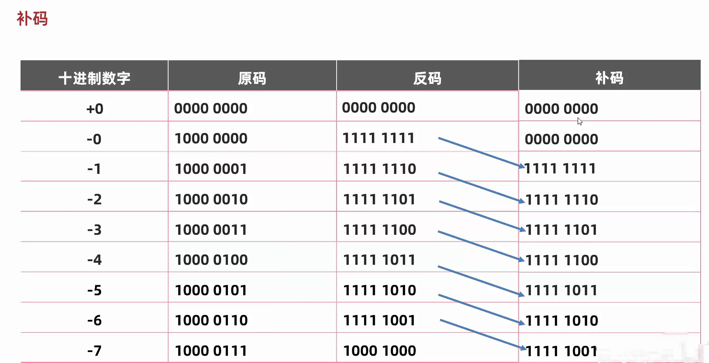
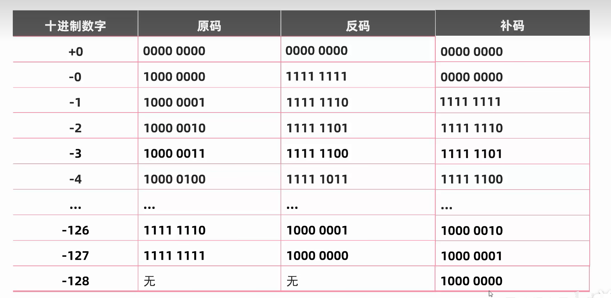
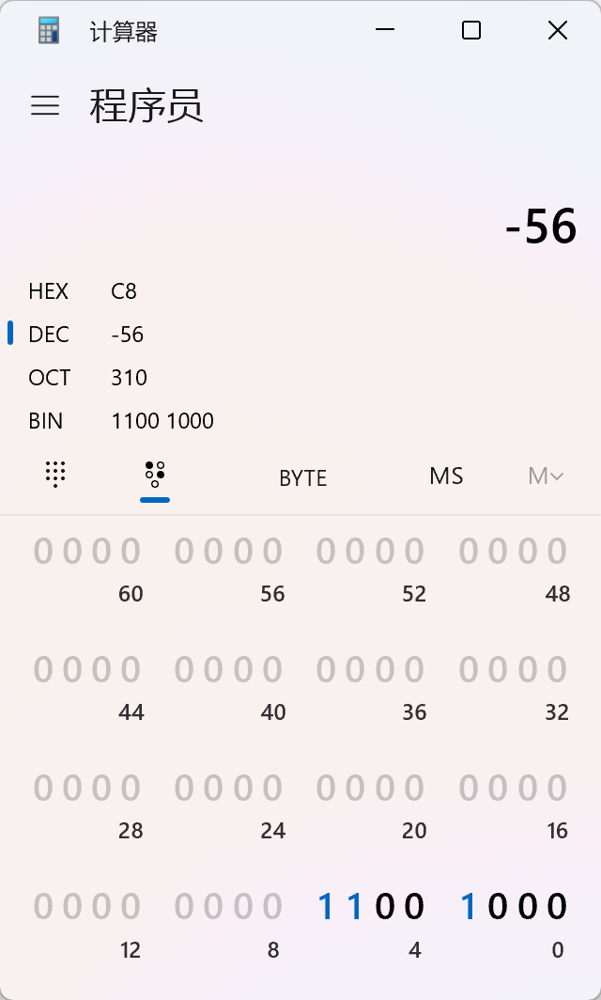

## 关键字
- 关键字的字母全是小写
- class: 用于创建\定义一个类，java中最基础的组成单元

## 字面量
- 字符串类型：用双引号括起来的内容
- 字符类型：使用单引号括起来的内容，比如：'A'
- \t制表符：在打印的时候，将前面字符串的长度补齐到8或者8的整数倍，最少补一个空格，最多8个。

## 变量
变量的定义格式：数据类型 变量名=数据值

## 计算机存储规则
文本的存储：
- GBK编码：收录21003个汉字，包含国家标准GB13000-1中的全部
中日韩汉字，和BIG5编码中的所有汉字。
- Unicode编码：国际标准字符集
- 图片数据存储：光学三原色：红绿蓝，简称RGB，写成十进制：(255,255,255)，也可以写成十六进制：FFFFFF
- 声音数据的存储：对声音的波形图进行采样后存储
- 视频的存储，实际上就是上面三种数据存储方式的组合

## 数据类型
- 基本数据类型：共八种
    - 整数类型：byte(1个字节范围：-128-127)、short(2个字节范围)、int(4个字节范围)、long(8个字节范围)，如果要定义long类型的变量，需要在数值后面一个L(可以大小写)，定义float类型变量的时候，需要在数值后面加上F/f
```java
public class Main{
    public static void main(String[] args){
        long n=999999999999L;
        System.out.println(n);
    }
}
```
    - 浮点数类型：float、double
    - 字符：char
    - 布尔：boolean
- 引用数据类型

## 标识符
定义：给类型、方法、变量起的名字

- 由数字、字母、下划线和美元符号组成
- 不能以数字开头
- 不能是关键字
- 区分大小写
例如：#abc,这个标识符是不合理的，因为不满足第一条规则

命名建议：小驼峰命名法：方法，变量，大驼峰命名法：类名

## 键盘录入
使用Scanner类

```java
import java.util.Scanner;

public class Main{
    public static void main(String[] args){
        Scanner sc=new Scanner(System.in);
        int a=sc.nextInt();
        System.out.println(a);
        //循环录入
//        while(sc.hasNext()){
//            System.out.println(sc.next());
//        }
    }
}
```

## 算术运算符的类型转换
- 隐式类型转换(自动类型提升)：取值范围小的变成大的
    - byte、short、char三种类型在进行运算的时候，先转成int，然后再进行运算
```java
    char a='a';
    int b=1;
    System.out.println(a+b);//a先转化为acsii码后运算98
    byte a=1;byte b=2;//a+b的类型是啥？int
```
- 显式类型转换：取值范围大的变成小的，需要手动转换

格式：目标数据类型 变量名=(目标数据类型) 被强转的数据
```java
    double b=100;
    int a=b;//报错提示
    //正确使用姿势
    double b=100;
    int a=(int)b;
    //byte类型计算隐式默认转换为int，手动将a+b求和后的值强转
    byte a=1;byte b=2;  
    byte c=(byte)(a+b);
```

- 字符串中的"+"操作，当"+"前后出现字符串中的时候，就不是算术运算符了，而是将前后字符串连接后形成一个新的字符串
```java
System.out.println('a'+1);//98
System.out.println('a'+"bc");//abc
```
## 赋值运算符
赋值运算符隐含了强转
- +=
- -=
- *=
- /=
- %=
```java
short a=1;
a+=1;//等同于a=(short) (a+1);而不是隐式类型转换
```
## 逻辑运算符
- &：都为真才为真
- |：两边都为假才是假，否则真
- ^：异或运算符：两边不同为真，否则假
- !:取反
- 短路逻辑运算符：
    - &&：短路与，结果和&一样，但是有短路效果，效率比较高
    - ||：短路或，结果和|一样，但是有短路效果，效率比较高
## 原码、反码、补码
- 反码：为了解决原码不能计算负数而出现的，正数的反码等于本身，负数的反码等于符号位不变，其他位取反
- 补码：正数的补码等于本身，负数的补码等于反码+1
```text
10000000,这是0的二进制，如果用原码计算，+1预期结果是1，实际上10000001等于-1，所以使用反码计算可以不区分正负数，但是用反码还是会有一个问题就是如果运算结果是跨0的，那需要补一，比如-4+7，-4的反码是11111011，7的反码是00000111，相加结果就是00000010，也就是2，需要补一位，这是因为在反码中00000000和11111111表示的分别是+0和-0都是0，所以跨零的计算，步数少算了一步，需要+1，因此出现了补码，补码的出现也就是将+0和-0统一成为了00000000
```

- 现代计算机都用补码表示整数

现在使用补码表示之后，多出来的10000000，表示的就是-128，这也是为什么数字类型数值范围左边界始终比右边界多一的原因，也是为什么一个字节的取值范围是[-128,127]的真正原因
```java
    int a=200;//int类型是4个字节，二进制补码表示：0000 0000 0000 0000 0000 0000 1100 1000
    byte b=(byte) a;//byte是1个字节范围，二进制补码表示：1100 1000，转换为10进制后就是56
    System.out.println(b);//-56
```


## 数组的基本使用
定义：
- 一维数组：int array[]，二维数组：int array[][]
- 数组的静态初始化(在内存中，为数组容器开辟空间，并将数据存入容器的过程)：数组类型 []数组名=new 数据类型[]{元素1,元素2...}
```java
        int []arr=new int[]{1,2,3};
        double [] brr=new double[]{2,3,4};
        //二维数组
        int arr[][]=new int[][]{
            {1,2,3},
            {4,5,6,7,8}
        };
        //简写格式：
        int crr[]={2,3,4,5,6};
        //打印结果是个地址，数组的地址值表示的是数组在内存中的位置
        System.out.println(crr);//[I@b4c966a，I表示的是int类型，@是分隔符号，后面的才是真正的地址部分
        
```
- 数组的动态初始化：小数类型，默认初始化值为0.0，字符串类型，默认初始化为"\u0000"空格，引用数据类型，默认初始化值为null,布尔类型，默认初始化值为false
```java
int arr[]=new int[100];
arr[0]//初始化值为0
arr[index]=xxx;
```
## java内存分配
- 栈空间：例如创建一个数组arr,栈空间存储的就是arr在堆空间中的地址值，堆空存储实际的数组元素，基本数据类型的真实值就是存储在这里的，而引用数据类型的变量存的是地址值
- 堆空间：存储的是引用类型的空间
- 方法区：运行一个类的时候，这个类的字节码文件就会加载到方法区中临时存储

### 一个对象的内存图
Student st=new Student()
1. 加载class文件
2. 申明局部变量
3. 在堆中开辟一个空间
4. 默认初始化
5. 显示初始化
6. 构造方法初始化
## 方法
方法是程序中最小的执行单元
```java
//方法的定义格式
public(方法的修饰符) static(可选) 返回类型 方法名称(参数){
    return 返回值
}
```
### 形参和实参
- 形参：全称形式参数，指的是方法中定义的参数
- 实参：全称实际参数，方法调用中的参数
### 方法的重载
在同一个类中，定义了多个同名的方法，这些同名的方法具有相同的功能，每个方法具有不同的参数类型和参数个数，这些方法构成了重载关系
```java
//如下两个fn方法构成了重载关系
public class Main{
    public static float fn(int a){
        return 0.0f;
    }
    public static int fn(int a,int b){
        return 0;
    }
}
//如下两个fn不构成重载关系：因为不满足不同的参数类型和参数个数的条件
public class Main{
    public static float fn(int a){
        return 0.0f;
    }
    public static int fn(int a){
        return 0;
    }
}
//如下两个方法构成重载关系：因为参数有不同的类型
public class Main{
    public static float fn(int a){
        return 0.0f;
    }
    public static int fn(double a){
        return 0;
    }
}

```


