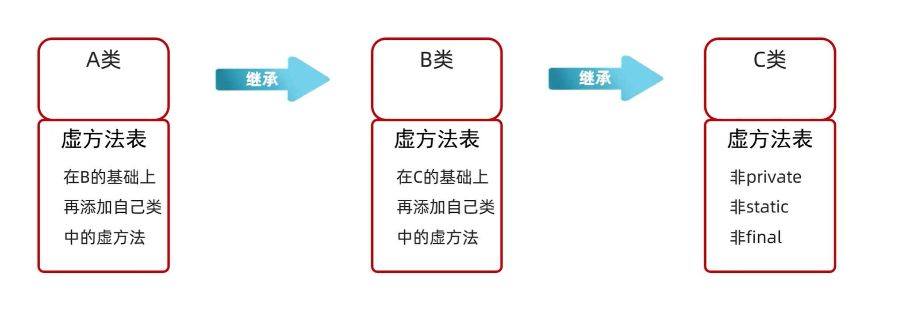

## 类和对象
类是共同特征的描述，对象是真实存在的具体案例
```java
//定义类的格式
public class 类名{
    1. 成员变量
    2. 成员方法
    3. 构造器
    4. 代码块
    5. 内部类
}
```
- 用来描述一类事物的类，叫做javabean类：javabean类中是不写main方法的
- 编写main方法的类，叫做测试类
- 一个java文件中可以定义多个class类，且只有一个能被public修饰，而且public修饰的类名必须成为代码文件名称，实际开发中建议一个文件定义一个class
- 成员变量的完整定义格式：修饰符 数据类型 变量名

## 面向对象三大特征
### 封装
- 封装：对象代表什么，就得封装对应的数据，并提供数据对应的行为
### 继承
java中提供了一个关键字extends，用这个关键字，可以让一个类和另一个类之间建立继承关系
```java
//Student被称为子类（派生类），Person称为父类(基类或者超类)
public class Student extends Person{}
``` 

- 把子类中重复的代码提取到父类中，提高代码的可复用性
- 子类可以在父类的基础上，增加其他的功能，使子类更加强大
- java中只支持单继承，不支持多继承，但支持多层继承
- 每个类都间接或者直接继承于Object
- 只有父类中的虚方法(非private、非static、非final)才能被子类继承


#### 继承中成员变量访问特点
就近原则：先在局部位置找，本类成员位置找，父类成员位置找，逐级往上
```java
class Person{
    String name="sb";
}

class Student extends Person{
    String name="zzz";
    public void say(){
        String name="hhh";
        System.out.println(name);
        System.out.println(this.name);
        System.out.println(super.name);
    }
}
```
#### 方法的重写
当父类的方法不能满足子类现在的需求时，需要进行方法的重写，在继承体系中，子类出现与父类一模一样的方法声明，我们称这个子类的这个方法就是重写的方法

- @Override重写注解，@Override放在重写后的方法上，校验子类重写的时候语法是否正确，建议重写的方法都加上这个注解

重写要求：

1. 重写方法的名称、形参列表必须与父类中保持一致
2. 子类重写父类方法时，访问权限子类必须大于等于父类（空着不写< protected < public）
3. 子类重写父类方法时，返回值类型子类必须要小于等于父类
4. 建议：重写的方法尽量与父类保持一致
5. 只有被添加到虚方法表中的方法才能被重写

#### 继承中构造方法的访问特点
- 子类默认是不能继承父类的构造方法的
- 子类中所有构造方法默认先访问父类的无参构造，再执行自己（为什么：子类的初始化的时候，有可能会使用到父类中的数据，如果父类没有完成初始化，子类将无法使用到父类的数据）
- 子类的构造方法的第一行语句默认都是super();不写也是存在的，且必须在第一行
```java
class Person{
    private String name;
    private int age;

    public Person(){
        //这里的this表示调用本类其他构造方法，一般给对象一个默认值的时候使用此方式
        //细节：虚拟机在第一行就不会调用super()了
        this(null,18);
    }


    public Person(String name,int age){
        this.name=name;
        this.age=age;
    }
}

Person person=new Person();
```


### 多态
定义：同类型的对象，表现出不同的形态

多态的表现形式：父类类型 对象名称=子类对象

多态的前提：有继承/实现关系、有父类引用指向子类对象、有方法重写

多态的好处：使用父类型作为参数，可以接收所有子类对象

多态调用成员的特点：
- 变量调用：编译看左边，运行也看左边
- 方法调用：编译看左边，运行看右边
```java
class Animal{
    public String name="动物";
    public void eat(){
        System.out.println("我要吃食物");
    }
}

class Dog extends Animal{
    public String name="狗";

    @Override
    public void eat() {
        System.out.println("我要吃骨头");
    }
}

 Animal dog=new Dog();
//打印结果是Animal中的name成员变量
System.out.println(dog.name);//编译看左边：javac编译代码的时候，会看左边的父类中有没有这个变量，如果有则编译成功，否则编译失败，运行的时候也看左边，java运行代码的时候，实际上获取的就是左边父类中成员变量的值
//调用结果是Dog类中的eat方法
dog.eat();
```

## private关键字
private权限修饰符，可以用来修饰成员变量和成员方法，被private修饰的成员只能在本类中使用
- 针对对于private修饰的成员，如果需要其他类访问和修改，则提供setXXX(参数)和getXXX()的方法
```java
public class Main{
    public static void main(String[] args){
        GrilFriend grilFriend = new GrilFriend();
        //报错
        grilFriend.age=19;
        grilFriend.setAge(19);
        System.out.println(grilFriend.getAge());
    }
}

class GrilFriend{
    private String name;
    private int age;

    public void setAge(int age){
        this.age=age;
    }
    
    public int getAge(){
        return age;
    }
}
```
## this关键字
- 区分成员变量&局部变量
- 本质：代表的是方法调用者的地址值,在类中其实就是一个JVM塞到方法中的一个局部变量
```java
class GrilFriend{
    //成员变量
    private int age;

    public void sayHello() {
        int age = 19;
        //就近原则，打印结果为局部变量
        System.out.println(age);
        //如果想要打印成员变量，加上this
        System.out.println(this.age);
    }
}
```
## 构造方法
构造方法也叫构造器/构造函数，在创建对象的时候给成员变量赋值的
- 特点：方法名与类名保持一致，没有返回值类型，也没有具体的返回值，同时**构造方法是可以重载的**
- 执行时机：创建对象的时候由虚拟机自动调用，不能手动调用构造方法，每次创建对象都会调用一次构造方法
- 最佳实践：不管是否使用，都必须写上空参数的构造器和有参数的构造器的定义
```java

public class Main{
    public static void main(String[] args){
        GrilFriend grilFriend1 = new GrilFriend();
        GrilFriend grilFriend2 = new GrilFriend(23);
        //空参构造，如果没有定义构造函数，new 对象的时候虚拟机会加上一个空参构造
        BoyFriend boyFriend = new BoyFriend();
    }
}

class GrilFriend{
    private int age;

    public GrilFriend(){}

    public GrilFriend(int age){
        this.age=age;
    }
}

class BoyFriend{
    
}
```
## 标准javaBoolean
- 类名需要见名知意
- 成员变量使用private修饰
- 提供至少两个构造器：一个空的构造函数，一个有成员变量全部初始化的构造函数
- 成员方法：每个成员变量都提供对应的getXXX()以及setXXX()方法
```java
class GrilFriend{
    private int age;

    public GrilFriend(){}

    public GrilFriend(int age){
        this.age=age;
    }

    public void setAge(int age) {
        this.age = age;
    }
    public int getAge() {
        return this.age;
    }
}
```
### 快捷键生成javaBoolean
也可以下载插件ptg右键一键生成javaBoolean
```java
class BoyFriend{
    private int age;
    private String name;
    private char gender;
    private String email;

    //使用快捷键生成getter&setter
    //alt+insert
}
```
### 快捷键生成测试类方法
psvm

## 工具类
只包含静态方法的类，不创建实例，用于封装一组通用的，无状态的辅助功能，比如java.util.Arrays这个类，Arrays.fill方法等通用能力，通常工具类的构造方法是私有化的，防止实例化

## 成员变量&局部变量
- 成员变量：类中方法外的变量，存放在堆中，整个类中有效，生命周期：随着对象的创建而存在，随着对象的消失而消失
- 局部变量：方法中的变量，存放在栈中，整个方法中有效，生命周期：随着方法调用而存在，随着方法调用结束而消失

## static
static表示的是静态，是java中的一个修饰符，可以修饰成员方法，成员变量

- 被static修饰的成员变量，叫做静态变量，该类所有对象共享
```java
public class Student{
	static String teacherName;
	public void show(){
	//静态的有两种访问方式如下：第一种，对象调用，第二种，类名调用
		System.out.println(this.teacherName);
		System.out.println(Student.teacherName);
	}
}
Student.teacherName="sb";
```
- 被static修饰的成员方法，叫做静态方法（多在测试类和工具类中，javabean类中很少使用）
	- 静态方法中只能访问静态的方法或者变量，同时没有this关键字 

```java
class Student{
	//实际上每个非静态的成员方法的参数在运行的时候，虚拟机都传入了this（当前方法调用者的this值）
	public void show(Student this){
	}
}
new Student().show();
```