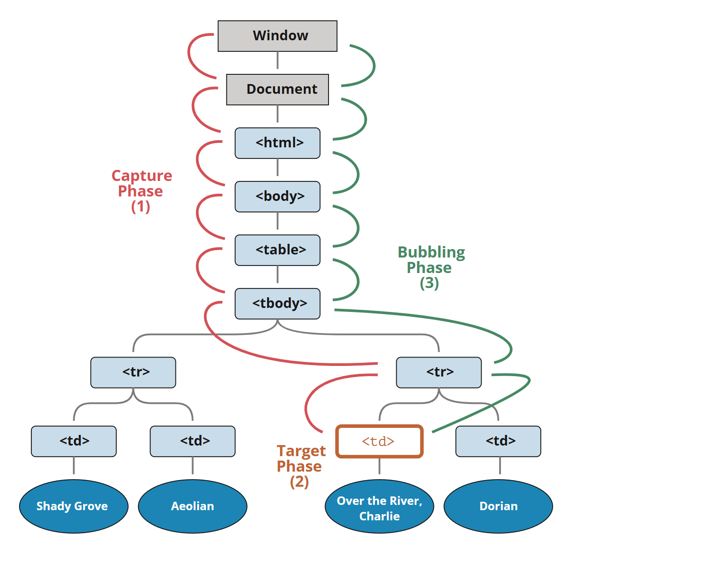

## 冒泡和捕获


上图中，点击 <td>，事件首先通过祖先链向下到达元素（捕获阶段），然后到达目标（目标阶段），最后上升（冒泡阶段），在途中调用处理程序

```html
<body>
	<div>
		<button>111</button>
	</div>
</body>
```

```javascript
	const div = document.querySelector('div');
	const button = document.querySelector('button');

	div.onclick = function (e) {
		//div,div,button
		console.log(this, e.currentTarget, e.target);

	}

	button.onclick = function (e) {
		//button,button,button
		console.log(this, e.currentTarget, e.target);
	}
```

- this等同于e.currentTarget,表示当前事件绑定的运行程序的元素，而e.target表示的是目标元素

> 冒泡很方便。不要在没有真实需求时阻止它：除非是显而易见的，并且在架构上经过深思熟虑的