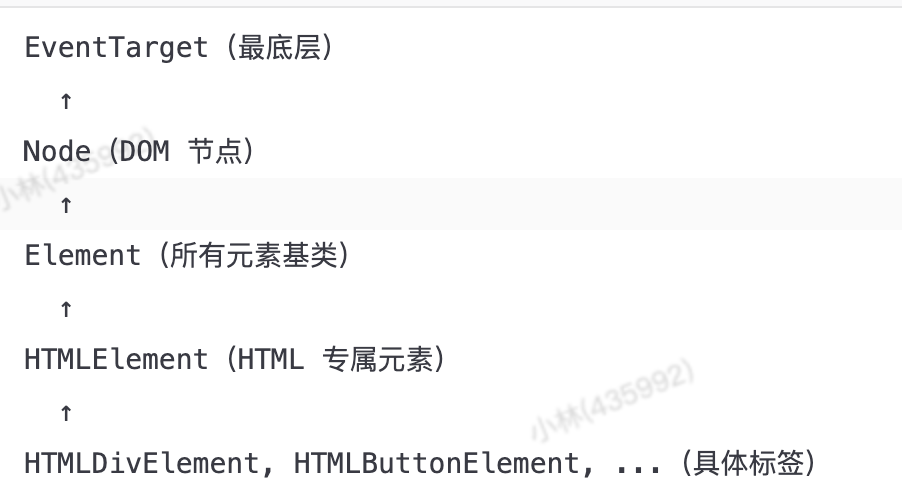

## 冒泡和捕获


上图中，点击 <td>，事件首先通过祖先链向下到达元素（捕获阶段），然后到达目标（目标阶段），最后上升（冒泡阶段），在途中调用处理程序

```html
<body>
	<div>
		<button>111</button>
	</div>
</body>
```

```javascript
	const div = document.querySelector('div');
	const button = document.querySelector('button');

	div.onclick = function (e) {
		//div,div,button
		console.log(this, e.currentTarget, e.target);

	}

	button.onclick = function (e) {
		//button,button,button
		console.log(this, e.currentTarget, e.target);
	}
```

- this等同于e.currentTarget,表示当前事件绑定的运行程序的元素，而e.target表示的是目标元素

> 冒泡很方便。不要在没有真实需求时阻止它：除非是显而易见的，并且在架构上经过深思熟虑的,举个简单的例子：埋点，如果有的元素阻止冒泡，有的区域就无法埋点统计到该区域是否点击了

## 事件委托
> 这个想法是，如果我们有许多以类似方式处理的元素，那么就不必为每个元素分配一个处理程序 —— 而是将单个处理程序放在它们的共同祖先上。

关于事件委托的case可以参考：https://zh.javascript.info/event-delegation

## dom.dispatchEvent派发事件
```javascript

const btn = document.getElementById("btn");

// 添加事件监听
btn.addEventListener("click", () => {
  console.log("按钮被点击了");
});

// 派发 click 事件（模拟点击）
btn.dispatchEvent(new MouseEvent("click"));

// 控制台输出：按钮被点击了
```
## Event事件对象继承结构图

```text
Event（基础事件）
    │
    ├── AnimationEvent
    ├── ClipboardEvent
    ├── CompositionEvent
    ├── CustomEvent
    ├── FocusEvent
    ├── InputEvent
    ├── UIEvent（用户界面事件）
    │       │
    │       ├── MouseEvent（鼠标事件）
    │       │       ├── PointerEvent
    │       │       ├── WheelEvent
    │       │       └── DragEvent
    │       │
    │       ├── KeyboardEvent（键盘事件）
    │       └── TouchEvent（移动端触摸）
    │
    └── ProgressEvent（包括 XMLHttpRequest 事件）

```

## DOM节点继承结构图

之所以最底层叫做EventTarget，是因为只要是继承EventTarget的对象都可以监听和派发事件，和事件对象继承保持独立

## drag事件
- 被拖动的元素(draggable)，只触发dragStart,drag,dragEnd事件
- 放置目标（如容器）只触发dragenter,dragover,dragleave,drop事件