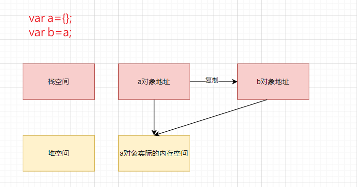

## js存在引用传递吗？
js只有值传递，不存在引用传递
> tips:es6的语法是存在引用传递的，符号绑定
```javascript
//a.js
export let count=1;
setInterval(()=>count++,500);
```
```javascript
//b.js
import {count} from "a.js"
setInterval(()=>console.info(count),1000);
```
上面的例子调试可以看出，a.js中的count改变的时候,b.js中的count也会改变，这是因为count是引用传递。
## 什么是值传递以及js为什么只有值传递？
举个栗子：实际上var b=a其实就是将a的地址复制到b的地址

如何验证js只有值传递呢？其实只要把图中的例子的b改一下，比如var b={};b={age:10},然后分别打印a和b的结果：
```javascript
console.info(a)//{}
console.info(b)//{age:10}
```
通过上面的结果就可以发现，即时b改变了，但是没有影响到a,如果是引用传递的话，必定会得到a={age:10}的结果。分析一下：可以发现b改变的只是值，也就是对象的地址


## 扩展知识
java也是只有值传递
其他语言比如c语言，c++,c#，这些有指针的是有引用传递的，同时注意引用传递和指针的区别：引用直接指向地址，指针是开一个内存空间存一个地址，指针可以用空间存其他地址，引用不能改，指针相当于地址类型变量，引用相当于地址类型常量，只能读，不能改