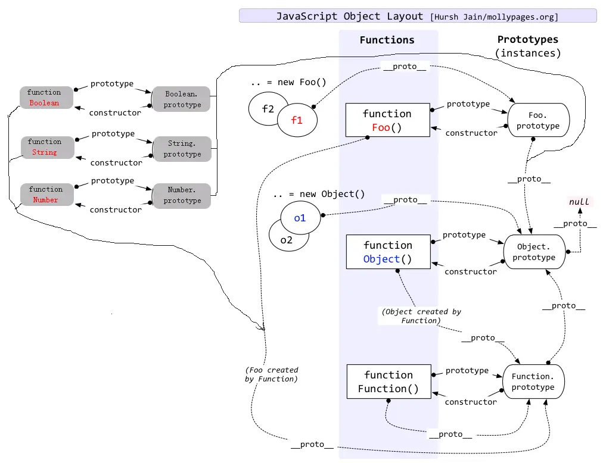
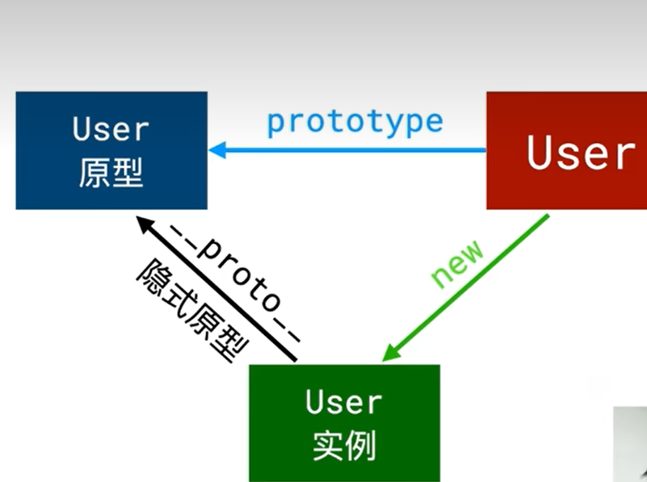

## 原型链
允许对象从其他对象继承属性和方法的一种机制


### 注意点
1. 1.prototype对象只存在于构造函数中，用于存储共享属性和方法
2. function.constructor和function.prototype.constructor的区别：function.constructor指向的是function实例的构造函数，function.prototype.constructor指向的function本身
```javascript
console.log((function (){}).constructor===Function)//true
```

### 三角关系
基本所有的对象都满足如下这个三角关系

