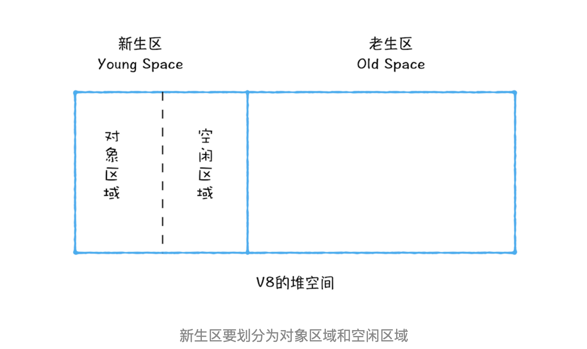
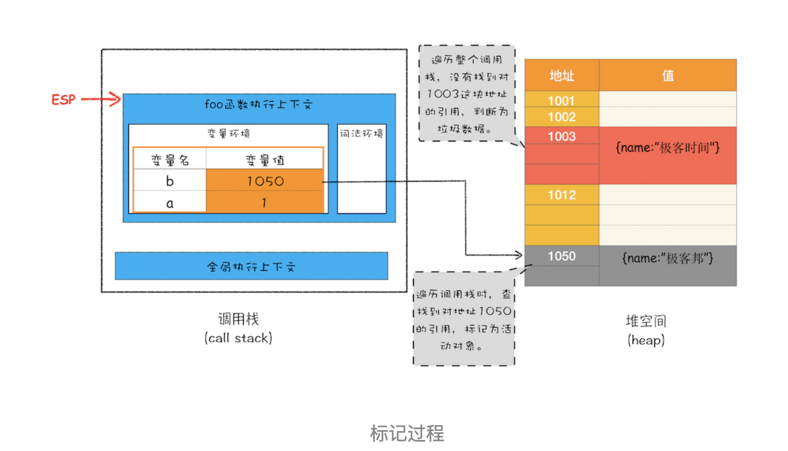
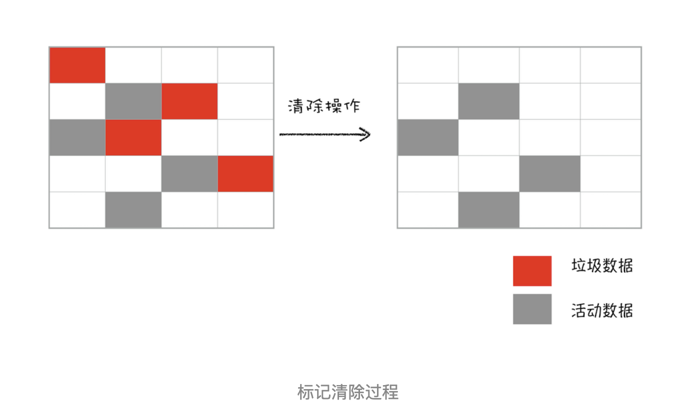
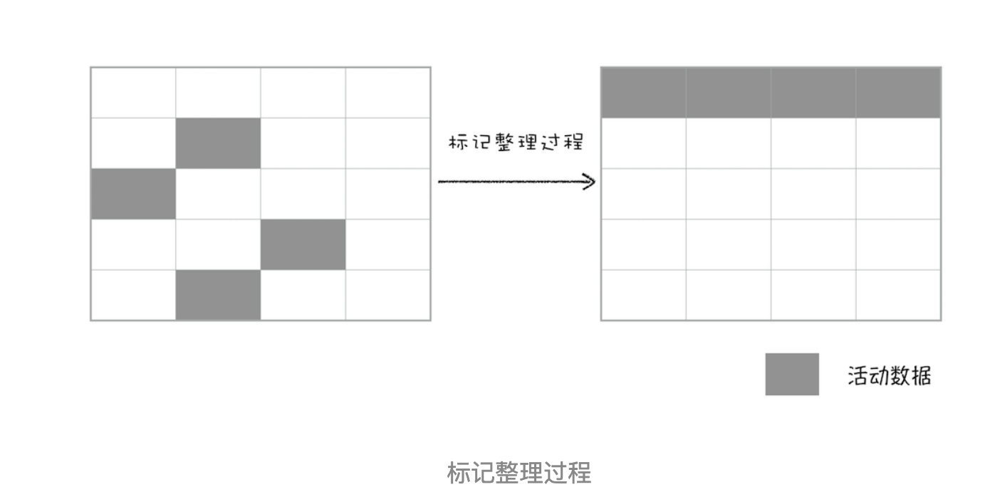
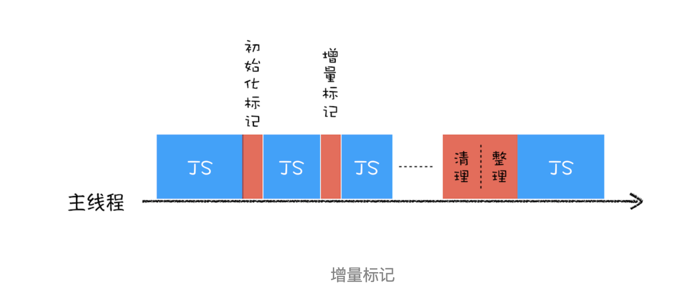

## 内存泄露
程序的运行需要内存，对于持续运行的服务进程，必须及时释放不再用到的内存，否则内存占用会越来越高，轻则影响系统性能，重则导致进程崩溃

也就是说，不再用到的内存，如果没有及时释放，就叫做内存泄露

## js中的垃圾回收
浏览器的js具有自动垃圾回收机制。垃圾收集器会定期找出那些不在继续使用到的变量，然后释放内存。但是这个过程并不是实时的，因为其开销大并且GC时体质响应其他操作，所以垃圾回收器会按照固定的时间间隔周期性的执行。

> 注意：垃圾回收器针对的是堆中的内存，而基本数据类型的变量是和执行上下文生命周期保持一致（基本数据类型存放在栈上，但当它被闭包捕获时，形成闭包对象，会被移入堆中）
### 标记清除
1. 标记（Mark）：从"根"（Root）出发，把能到达的对象全部打上标记。
2. 清除（Sweep）：遍历所有对象，没被标记的就是垃圾，回收掉。

#### 浏览器的垃圾回收器
在v8中会把堆分成新生代和老生代两个区域，新生代存放的是生存是时间较短的对象，老生代中存放的是生存时间久的对象

新生区通常只支持1~8M的容量，而老生区支持的容量就很大了，v8分别使用两个不同的垃圾回收器，以便更加高效地实施垃圾回收
- 副垃圾回收期，主要负责新生代的垃圾回收
- 主垃圾回收器，主要负责老生代的垃圾回收

##### 主垃圾回收器
1. 首先是标记阶段，标记过程就是从一组元素开始，递归遍历这组根元素，在这个遍历过程中，能到达的元素称为活动对象，没有到达的元素就可以判断为垃圾数据

2. 接下来就是垃圾的清理过程，直接清除掉标记了的垃圾数据

3. 3.对一块内存多次执行标记-清除算法之后，会产生大量的不连续的内存碎片，而碎片过多会导致大对象无法分配到足够的连续内存，于是又产生了另外一种算法——标记 - 整理（Mark-Compact）

##### 副垃圾回收器
新生代中使用scavenge算法来处理，所谓的scavenge算法，是把新生代空间划分成两个区域，一半是对象区域，一半是空闲区域

新加入的对象都会存放到对象区域，当对象区域快被写满时，就需要执行一次垃圾回收清理过程：
1. 对对象区域的垃圾做标记
2. 垃圾清理阶段，副垃圾回收器会把这些存活的对象复制到空闲区域中，同时它还会把这些对象有序的排列起来，所以这个复制过程也就相当于内存整理过程，复制后空闲区域就没有了内存碎片了
3. 完成复制之后，对象区域与空闲区域进行角色翻转，也就是原来的对象区域变成空闲区域，原来的空闲区域变成了对象区域，这样就完成了垃圾对象的回收操作
4. 经过两次垃圾回收依然还存活的对象，会被移动到老生区去
### 引用计数
引用技术的含义是跟踪记录每个值被引用的次数。当垃圾回收器下次再运行的时候，它就会释放哪些引用次数为0的值所占用的内存（现代浏览器基本上都是使用标记清除进行垃圾回收，引用计数缺陷较明显：循环引用）
### 全停顿
由于js是运行在主线程之上的，一旦执行垃圾回收，都需要将正在执行的js脚本停止下来，待垃圾回收完毕之后再恢复脚本执行，我们把这种行为称为全停顿

为了降低老生带（新生代空间小全停顿影响不大）垃圾回收而造成的卡顿，v8将标记过程分成一个个子标记过程，同时让垃圾回收标记和Js应用逻辑交替进行，直到标记阶段完成，我们把这个算法称为增量标记算法

