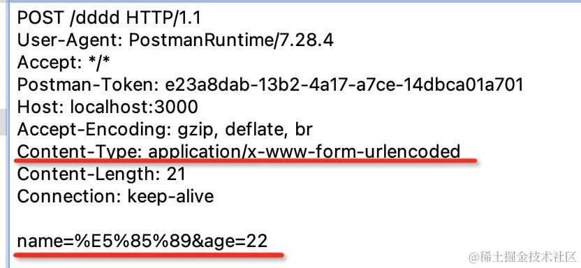
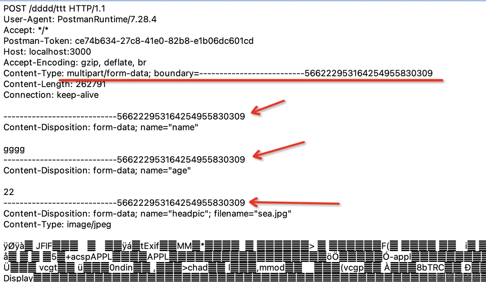
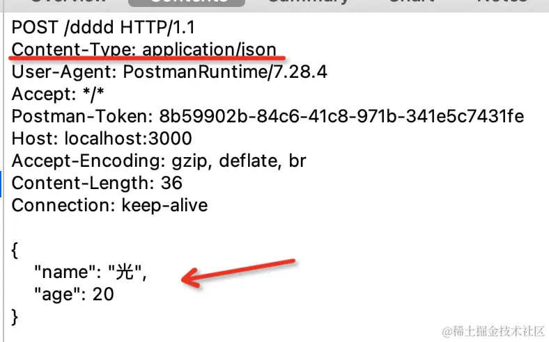

## 5种数据传输方式
- url param
- query
- form-urlencoded
- form-data
- json
## form-urlencoded
直接使用form表单提交数据那种，它和query字符串的区别只是放在了body里面，然后指定content-type为`application/x-www-form-urlencoded`

通过&分割的form-urlencoded的方式需要对内容进行url encode,如果传递大量数据，比如上传文件时就不是很合适，因为文件encode一遍就比较慢了。
## form-data
form-data不再是通过&分隔数据了，而是通过--------- + 一串数字做为 boundary 分隔符

form-date需要指定content-type为`multipart/form-data`，然后指定boundary也就是分割线。很显然，这种方式适合传输文件，但是毕竟多了一些用来分隔的boundary,所以请求体会增大。
## json
form-urlencoded 需要对内容做 url encode，而 form data 则需要加很长的 boundary，两种方式都有一些缺点。如果只是传输 json 数据的话，不需要用这两种。
可以直接指定content type 为 application/json 就行：

