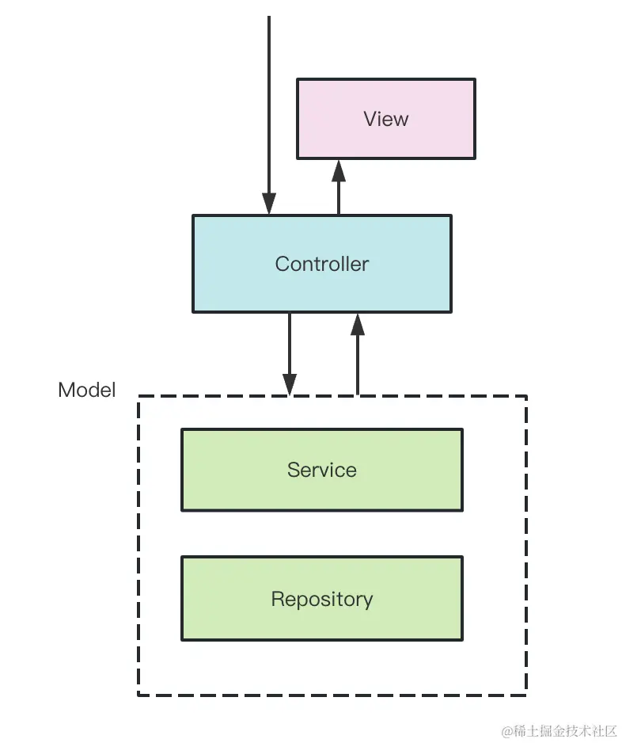

## 传统MVC架构
MVC架构下，请求会先发送给Controller,由它调度Modal层的Service来完成业务逻辑，然后返回对应的View

## 什么是AOP？
AOP也就是**面向切面编程**

这种横向扩展点就是切面，这种透明的加入一些切面逻辑的编程方式就是AOP,**AOP 的好处是可以把一些通用逻辑分离到切面中，保持业务逻辑的纯粹性，这样切面逻辑可以复用，还可以动态的增删。**
> 而 Nest 实现 AOP 的方式更多，一共有五种，包括 Middleware、Guard、Pipe、Interceptor、ExceptionFilter。
### 中间件Middleware
全局中间件
```typescript
	app.use(function (req: Request, res: Response, next: NextFunction) {
		console.log('before', req.url);
		next();
		console.log('after');
	});
```

这种可以在handler前后动态增加一些可以复用的逻辑，就是AOP的切面编程的思想


**路由中间件**
```shell
nest g middleware log --no-spec --flat
```
### Guard
Guard就是路由守卫的意思，可以用于在调用某个Controller之前判断权限，返回true或者false来决定是否放行。


### Interceptor
Interceptor是拦截器的意思，可以在目标Controller方法前后加入一些逻辑

### Pipe
Pipe是管道的意思，用来对参数做一些校验和转换,如果不满足校验规则，则抛出异常

### ExceptionFilter
ExceptionFilter可以对抛出的异常做处理，返回对应的响应,nest提供的异常，比如：`BadRequestException`就是ExceptionFilter提供的

## 总结
以上几种切面的使用方法基本一致，这里介绍一种，以此类推
1. 全局使用：共有两种方式
```typescript
//第一种方式
app.useGlobalGuards(new LoginGuard());
// 第二种方式
providers:[
	{
		provide:APP_GUARD,
		useClass:LoginGuard
	}
]
```
2. 局部使用
```typescript
@Injectable()
export class AppService {
	@UseGuards(LoginGuard)
	getHello(): string {
		return 'Hello World!';
	}
}

```

## 执行流程
