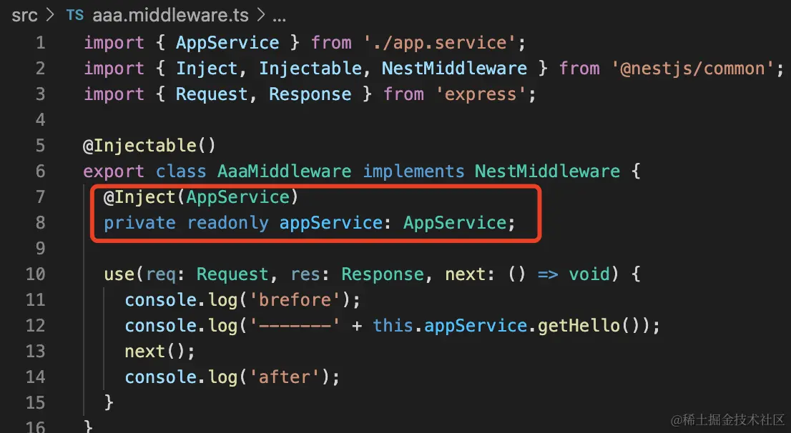
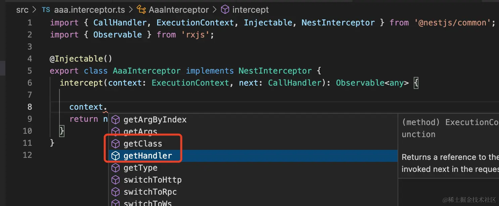

## 基本使用
`nest g middleware aaa --no-spec --flat`
```typescript
export class AppModule implements NestModule {
	configure(consumer: MiddlewareConsumer) {
		//在所有的路由上都使用这个中间件
		//consumer.apply(LogMiddleware).forRoutes('*');
		consumer
			.apply(LogMiddleware)
			.forRoutes({ path: 'hello*', method: RequestMethod.GET });
	}
}
```
除了以上的这种方式，还有其他方式使用路由

**nest为什么要把Middleware做成class呢？**
当然是为了依赖注入

如果不注入依赖，还可以写成函数的方式

```typescript
export class AppModule implements NestModule {
	configure(consumer: MiddlewareConsumer) {
		//在所有的路由上都使用这个中间件
		//consumer.apply(LogMiddleware).forRoutes('*');
		consumer
			.apply(function () {
				console.log('你是傻逼');
			})
			.forRoutes({ path: 'hello*', method: RequestMethod.GET });
	}
}
```
```typescript
//app.use相当于configure方法中的forRoutes("*")
const app = await NestFactory.create(AppModule);
app.use(function(next){})
```
## Middleware与Interceptor的区别
1. interceptor 是能从 ExecutionContext 里拿到目标 class 和 handler，进而通过 reflector 拿到它的 metadata 等信息的，这些 middleware 就不可以。

2. interceptor是可以通过rxjs的操作符来组织响应处理流程的