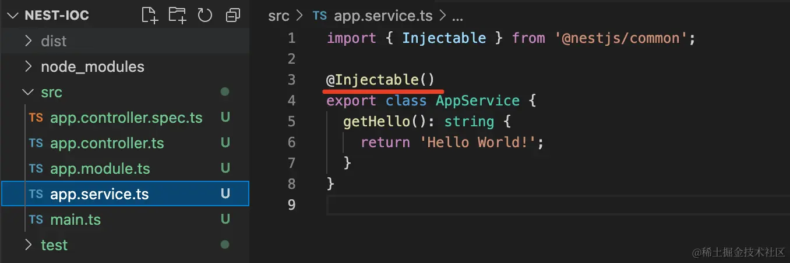
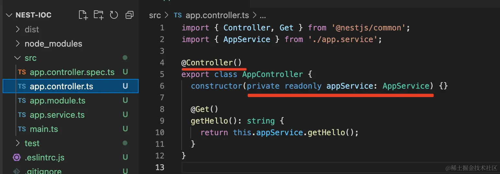
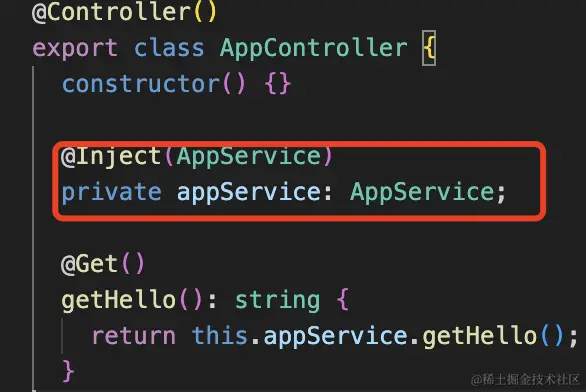

## 实现思路
它有一个放置对象的容器，程序初始化的时候会扫描class上声明的依赖关系，(在class上声明依赖的方式，大家都选择了装饰器的方式)然后把这些class都给new一个实例放到容器中。创建对象的时候，还会把他们依赖的对象注入进去，这就完成了自动的对象创建和组装。**从主动创建依赖到被动等待依赖注入，这就是反转控制**
 
例子：

AppService声明了@Injectable,代表这个class可以被注入，那么nest就会将它的对象放入到IOC容器中

AppController声明了@Controller,代表这个class可以被注入，nest也会将它放入到IOC容器中
前者AppController的构造器参数依赖了AppService，后者通过属性的方式声明了AppService,两种方式都可以
## nest中4种对象
### Module
Module可以理解成大家长，手下有四种孩子。如果某个service想要使用另一个module下的service的话，就必须在imports中导入其对应的module，因为provider想要服务别人，就必须需要"大家长"的同意.
### providers
既能服务别人，也能享受别人的服务
### imports
享受别人家的服务
### exports
导出，让别人也可以享受到的服务
