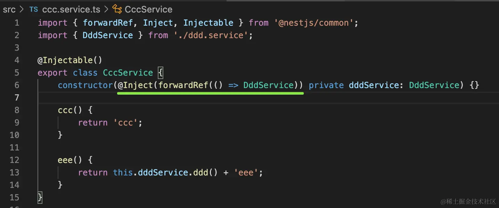
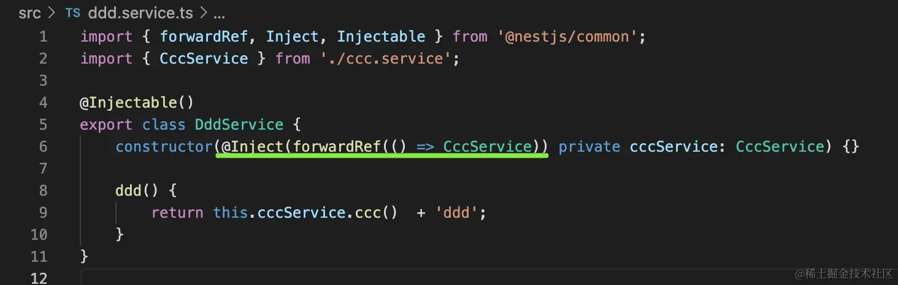

## Module的循环依赖
```typescript
//Aaa.module.ts
@Module({
    imports:[BbbModule]
})
//Bbb.Module.ts
@Module({
    //error:the module at index [0] of the BbbModule "imports" array is undefined;
    imports:[AaaModule]
})
```
以上报错原因很简单，因为AaaModule和BbbModule都还没有创建完毕
**如何解决？使用forwardRef**

```typescript
//Aaa.module.ts
@Module({
    imports:[forwardRef(()=>BbbModule)]
})
//Bbb.Module.ts
@Module({
    //error:the module at index [0] of the BbbModule "imports" array is undefined;
    imports:[forwardRef(()=>AaaModule)]
})
```
使用了forwardRef，nest就会单独创建两个Module，之后再把Module的引用转发过去

## Provider的循环依赖
比如：同一module下的两个provider相互引用

```typescript
import { Injectable } from '@nestjs/common';
import { CccService } from './ccc.service';

@Injectable()
export class DddService {
    constructor(private cccService: CccService) {}

    ddd() {
        return this.cccService.ccc()  + 'ddd';
    }
}

```
```typescript
import { Injectable } from '@nestjs/common';
import { DddService } from './ddd.service';

@Injectable()
export class CccService {
    constructor(private dddService: DddService) {}

    ccc() {
        return 'ccc';
    }

    eee() {
        return this.dddService.ddd() + 'eee';
    }
}

```
**解决方法，使用forwardRef**

