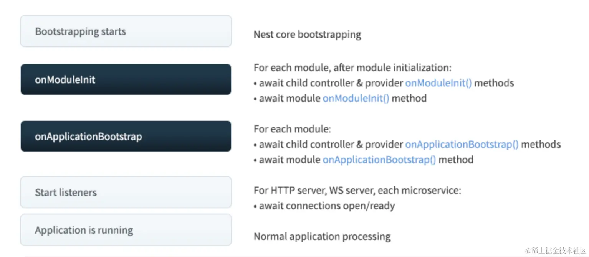

## 如何使用其他Module的exports
```typescript
@Module({
	controllers: [AaaController],
	providers: [AaaService],
	exports: [AaaService],
})
export class AaaModule {}
```
```typescript
@Module({
    imports: [AaaModule],
    controllers: [BbbController],
    providers: [BbbService],
})
export class BbbModule {}
```
```typescript
//使用
    @Inject(AaaService) 
	private readonly aaaService: AaaService;
```
## 全局模块
以上例子可以看出，如果这个module的exports有其他多个module使用，则每次需要imports，比较麻烦，我们可以将公共的module,声明为全局的
```typescript
@Global()
@Module({
	controllers: [AaaController],
	providers: [AaaService],
	exports: [AaaService],
})
export class AaaModule {}
```
这样其他module要使用exports，就无需imports了。

## 生命周期
首先，递归初始化模块，会依次调用模块内的 controller、provider 的 onModuleInit 方法，然后再调用 module 的 onModuleInit 方法。

全部初始化完之后，再依次调用模块内的 controller、provider 的 onApplicationBootstrap 方法，然后调用 module 的 onApplicationBootstrap 方法

然后监听网络端口。

之后 Nest 应用就正常运行了。

```typescript
@Controller('aaa')
export class AaaController implements OnModuleInit, OnApplicationBootstrap {
	constructor(private readonly aaaService: AaaService) {}
	onModuleInit() {
		console.log('AaaController onModuleInit');
	}
	onApplicationBootstrap() {
		console.log('AaaController onApplicationBootstrap');
	}
}

```
销毁的时候也有生命周期

