## @Controller,@Module
通过@Module和@Contoller分别声明Module和Controller
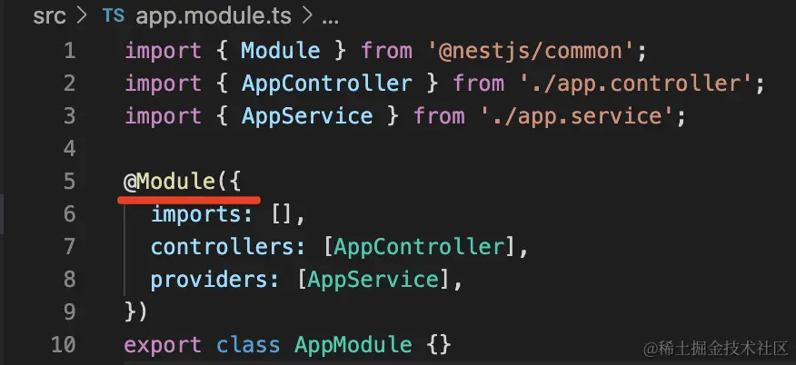
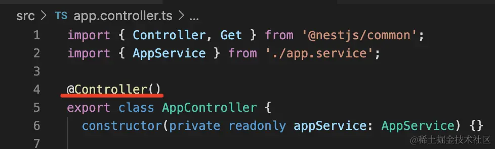
## @Injectable，@Inject，@Optional
通过@Injectable声明provider,provider的一个特性就是可以被注入，@Injectable就是让这个类拥有此特性
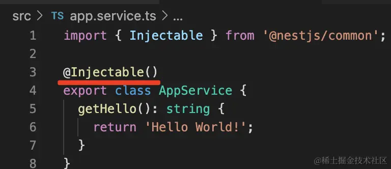
如何注入其他provider?
注入的方式可以是构造器注入，也可以是属性注入
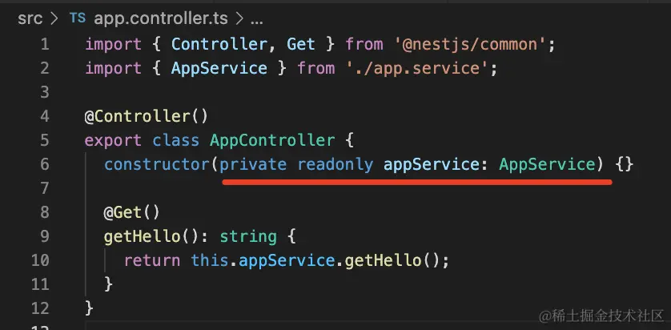
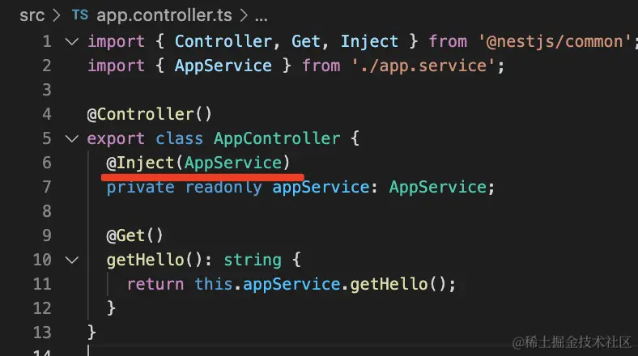
声明provider的方式有多种，你可以通过useValue,useFactory,useClass等多种方式声明provider
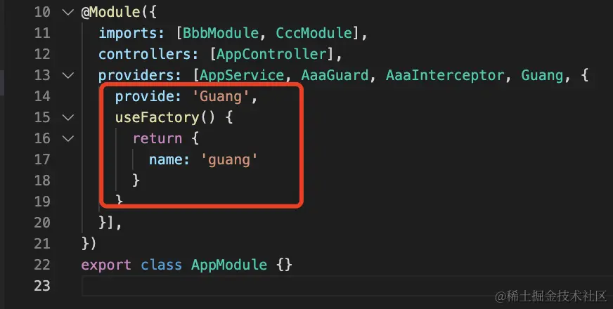
这时候也需要通过@Inject指定注入的token
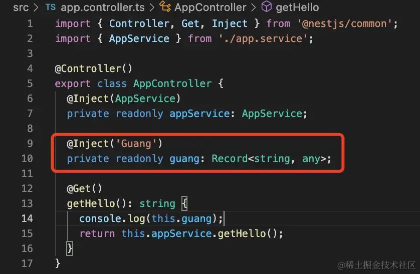
这些注入的依赖如果没有的话，创建对象时就会报错，但如果它是可选的，你可以使用@Optional声明一下。
## @Global
如果模块被很多地方引用，为了方便，可以使用@Global把它声明为全局的，这样它exports的provider就可以直接注入了
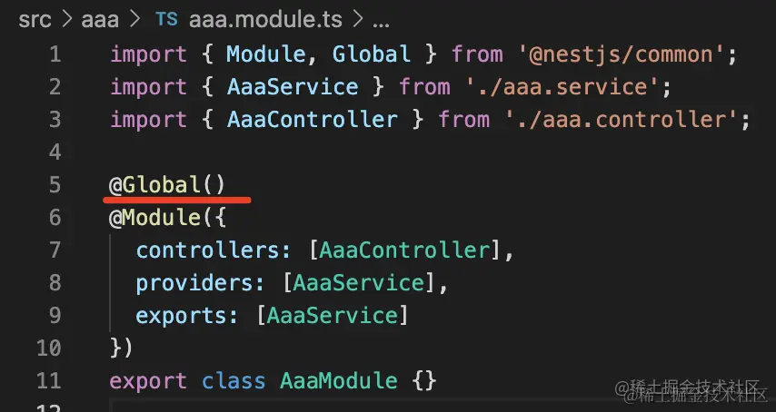
## @Catch,@UseFilters,@UseGuards,@UseInterceptors,@UsePipes
filter是用来处理抛出的未捕获异常的,通过@Catch来指定处理的异常
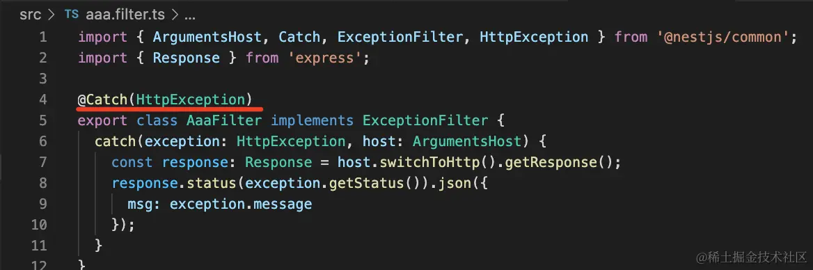

通过@UseFilters应用到handler上
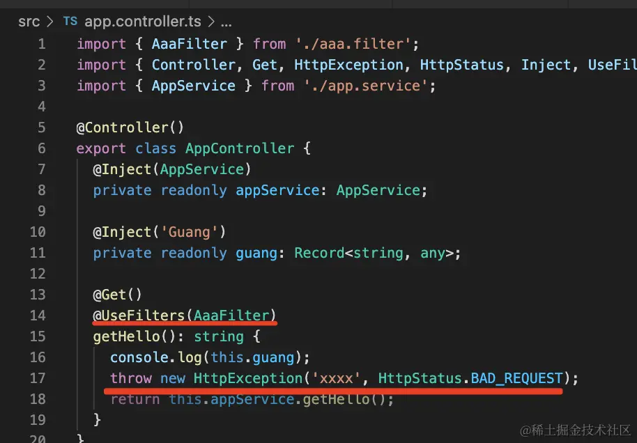
除了filter之外，interceptor，guard,pipe等也是这样使用的
## @Get,@Post,@Put,@Delete,@Patch,@Options,@Head
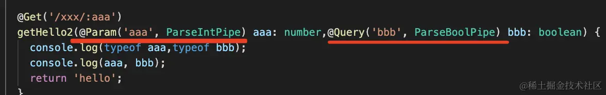
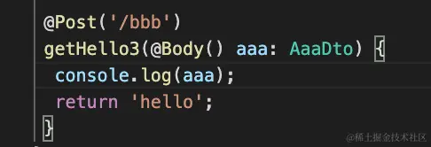

## @SetMetadata
handler和class可以通过@SetMetadata指定metadata,可以用来做鉴权
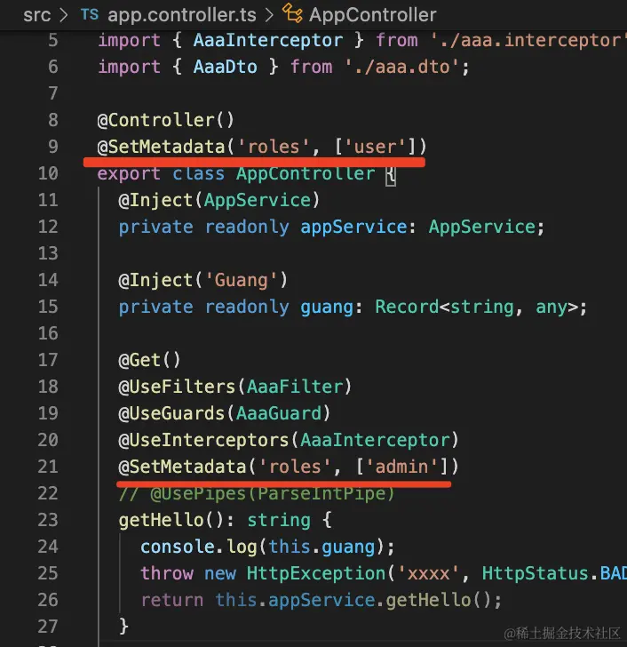
然后在guard或者interceptor里面取出来
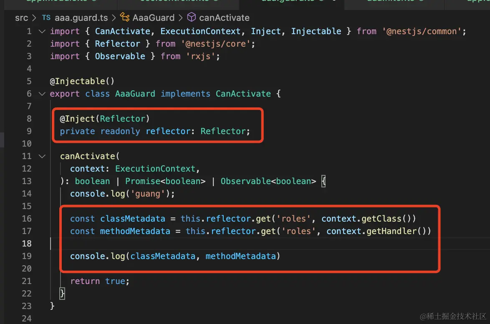
## @Headers
可以通过@Headers装饰器获取某个请求头或者全部请求头
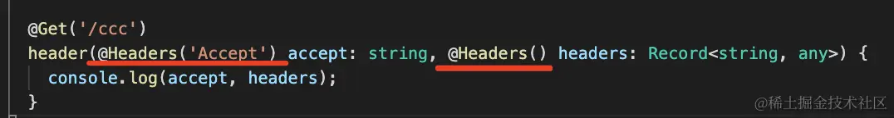
## @Ip
通过@Ip可以获取到请求的IP

## @Session
通过@Session可以拿到session对象
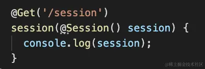
但是要使用session需要安装一个express中间件
```shell
npm install express-session
```
在main.ts中配置
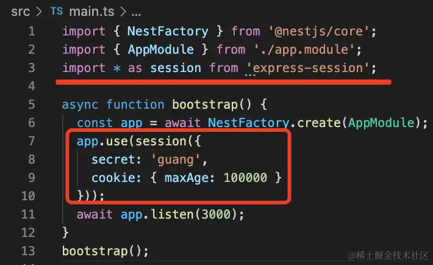
## @Req,@Request,@Res,@Response
@Req等同于@Request,@Res等同于@Response
## @Next
你有两个 handler 来处理同一个路由的时候，可以在第一个 handler 里注入 next，调用它来把请求转发到第二个 handler：
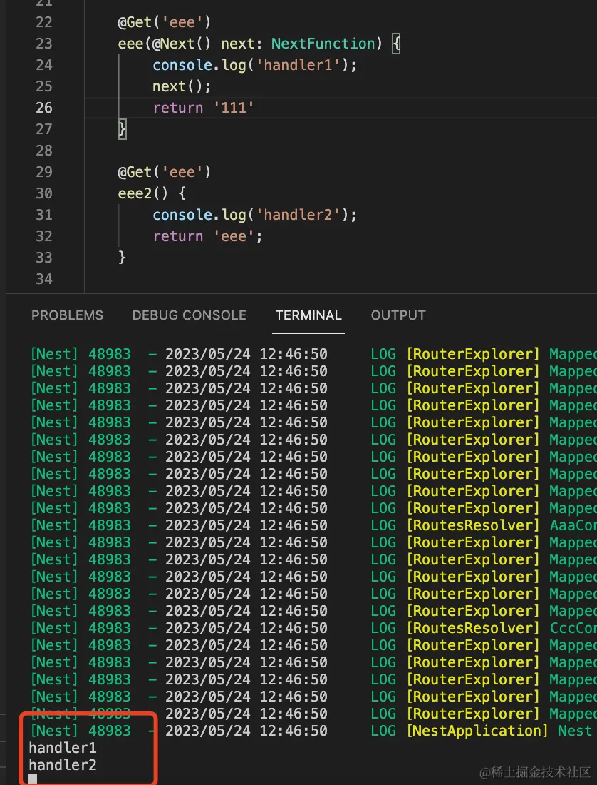
Nest不会处理注入@Next的handler的返回值
## @HttpCode
handler默认返回的是200的状态码,你可以通过@HttpCode修改它
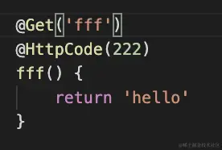
## @Redirect
通过@Redirect装饰器来指定路由重定向的url
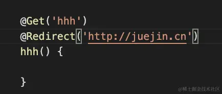
或者在返回值的地方设置url
```typescript
@Get('xxx')
@Redirect()
async jump() {
    return {
      url: 'https://www.baidu.com',
      statusCode: 302
    }  
}

```
