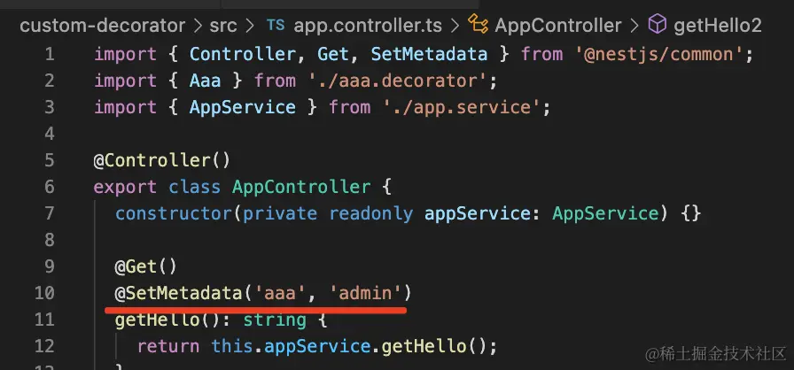
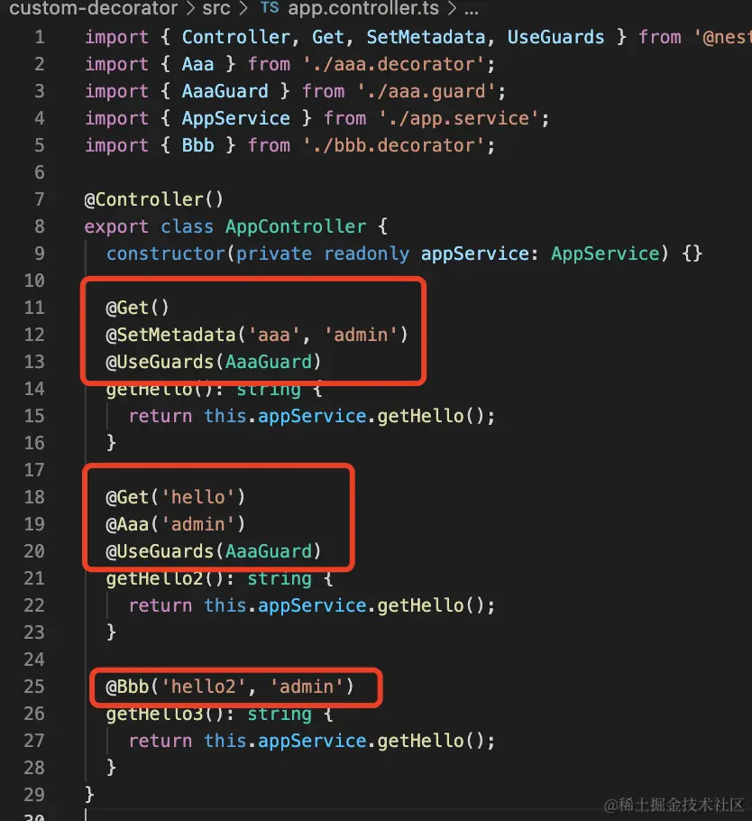
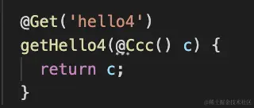

## setMetadata

## 自定义装饰器
在setMetadata上封装一层
```typescript
import { Role } from '../utils/const';
import { SetMetadata } from '@nestjs/common';

export const Roles = (...roles: Role[]) => SetMetadata('roles', roles);

```
## 合并装饰器
```typescript
import { applyDecorators, Get, UseGuards } from '@nestjs/common';
import { Aaa } from './aaa.decorator';
import { AaaGuard } from './aaa.guard';

export function Bbb(path, role) {
  return applyDecorators(
    Get(path),
    Aaa(role),
    UseGuards(AaaGuard)
  )
}

```


## 自定义参数装饰器
```typescript
import { createParamDecorator, ExecutionContext } from '@nestjs/common';

export const Ccc = createParamDecorator(
  (data: string, ctx: ExecutionContext) => {
    //data就是给装饰器传入的值，ctx就是全局上下文对象
    return 'ccc';
  },
);

```


```typescript
import { ExecutionContext, createParamDecorator } from '@nestjs/common';

/**
 * 实现nest内置的@Query装饰器
 */
export const MyQuery = createParamDecorator(
	(key: string | undefined, ctx: ExecutionContext) => {
		const request = ctx.switchToHttp().getRequest();
		return key ? request.query[key] : request.query;
	},
);

```