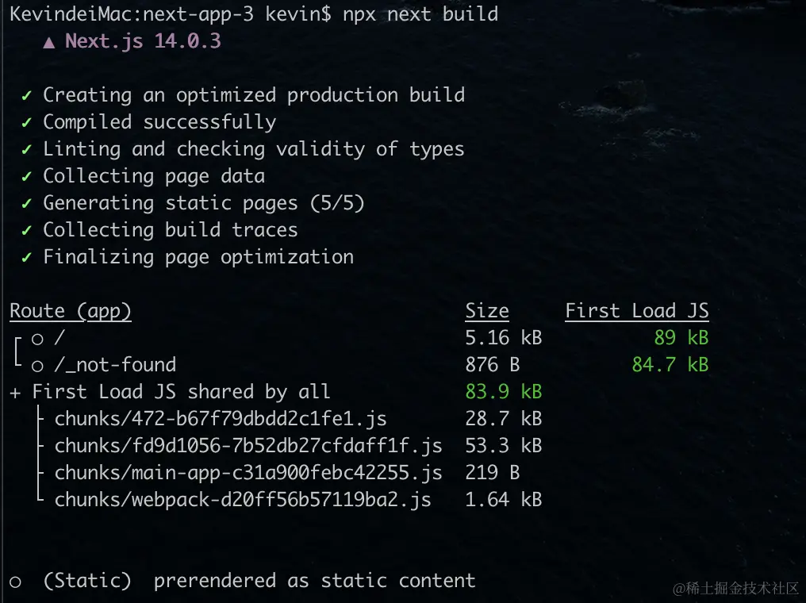

## 常用命令
- 开发的时候使用npm run dev
- 部署的时候使用npm run build构建生产代码，再执行npm run start运行生产代码。
## Next.js CLI
- npx next -h:查看next命令的相关指令
- npx next build,打包产物如下：

图中的文件都是gzip进行压缩了的。
> 加载目标路由一共所需的 JS 大小 = 每个路由都需要依赖的 JS 大小 + 目标路由单独依赖的 JS 大小
- 加载目标路由一共所需的 JS 大小就是 First Load JS
- 目标路由单独依赖的 JS 大小就是 Size
- 每个路由都需要依赖的 JS 大小就是图中单独列出来的 First load JS shared by all
