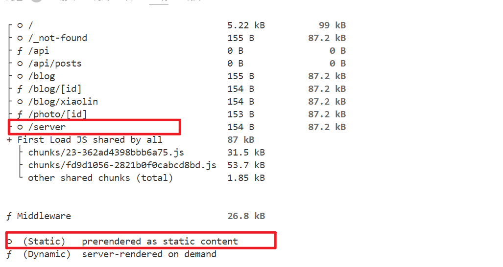
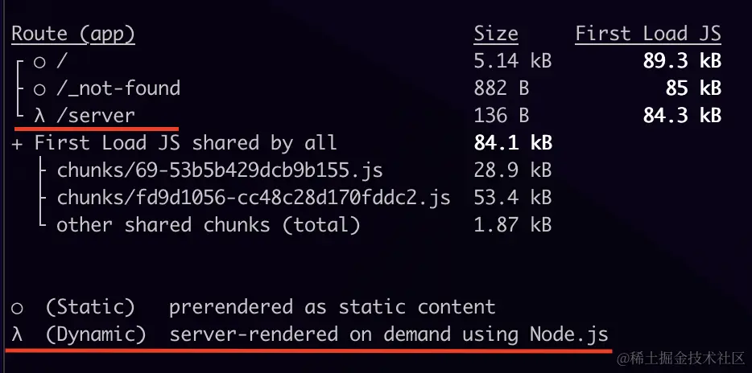

## 静态渲染
这是默认的渲染策略，路由在构建的时候渲染，或者在重新验证的后后台渲染，其结果会被缓存并且可以推送到CDN上
```javascript
//server/page.js
export const revalidate = 10
//这里的10表示至少在用户访问页面10s后，后台会进行验证一次

export default async function Page() {

  const url = (await (await fetch('https://api.thecatapi.com/v1/images/search')).json())[0].url
  
  return (
    
  )
}

```
运行 npm run build && npm run start，此时 /server显示为静态渲染

## 动态渲染
路由在请求时渲染，适用于针对用户个性化或者依赖请求中的信息(比如cookie、URL参数)的情况<br>
在渲染过程中，如果使用了动态函数或者未缓存的数据请求，Next.js就会切换为动态渲染
### 使用动态函数
动态函数指的是只有在请求的时候才能够获取到的数据(如cookie、请求头、URL参数)的函数
- cookies()和headers()：获取cookie和header
- searchParams:页面查询参数
```javascript
//server/page.js
export default async function Page({ searchParams }) {
  const url = (await (await fetch('https://api.thecatapi.com/v1/images/search')).json())[0].url
  return (
    <>
      
      {new Date().toLocaleTimeString()}
      {JSON.stringify(searchParams)}
    </>
  )
}
```
运行 npm run build && npm run start，此时 /server显示为动态渲染：

此时页面刷新，图片还是没有变，而时间发生了变化，这是因为fetch 接口的返回数据被缓存，可以将请求修改为如下：
```javascript
 const url = (await (await fetch('https://api.thecatapi.com/v1/images/search', { cache: 'no-store' })).json())[0].url
```
### 使用未缓存的数据请求
就像上面所示，有的情况，fetch请求是不会进行缓存的：
- fetch 请求添加了 cache: 'no-store'选项
- fetch 请求添加了 revalidate: 0选项
- fetch 请求在路由处理程序中并使用了 POST 方法
- 在headers 或 cookies 方法之后使用 fetch请求
- 配置了路由段选项 const dynamic = 'force-dynamic'
- 配置了路由段选项fetchCache ，默认会跳过缓存
- fetch 请求使用了 Authorization或者 Cookie请求头，并且在组件树中其上方还有一个未缓存的请求

数据缓存和渲染策略是分开的。假如你选择了动态渲染，Next.js 会在请求的时候再渲染 RSC Payload 和 HTML，但其中涉及的数据请求，依然是可以从缓存中获取的。

## 其他术语
### 局部渲染
局部渲染指的是仅在客户端重新渲染导航时更改的路由段，共享段的内容的继续保留。举个例子，当在两个相邻的路由间导航的时候, /dashboard/settings 和 /dashboard/analytics，settings 和 analytics 页面会重新渲染，共享的 dashboard 布局会保留。
### 动态路由
```javascript
export default function Page({ params }) {
  return <div>My Post: {params.slug}</div>
}

```
动态路由并不一定是动态渲染，也可以通过generateStaticParams静态生成路由
### 动态段
路由中的动态段，举个例子，app/blog/[slug]/page.js中 [slug]就是动态段。