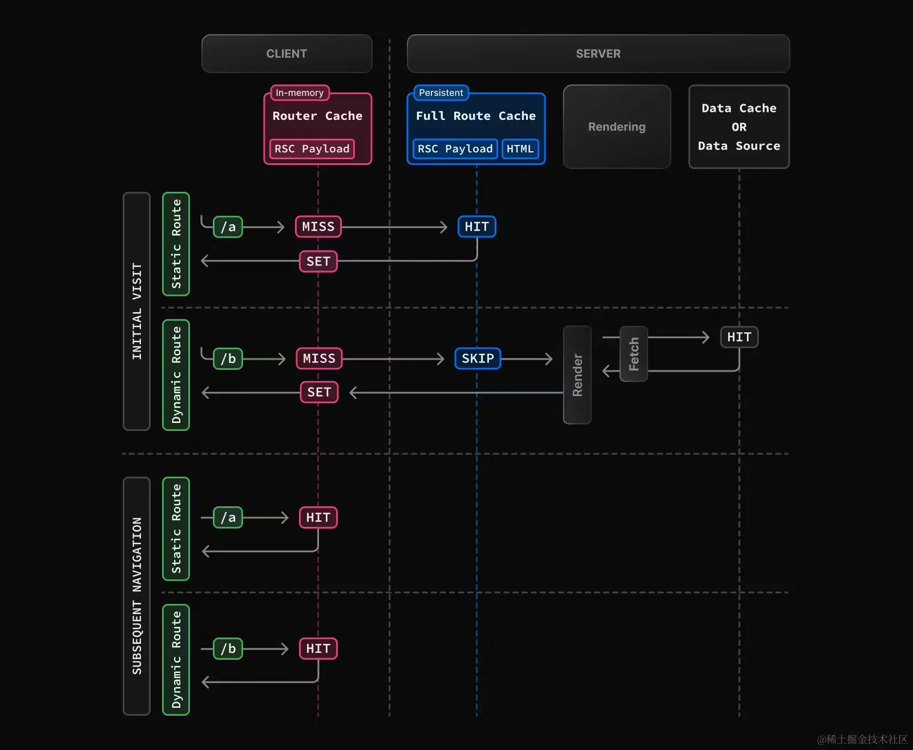

## 完整路由缓存
Next.js 在构建的时候会自动渲染和缓存路由，这样当访问路由的时候，可以直接使用缓存中的路由而不用从零开始在服务端渲染，从而加快页面加载速度。

上图中/a是静态渲染的方式,/b是动态渲染的方式，可以看到除了在server做了一层缓存，同时在客服端client层也做了一层缓存  
静态路由 /a 因为有完整路由缓存，所以不会重新渲染一遍。动态路由 /b 没有完整路由缓存，所以会重新执行一遍渲染。但这并不影响客户端的路由缓存，所以在后续的请求中都命中了路由缓存。
### 持续时间
完整路由缓存默认是持久的，这意味着用户可以跨用户请求复用
### 失效方式
- 重新验证数据：重新验证数据缓存可以让完整路由缓存失效，毕竟渲染输出依赖数据
- 重新部署：数据缓存是可以跨部署的，但是完整路由缓存会在重新部署的时候清除
### 退出方式
退出完整路由的方式是将其改为动态渲染
- 使用动态函数：使用动态函数后会改为动态渲染
- 利用路由段配置项：dynamic="force-dynamic"或revaliate=0这会跳过完整路由缓存和数据缓存，也就是说，每次请求时都会重新获取数据并渲染组件。此时路由缓存依然可以用，毕竟它是客户端缓存
- 退出数据缓存：如果路由中有一个 fetch 请求退出了缓存，则会退出完整路由缓存。这个特定的 fetch 请求会在每次请求时重新获取，其他 fetch 请求依然会使用数据缓存。Next.js 允许这种缓存和未缓存数据的混合
简单来说，完整路由缓存只适用于静态渲染，在服务端保留静态渲染的产物 RSC Payload 和 HTML。

## 路由缓存
### 工作原理
Next.js 有一个存放在内存中的客户端缓存，它会在用户会话期间按路由段存储 RSC Payload。这就是路由缓存。  
举个简单的例子：  
当访问/a的时候，因为是首次访问（MISS），将 /（layout）和 /a(page)放在路由缓存中（SET），当访问与 /a共享布局的 /b的时候，使用路由缓存中的 /（layout），然后将 /b(page)放在路由缓存中（SET）。再次访问 /a的时候，直接使用路由缓存中（HIT）的 /(layout)和 /b(page)。  
不止如此，当用户在路由之间进行导航的时候，Next.js会缓存访问过的路由段并预获取用户可能导航的路由(基于视口的<link>组件)，这会给用户带来更好的导航体验：  
1. 即时前进和后退导航，因为访问过的路由已经被缓存，并且预获取了新路由
2. 导航不会导致页面重载，并且会保留 React 的状态和浏览器状态
### 持续时间
路由缓存存放在浏览器的临时缓存中，有两个因素决定了路由缓存的持续时间：
- Session，缓存在导航时持续存在，当页面刷新的时候会被清除
- 自动失效期：单个路由段会在特定时长后自动失效：
    - 如果路由是静态渲染，持续 5 分钟
    - 如果路由是动态渲染，持续 30s
### 失效方式
有两种方式可以让路由缓存失效：
- 在Server Action中：
    - 通过 revalidatePath 或 revalidateTag 重新验证数据
    - 使用 cookies.set 或者 cookies.delete 会使路由缓存失效，这是为了防止使用 cookie 的路由过时（如身份验证）
- 调用 router.refresh 会使路由缓存失效并发起一个重新获取当前路由的请求

## 总结
路由缓存和完整缓存的区别：
1. 路由缓存发生在用户访问期间，将 RSC Payload 暂时存储在浏览器，导航期间都会持续存在，页面刷新的时候会被清除。而完整路由缓存则会持久的将 RSC Payload 和 HTML 缓存在服务器上
2. 完整路由缓存仅缓存静态渲染的路由，路由缓存可以应用于静态和动态渲染的路由