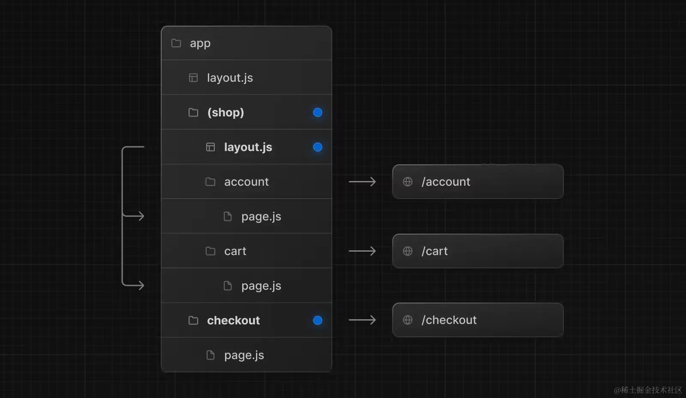
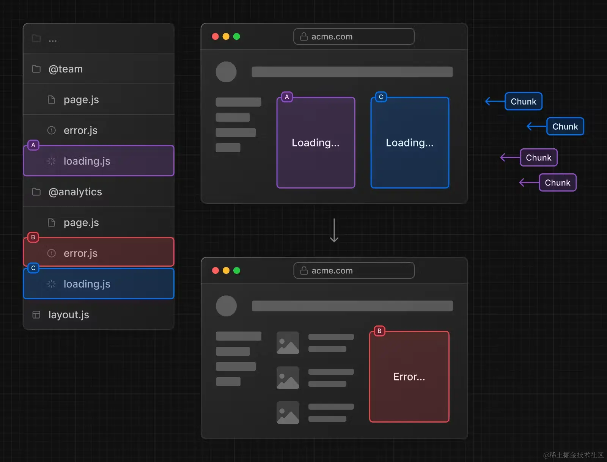

## App Route结构
```
src/
└── app
    ├── page.js 
    ├── layout.js
    ├── template.js
    ├── loading.js
    ├── error.js
    └── not-found.js
    ├── about
    │   └── page.js
    └── more
        └── page.js

```
## 定义页面

- app/page.js 对应路由 /
- app/dashboard/page.js 对应路由 /dashboard
- app/dashboard/settings/page.js 对应路由/dashboard/settings
- analytics 目录下因为没有 page.js 文件，所以没有对应的路由。这个文件可以被用于存放组件、样式表、图片或者其他文件。

## 定义布局

```jsx
// app/dashboard/layout.js
export default function DashboardLayout({
  children,
}) {
  return (
    <section>
      <nav>nav</nav>
      {children}
    </section>
  )
}

```

```jsx
// app/dashboard/page.js
export default function Page() {
  return <h1>Hello, Dashboard!</h1>
}

```


>  你可以发现：同一文件夹下如果有 layout.js 和 page.js，page 会作为 children 参数传入 layout。换句话说，layout 会包裹同层级的 page
### 根布局
布局支持嵌套，最顶层的布局我们称之为根布局（Root Layout），也就是 app/layout.js。它会应用于所有的路由
```jsx
// app/layout.js
import './globals.css'
import { Inter } from 'next/font/google'

const inter = Inter({ subsets: ['latin'] })

export const metadata = {
  title: 'Create Next App',
  description: 'Generated by create next app',
}

export default function RootLayout({ children }) {
  return (
    <html lang="en">
      <body className={inter.className}>{children}</body>
    </html>
  )
}
```
- app 目录必须包含根布局，也就是 app/layout.js 这个文件是必需的。
- 根布局必须包含 html 和 body标签，其他布局不能包含这些标签。如果你要更改这些标签，不推荐直接修改，参考《Metadata 篇》。
-  你可以使用路由组创建多个根布局。
- 默认根布局是服务端组件，且不能设置为客户端组件。

## 定义模板
模板类似于布局，它也会传入每个子布局或者页面。但不会像布局那样维持状态
```jsx
// app/template.js
export default function Template({ children }) {
  return <div>{children}</div>
}
```
layout 会包裹 template，template 又会包裹 page

## 定义加载页面

```jsx
// app/dashboard/loading.js
export default function DashboardLoading() {
  return <>Loading dashboard...</>
}
```
```jsx
// app/dashboard/page.js
async function getData() {
  await new Promise((resolve) => setTimeout(resolve, 3000))
  return {
    message: 'Hello, Dashboard!',
  }
}
export default async function DashboardPage(props) {
  const { message } = await getData()
  return <h1>{message}</h1>
}

```
要实现loading效果，上面必须使用async导出，除了这种方式，还可以使用如下这种方式

```jsx
// /dashboard/about/page.js
import { use } from 'react'

async function getData() {
  await new Promise((resolve) => setTimeout(resolve, 5000))
  return {
    message: 'Hello, About!',
  }
}

export default function Page() {
  const {message} = use(getData())
  return <h1>{message}</h1>
}

```

如果一个文件夹下既有layout.js,又有template.js又有loading.js，那么它们之间的层级关系是如何的？


## 定义错误处理
> 错误组件必须是客服端组件
特殊文件error.js,简单来说就是给page.js和children包了一层ErrorBoundary

```jsx
'use client' // 错误组件必须是客户端组件
// dashboard/error.js
import { useEffect } from 'react'
 //reset方法是error.js中提供的，帮助尝试从错误中恢复
export default function Error({ error, reset }) {
  useEffect(() => {
    console.error(error)
  }, [error])
 
  return (
    <div>
      <h2>Something went wrong!</h2>
      <button
        onClick={
          // 尝试恢复
          () => reset()
        }
      >
        Try again
      </button>
    </div>
  )
}

```
根据层级管理，我们可以很容易看出，同层级下的layout.js和template.js中如果发生了报错，error.js是无法捕获到这个错误第的，所以next提供了全局错误处理`global-error.js`,`global-error.js`会包裹整个应用，而且当它触发的时候，它会替换掉根布局的内容，所以也要定义`html`和`body`标签
```jsx
'use client'
// app/global-error.js
export default function GlobalError({ error, reset }) {
  return (
    <html>
      <body>
        <h2>Something went wrong!</h2>
        <button onClick={() => reset()}>Try again</button>
      </body>
    </html>
  )
}

```

## 定义404页面
next项目默认的404页面：

如果你要修改默认的404页面，你可以这样：
```jsx
import Link from 'next/link'
 
export default function NotFound() {
  return (
    <div>
      <h2>Not Found</h2>
      <p>Could not find requested resource</p>
      <Link href="/">Return Home</Link>
    </div>
  )
}

```
关于 app/not-found.js 一定要说明一点的是，它只能由两种情况触发：<br>
1. 当组件抛出了 notFound 函数的时候
2. 当路由地址不匹配的时候
---
如果`not-found.js`文件放到了任何的子文件夹下，它只能够使用`notFound`函数手动出发了，比如：
```jsx
// /dashboard/blog/page.js
import { notFound } from 'next/navigation'

export default function Page() {
  notFound()
  return <></>
}

```
执行 notFound 函数时，会由最近的 not-found.js 来处理。但如果直接访问不存在的路由，则都是由 app/not-found.js 来处理。