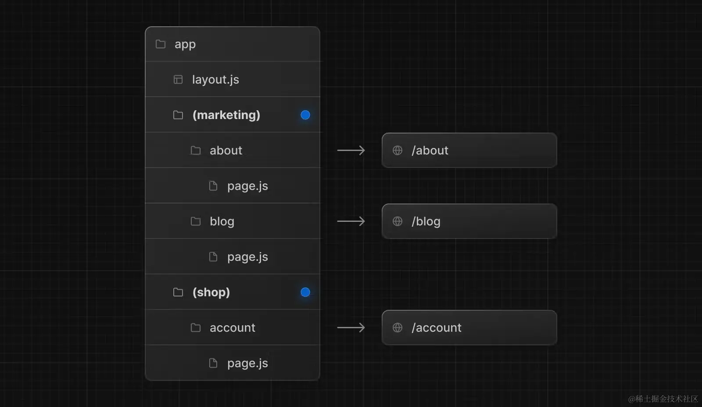
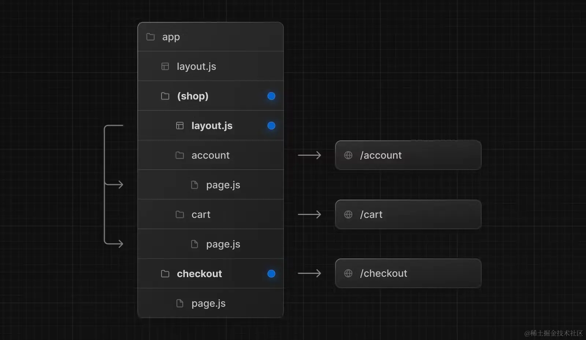
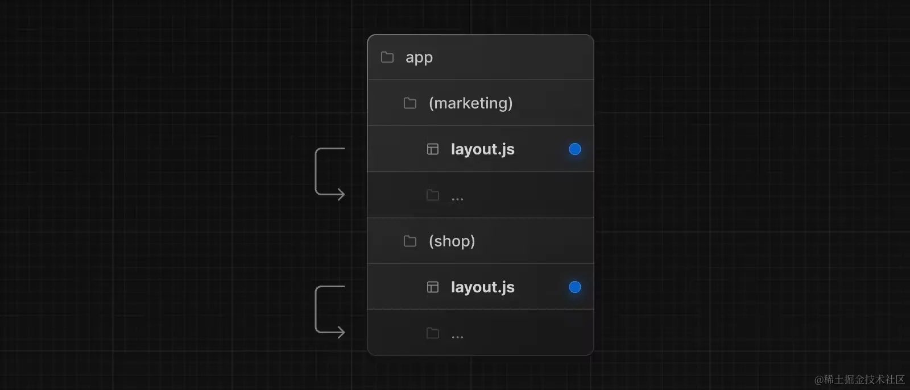
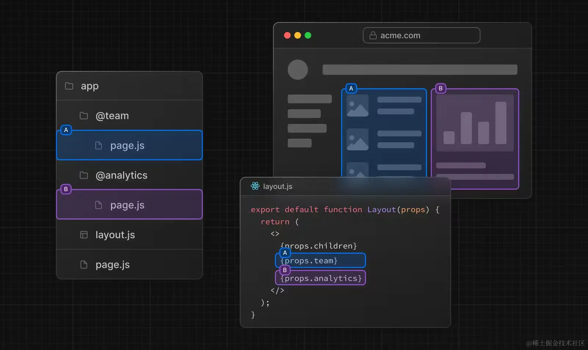
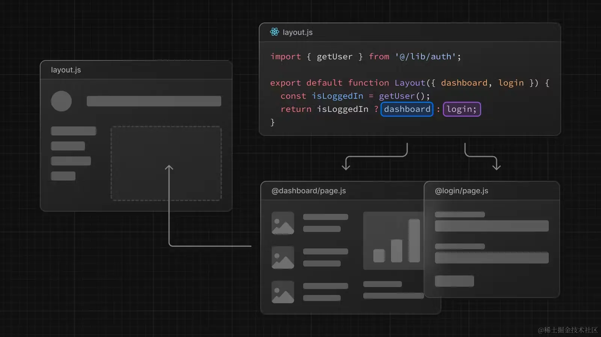
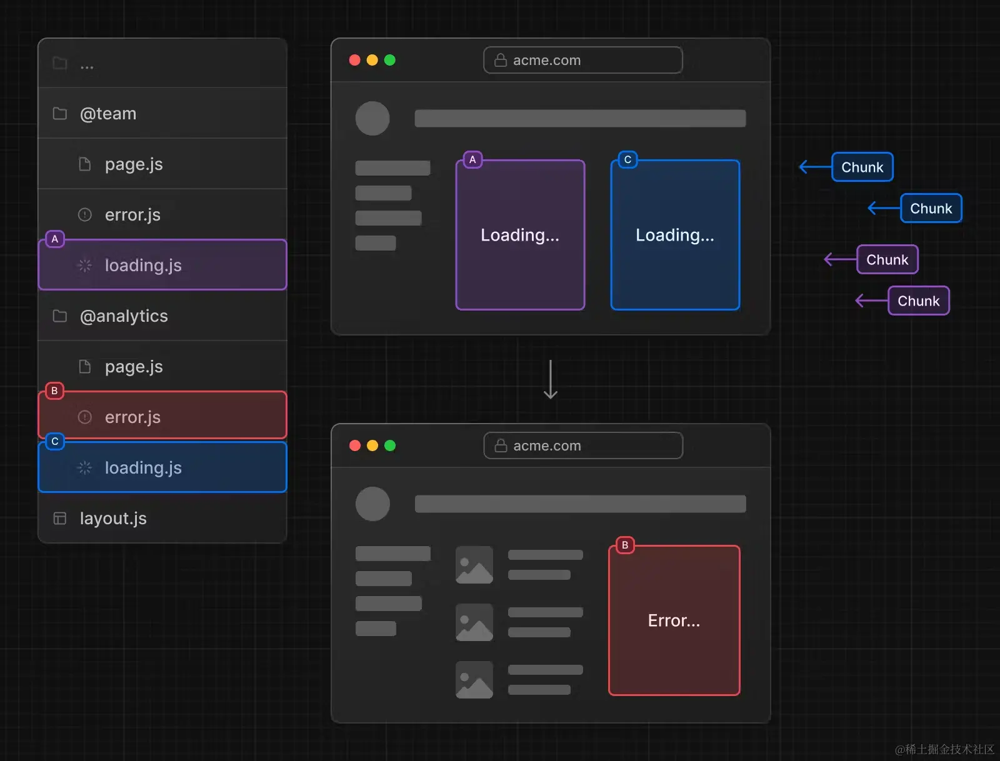
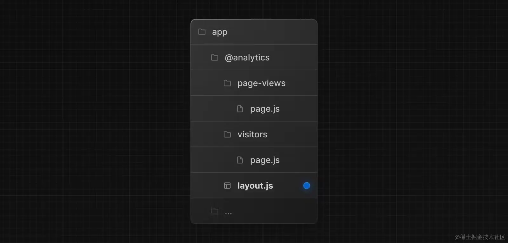
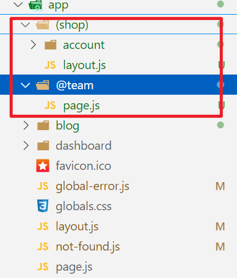

## 动态路由
### [folderName]
```jsx
// app/blog/[slug]/page.js
export default function Page({ params }) {
  return <div>My Post: {params.slug}</div>
}

```
当你访问 /blog/a的时候，params 的值为 { slug: 'a' }。
当你访问 /blog/yayu的时候，params 的值为 { slug: 'yayu' }
### [...folderName]
在命名文件夹的时候，如果你在方括号内添加省略号，比如 [...folderName]，这表示捕获所有后面所有的路由片段。
也就是说，app/shop/[...slug]/page.js会匹配 /shop/clothes，也会匹配 /shop/clothes/tops、/shop/clothes/tops/t-shirts等等。
### [[...folderName]]
在命名文件夹的时候，如果你在双方括号内添加省略号，比如 [[...folderName]]，这表示可选的捕获所有后面所有的路由片段。它与上一种的区别就在于，不带参数的路由也会被匹配（就比如 /shop）
## 路由组
在app目录下，文件夹名称通常被映射到URL中，但是你可以将文件夹标记为路由组，阻止文件夹名称被映射到URL中。
### 按照逻辑分组
将路由按逻辑分组，但不影响 URL 路径：

### 创建不同布局
借助路由组，即便是在同一层级，也可以创建不同的布局。

在这个例子中，/account 、/cart、/checkout 都在同一层级。但是 /account和 /cart使用的是 /app/(shop)/layout.js布局和app/layout.js布局，/checkout使用的是 app/layout.js
### 创建多个根布局

创建多个根布局，你需要删除app/layout.js,然后在每组都创建一个layout.js文件，创建的时候要注意，因为是根布局，所以要有html和body标签
## 平行路由
平行路由可以让你在同一个布局中同时或者有条件的渲染一个或者多个页面

```javascript
// app/layout.js
// 这里我们用了 ES6 的解构，写法更简洁一点
export default function Layout({ children, team, analytics }) {
  return (
    <>
      {children}
      {team}
      {analytics}
    </>
  )
}
```
### 用途1：条件渲染

### 用途2：独立路由处理
平行路由可以让你为每个路由定义独立的错误处理页面和加载界面

### 用途3：子导航
它们也能像正常的页面一样，添加子页面，比如我们在 @analytics 下添加两个子页面：/page-views and /visitors：

平行路由跟路由组一样，不会影响 URL，所以 /@analytics/page-views/page.js 对应的地址是 /page-views，/@analytics/visitors/page.js 对应的地址是 /visitors

> tips:在同一目录级别下，同时存在路由组和平行路由可能有问题
比如：访问/account路由组会404

其中layout的内容如下
```jsx
import { Inter } from "next/font/google";
import "./globals.css";
const inter = Inter({ subsets: ["latin"] });

export const metadata = {
  title: "Create Next App",
  description: "Generated by create next app",
};

export default function RootLayout({ children,team }) {
  return (
    <html lang="en">
      <body className={inter.className}>
				{team}
				{children}
				</body>
    </html>
  );
}
```
### default.js
...待写
## 拦截路由
...待写

