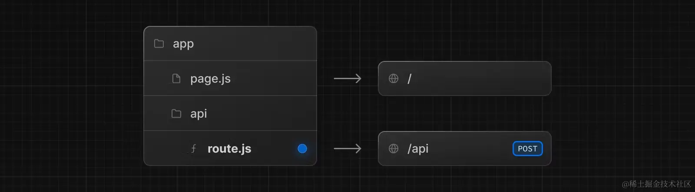
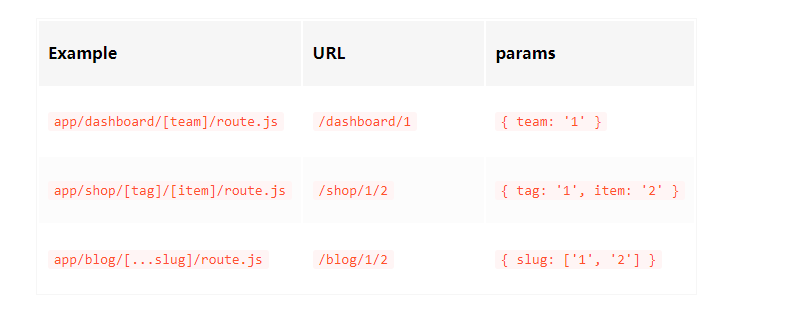

## 定义路由处理程序

该文件必须在 app目录下，可以在 app 嵌套的文件夹下，但是要注意 page.js和 route.js不能在同一层级同时存在。
例如：
```jsx
//app/api/posts.route.js
import {NextResponse} from "next/server"

export async function GET(){
	const res = await fetch('https://jsonplaceholder.typicode.com/posts')
  const data = await res.json()
  //这里也可以写成： return Response.json({ data })，NextResponse是基于Response的封装，ts支持更加友好
  return NextResponse.json({ data },{status:201})
}
```
访问/api/posts地址即可获取到对应的数据
### 支持方法
```javascript
// route.js
export async function GET(request) {}
 
export async function HEAD(request) {}
 
export async function POST(request) {}
 
export async function PUT(request) {}
 
export async function DELETE(request) {}
 
export async function PATCH(request) {}
 
// 如果 `OPTIONS` 没有定义, Next.js 会自动实现 `OPTIONS`
export async function OPTIONS(request) {}

```
### 传入参数
```javascript
export async function GET(request, context) {
  //  访问 /home, pathname 的值为 /home
	const pathname = request.nextUrl.pathname
	// 访问 /home?name=lee, searchParams 的值为 { 'name': 'lee' }
	const searchParams = request.nextUrl.searchParams
}

```
#### request参数
request对象是一个NextRequest对象，它是基于web request api的扩展，使用request可以快捷读取cookies和处理URL
#### context参数
目前context 只有一个值就是 params，它是一个包含当前动态路由参数的对象。
```javascript
// app/dashboard/[team]/route.js
export async function GET(request, { params }) {
  const team = params.team
}

```
当访问 /dashboard/1 时，params 的值为 { team: '1' }

## 缓存行为
### 默认缓存
默认情况下，使用 Response 对象（NextResponse 也是一样的）的 GET 请求会被缓存
```javascript
//app/api/posts.route.js
export async function GET(){
	console.log('GET /api/time')
  return Response.json({ data: new Date().toLocaleTimeString() })
}
```
在开发模式下，并不会被缓存，每次刷新时间都会改变，每次访问/api/posts，发现接口返回值都会刷新
**现在我们部署生产版本，运行 npm run build && npm run start：**,之后访问路径，发现不会被刷新了
### 退出缓存
实际上，默认缓存的条件是非常“严苛”的，这些情况都会导致退出缓存：
- GET 请求使用 Request 对象
```javascript
export async function GET(request) {
  const searchParams = request.nextUrl.searchParams
  return Response.json({ data: new Date().toLocaleTimeString(), params: searchParams.toString() })
}

```
- 添加其他 HTTP 方法，比如 POST
```javascript
export async function GET() {
  console.log('GET /api/time')
  return Response.json({ data: new Date().toLocaleTimeString() })
}

export async function POST() {
  console.log('POST /api/time')
  return Response.json({ data: new Date().toLocaleTimeString() })
}

```
- 使用了像cookies、headers这样的动态函数
```javascript
export async function GET(request) {
  const token = request.cookies.get('token')
  return Response.json({ data: new Date().toLocaleTimeString() })
}

```
此时会转为动态渲染。这是因为 cookies、headers 这些数据只有当请求的时候才知道具体的值。
- 路由段配置项手动声明为动态模式
```javascript
export const dynamic = 'force-dynamic'

export async function GET() {
  return Response.json({ data: new Date().toLocaleTimeString() })
}

```
### 重新验证
除了退出缓存，也可以设置缓存的有效期，有两种方案：
- 使用路由配置项
```javascript
export const revalidate = 10

export async function GET() {
  return Response.json({ data: new Date().toLocaleTimeString() })
}

```
export const revalidate = 10 表示设置重新验证频率为 10s，但是要注意：

这句代码的效果并不是设置服务器每 10s 会自动更新一次 /api/time。而是最少 10s 后才重新验证。

举个例子，假设你现在访问了 /api/time，此时时间设为 0s，10s 内持续访问，/api/time返回的都是之前缓存的结果。当 10s 过后，假设你第 12s 又访问了一次 /api/time，此时虽然超过了 10s，但依然会返回之前缓存的结果，但同时会触发服务器更新缓存，当你第 13s 再次访问的时候，就是更新后的结果。
- 使用请求的配置参数
```javascript
export async function GET() {
  const res = await fetch('https://api.thecatapi.com/v1/images/search', {
    next: { revalidate: 5 }, //  每 5 秒重新验证
  })
  const data = await res.json()
  console.log(data)
  return Response.json(data)
}

```