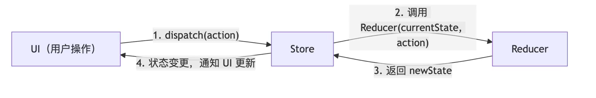

## 介绍
redux是单向数据流的
## 结构图

## reducer
是一个纯函数，它负责对变化进行分发和处理，最终将新的数据返回给Store
## store
它是一个单一数据源，而且是只读的
## action
是"动作"的意思，是一个它是对变化的描述：
```javascript
 {
    type: 'todos/todoAdded',
    payload: text
  }
```
- 必须包含一个type字段，用来描述将要发生什么
- 可以携带一些用来更新数据的信息，这部分通常被称为payload
## dispatch
> 更新state的唯一方法是调用store.dispatch()并传入一个action对象(最终是调用了reducer函数)