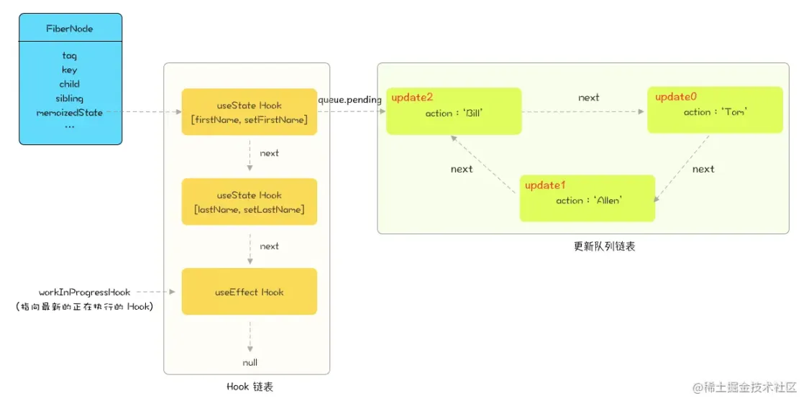
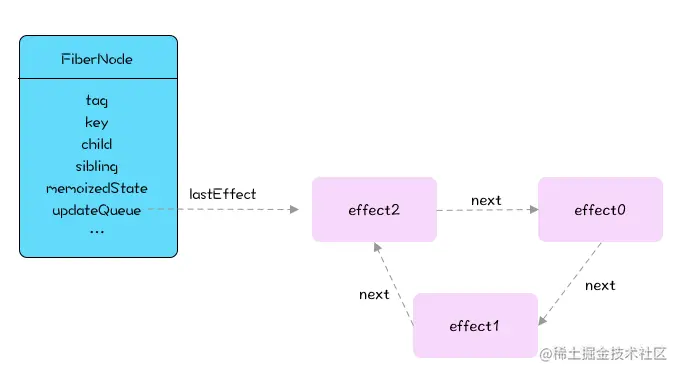
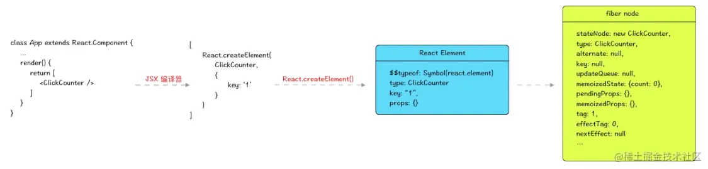
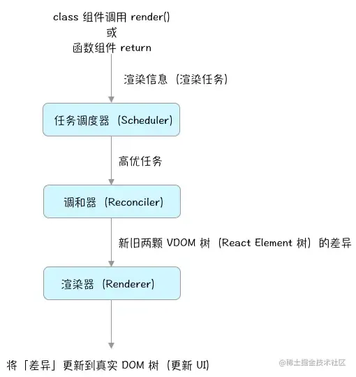

## memoizedState属性

memorizedState保存的hook结构：
```javascript
hook={
  //保存每次setState的环状链表
  queue:{
    pending:null
  },
  //传递给hook的初始值，比如useState对应的是intialState，useCallback对应的是intialCallback
  memorizedState:baseState,
  //与下一个hook形成无环列表
  next:null,
}
//updat对象保存的相关属性(简化版本)
const update = {
  // 更新执行的函数
  action,
  // 与同一个Hook的其他更新形成链表
  next: null,
};
```
需要区分hook对象的memoizedState和fiber的memoizedState属性，前者主要记录hook对象的信息(如state,callback或者是依赖项等)，后者存储的是hook对象链表
## updateQueue属性
> 注意与hook.queue.pending的区别，FiberNode.updateQueue只针对类组件的批量更新

- 批量更新，在一次更新操作中，React会遍历updateQueue链表，合并相同类型的更新操作，只执行最新的更新，这样可以提高更新的效率和性能
- 异步更新：当组件处于concurrent模式下的时候，React可以根据更新的优先级和时间片来进行适当的渲染工作

## React Fiber和React Element之间的联系

## React 架构
react15：jsx——>render function——>vdom
react16:jsx——> render function——>vdom——>fiber

```tsx
const App=()=>{
  const [state1,setState1]=React.useState(0)
  const [state2,setState2]=React.useState(0)

  const changeState=()=>{
    setState1(state=>state+1)
    setState1(state=>state+1)
    setState2(state=>state+1)
    setState2(state=>state+1)
  }
  return <div>
  <button onClick={changeState}>change state</button>
  </div>
}
```
## 调度器Scheduler
作用:通过优先级调度和时间切片的方式，来对组件的更新和渲染进行调度和分片处理。
根据任务的优先级和时间片的大小决定哪些任务应该优先执行，哪些应该等待下一轮空闲时间再执行。
> 在react 应用中，每次跟新或者渲染都会产生一系列任务，例如计算组件的输入参数值、比较virtual Dom的差异、进行DOM渲染等。这些任务需要在渲染帧之间均衡地分配时间，因此需要使用任务调度器控制任务调度和执行的顺序。

## setState执行流程
### 基本流程

1. 将setState传入的partialState参数存储在当前组件实例的state暂存队列中。
2. 判断当前react是否处于批量更新状态，如果是，将当前组件加入到待更新的组件队列中。
3. 如果未处于批量更新状态，将批量更新状态标识为true,用事务再次调用前一步方法，保证当前组件加入到了待更新组件队列中。
4. 调用事务的waper方法，遍历待更新组件队列依次执行更新。
5. 执行生命周期componentWillReceiveProps
6. 将组件的state暂存队列中的state进行合并，获得最终要更新的staet对象，并将队列置为空。
7. 执行生命周期函数componentShouldUpdate，根据返回值判断是否要继续更新。
8. 执行生命周期函数componentWillUpdate
9. 执行真正的更新，render
10. 执行生命周期函数componentDidUpdate
### 不同场景下setState
#### 钩子函数和合成事件中
在react的生命周期和合成事件中，react仍然处于它的更新机制中，这时候isBranchUpdate为true。
无论调用多少次setState，都不会执行更新，而是将要更新的state存入到_pendingStateQueue，将要更新的组件存入dirtyComponent。
当上一次更新机制执行完毕，以生命周期为例，所有组件，即最顶层组件didmount后会将isBranchUpdate设置为false,这时将之前积累的setState。
#### 异步函数和原生事件中
setState本身并不是异步的，而是如果在调用setState时，如果react正处于更新过程，当前更新会被暂存，等到上一次更新执行之后再执行，这个过程给人一种异步的假像。
在生命周期，根据js的异步机制，会将异步函数先暂存，等到所有同步代码执行完毕之后再执行，这时候上一次更新过程已经执行完毕，isBranchUpdate被设置为false
合成事件和钩子函数中，会进行批量更新优化,在里面state是异步的，而在原生事件和setTimeout、Promise.resolve.then()中都是同步的。
```tsx
interface IState {
  count1: number;
  count2: number;
}
class App extends React.Component<any, IState> {
  constructor(props: any) {
    super(props);
    this.state = { count1: 0, count2: 0 };
  }
  render() {
    console.info("render");
    return (
      <div>
        <button
          onClick={() => {
            Promise.resolve().then((res) => {
              this.setState({ ...this.state, count1: this.state.count1 + 1 });
              this.setState({ ...this.state, count2: this.state.count2 + 1 });
            });
          }}
        >
          test
        </button>
      </div>
    );
  }
}
//在Promise.resolve.then中改变两次state,视图会重新render两次
//如果点击回调改成这样，就会重新render一次

  onClick={()=>{
          this.setState({...this.state,count1:this.state.count1+1});
          this.setState({...this.state,count2:this.state.count2+1});
        }}
```
#### partialState合并机制
这个函数是用来合并state暂存队列的，最后返回一个合并后的state。
对于setState，如果传入的不是一个函数，只会被合并一次。
对于setState，如果传入的是一个函数，则函数的preState是前一次合并后的结果，所以计算结果是准确的。
#### componentDidMount调用setState
官方文档建议不要直接在ComponentDidMount中调用setState，这是由于该函数会在已经渲染完毕之后才会被调用，也就是函数已经渲染完毕之后才会被调用，调用setState会触发一次重新渲染，另一方面，也会触发子组件的componentDidUpdate函数的执行。
大部分情况下，可以设置初始值来搞定，当然，如果视图依赖state，我们可以在componentDidMount中调用接口，修改state。

#### componentWillUpdate,componentDidUpdate
这两个生命周期中不能够调用setState，因为在这里面调用setState容易造成死循环。导致程序崩溃。

## 好文推荐
结合此文章食用效果更佳
https://juejin.cn/post/6944863057000529933?searchId=20250623215908B33E2D7A4E297C1E3F0B#heading-8