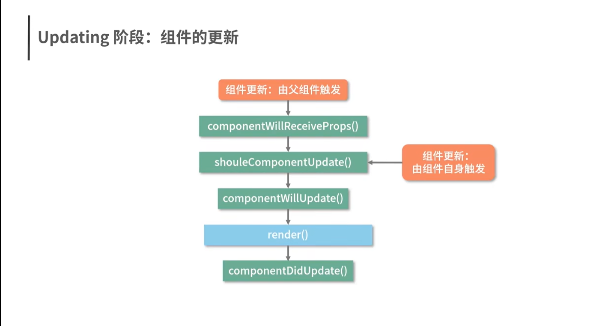
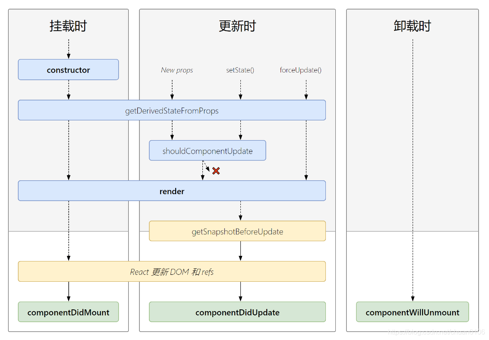

## React15生命周期
### 更新阶段涉及的生命周期函数
componentWillReceiveProps方法并不是因为props的变化而触发的，而是父组件的更新而触发的，也就是说即使父组件不给子组件传递props，父组件更新，子组件照样也会更新，这同样也适用于react16以及以上的版本

### 组件的卸载
分成两种情况：
- 组件在父组件中被移除了
- 组件中设置了key属性，父组件在render过程中，发现key值和上次不一样了
## React16生命周期
如图是React16.3版本的生命周期

> getDerivedStateFromProps有且只有一个用途，就是使用props派生/更新state,同时注意getDerivedStateFromProps是一个静态方法，不能够通过this访问到组件的一些属性，getDerivedStateFromProps方法对state的更新操作，并非"覆盖式"的更新，而是针对某个属性的定向更新。
### 为什么使用getDerivedStateFromProps代替componentWillReceiveProps？
getDerivedState只专注于做一件事情(限制更多)，而且从getDerivedStateFromProps方法是个静态方法就可以看出来，getDerivedStateFromProps方法不像componentWillReceiveProps一样，getDerivedStateFromProps不能够拿到this，也就是说它不可以通过this.setState产生一些副作用。