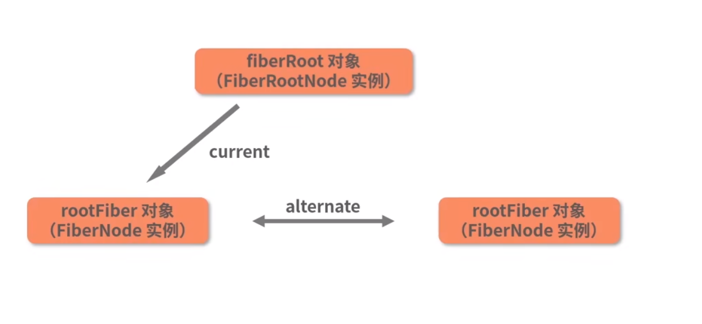

## 初始化阶段
```javascript
fiberRoot对象(FiberRootNode实例)---(current)->rootFiber对象(FiberNode实例)

开始的时候子节点比如(App函数)会挂载到fiberRoot.memoizedState上
```
## render阶段
- workInProgress节点其实就是current节点(即rootFiber)的副本
- 通过循环调用performUnitOfWork来触发beginWork，新的fiber节点就会被不断地创建。

## Fiber架构一定就是异步渲染的吗?
从动机上来看，Fiber架构的设计确实是为了Concurrent模式而存在，Fiber架构在React中并不能够和异步渲染画严格的等号，它是一种同时兼容同步渲染和异步渲染的设计(注意React18之前的，react16之后的react还是采用的legacy模式，react18完全支持concurrent模式)