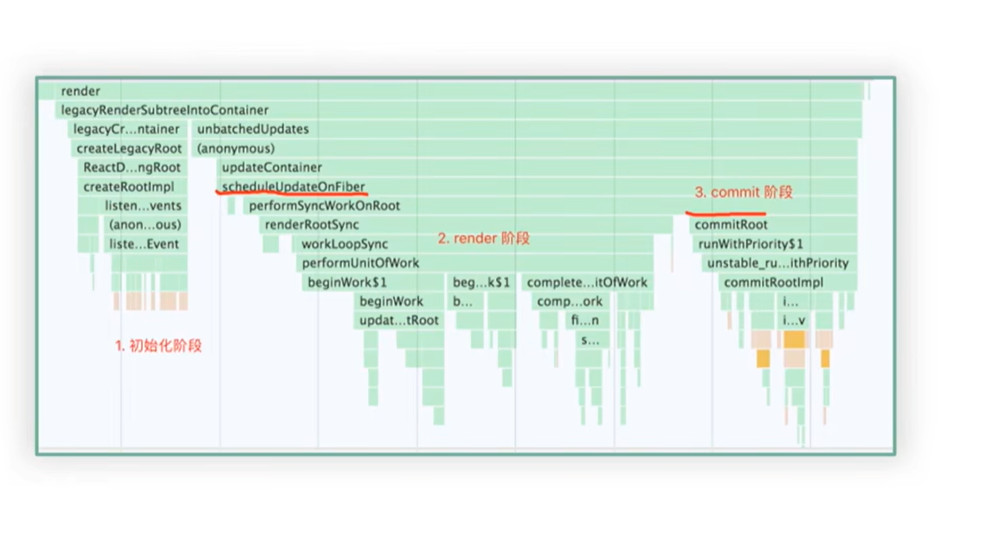
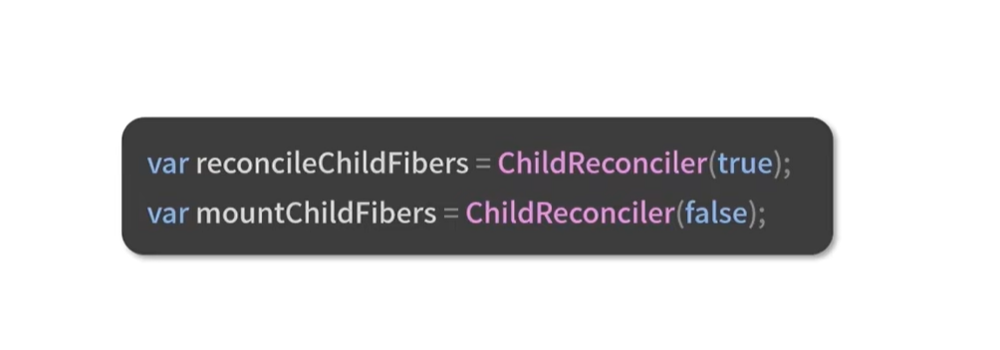
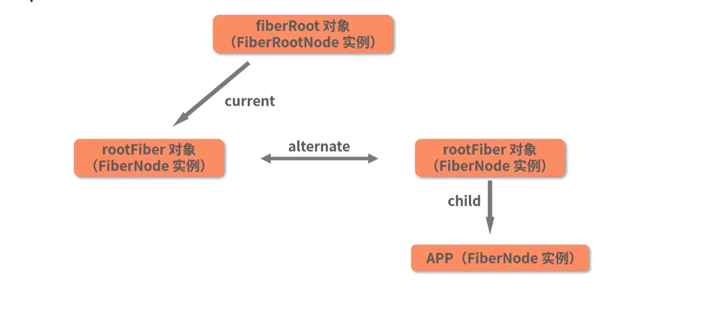

## 渲染流水线

## render过程中的异常处理和恢复机制
在react渲染Fiber树的时候如果遇到了异常有机会重试或者降级，而不是直接导致整个应用崩溃，比如ErrorBoundary、Suspense等机制实现
```javascript
do{
    try{
        workLoop(isYieldy);
    }catch(err){
        //重置hooks,context等
        resetHooks();
         if (nextUnitOfWork === null) {
            //...
         }else{
            if(符合某些条件){
                nextUnitOfWork = completeUnitOfWork(sourceFiber);
                //通过continue继续workLoop
                continue;
            }
         }
    }
    break;
}while(true);
```
## performaceUnitOfWork方法
通过循环调用performUnitOfWork方法来触发beginWork方法，新的Fiber节点就会不断被创建
```javascript
function workLoopSync(){
    while(workInProgress!==null){
        perfomaceUnitOfWork(workInProgress);
    }
}
```
## 第一次beginWork
在react首次渲染时，进入到render阶段之前已经存在了fiberRoot对象和current树的FiberRoot对象，因此第一次beginWork的时候，也就是创建workInProgress树的FiberRoot对象时，执行的是update逻辑。
## beginWork
- beginWork的入参是一对alternate连接起来的workInProgress和current节点
- 开启Fiber节点创建过程(传入Fiber，创建子Fiber)
    - 通过调用reconcileChildren方法，生成当前节点的子节点(这个方法会根据current是否为null判断进入到mount阶段还是update阶段)
        - 如果current为null:
        ```javascript
        workInProgress.child=mountChildFibers(workInProgress,null,...)
        ```
        - 如果current不为空:
        ```javascript
        workInProgress.child=reconcileChildFibers(workInProgress,current.child,...)
        ```
    - 在mount和update阶段都会调用ChildReconciler，这个方法的入参是布尔值(表示是否要处理副作用)，返回reconcilerChildFibers和mountChildFibers两个不同的函数，<font style="color:#fff;background-color:green">这两个函数的不同在于对副作用的处理不同</font>
    
    - ChildReconciler中定义了大量的形如placeXXX，deleteXXX,updateXXX,reconcileXXX等这样的函数，这些函数覆盖了对Fiber节点的创建，增加，删除，修改等操作，将直接或者间接被reconcileChildFibers调用
- rootFiber可以看作是App组件的父节点

## completeWork
completeWork的工作内容：负责处理Fiber节点到DOM节点的映射逻辑。
### completeWork内部有3个关键动作
- 创建DOM节点
- 将DOM节点插入到DOM树中
- 创建好的DOM节点将会被赋值给workInProgress节点的stateNode属性
- 将DOM节点插入到DOM树的操作是通过appendAllChildren函数来完成的
### completeUnitOfWork--开启收集EffectList的“大循环”
- 针对传入的当前节点，调用completeWork
- 将当前节点的副作用链插入到其父节点对应的副作用链中
- 以当前节点为起点，循环遍历其兄弟节点以及其父节点
## beginWork和completeWork调用顺序问题
- 对于一个Fiber节点，首先beginWor k
- 判断这个节点是否有Child：
    - 如果有child节点则进入到child节点的beginWork阶段
    - 如果没有,则判断是否有当前节点的sibling节点：
        - 如果有则进入到sibling节点的beginWork阶段
        - 如果没有则"归"到当前父节点的completeWork阶段
## 副作用链(effectList)的设计与实现
副作用链可以理解为render阶段"工作成果"的一个集合
- Fiber节点的effectList里面记录的是其需要更新的后代节点(对应completeUnitOfWork的第二点，这样当所有的节点都执行完毕completeWork工作之后，则rootFiber节点的effectList中就含有所有副作用的节点了)
- Fiber节点的effectList里面记录的是有副作用的节点

## 优先级调度
### 时间戳
- react的调度时间本质上是一个“过期时间戳”，用来决定不同更新任务的优先级和调度顺序
    - 每个更新（如 setState、props 变化）都会被分配一个 expirationTime
    - expirationTime 越大，优先级越高（同步任务最大）
- 如果是同步任务，比如事件处理，生命周期，expirationTime 取最大值（Sync）
- 如果是异步任务，比如setTimeout，数据请求，expirationTime 会比 currentTime 小一些，表示可以延后处理。

> TODO: 时间调度&时间分桶算法