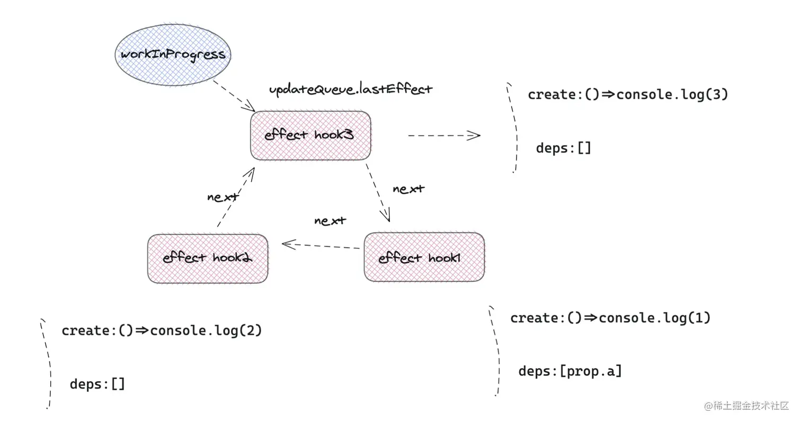

## mountEffect
创建update对象，挂载到fiber.updateQueue队列中<br>
比如下面的三个useEffect hook
```javascript
useEffect(()=>{
    console.log(1)
},[ props.a ])
useEffect(()=>{
    console.log(2)
},[])
useEffect(()=>{
    console.log(3)
},[])
```

### effectList
上面提到的updateQueue保存的单向链表
- 在render阶段，深度优先搜索遍历完fiber树之后，最终在fiber root上生成一条只带副作用的effect list链表
- 在commit阶段，通过遍历effect list，根据每个effect节点的effectTag类型，执行相应的dom更改

## useEffect对应的hook对象结构

## useEffect图解
https://www.yuque.com/clannadafterstory/wkbgyg/ea8om5xgydci5ykm#cdY0P

## 副作用执行
副作用的执行是在commit阶段，在执行副作用队列之前，react会将执行动作包装成一个异步任务，在不同环境下，react会通过不同方式实现异步功能，浏览器环境下优先使用MessageChannel(postMessage),如果没有就是用setTimeout，在polyfill或者测试环境下，甚至会用 fakeNode等技术


为什么优先使用MessageChannel(postMessage)?
1. 这种方式比setTimeout更快
2. 不会被浏览器throttle,页面在后台，或者标签页未激活的情况下，会降低定时器触发频率甚至暂停

> fakeNode:是一种 hack 技术，用于在没有 MessageChannel 的环境下模拟异步调度。比如创建一个 DOM 节点，监听它的事件，触发事件来模拟异步回调。