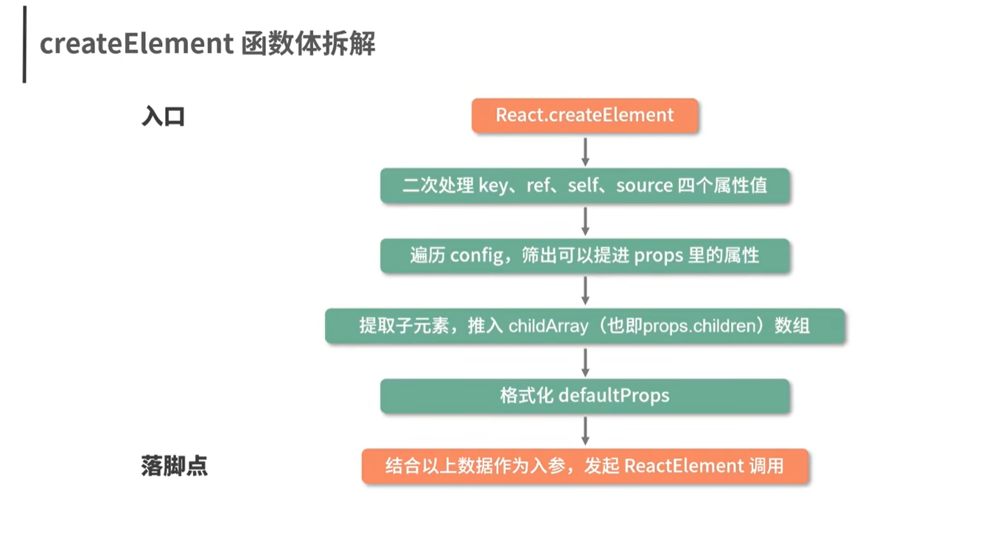
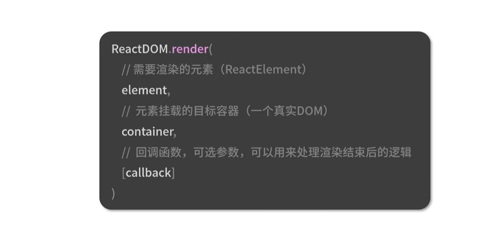
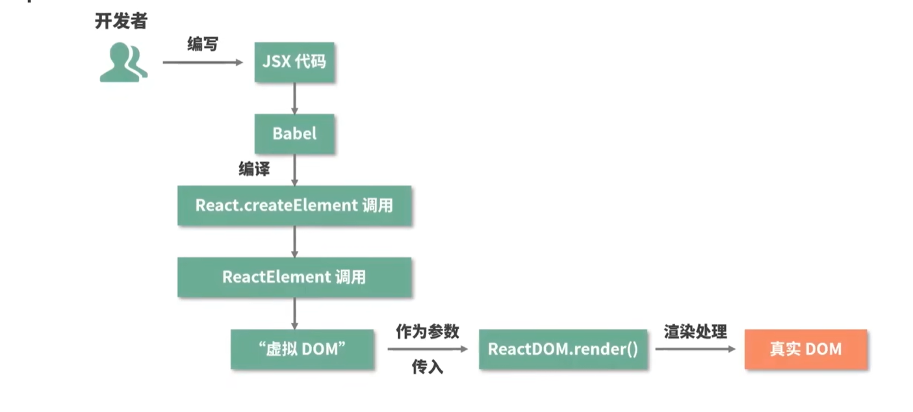

## React.createElement方法
React.createElement方法主要是进行参数的格式化

### ReactElement方法
将传入的参数，比如props,type等封装成为一个对象并返回，返回的这个js对象就是对dom的一个描述,可以视ReactElement方法就是一个对象
## ReactDOM.render方法
ReactDOM.render方法：将虚拟dom转换为真实dom，<mark>**注意这里的ReactDOM.render方法并不等同于组件中的render方法,组件生命周期中的render方法只是将虚拟dom返回**</mark>

## 总结
