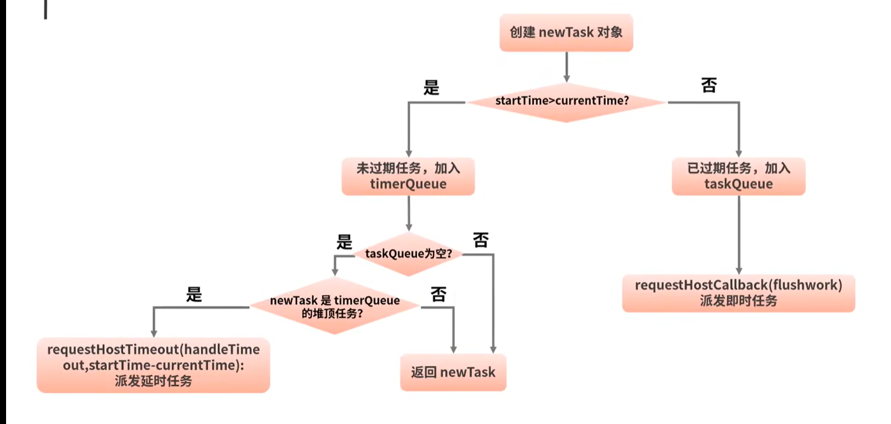

## 相关概念
- startTime:任务的开始时间
- expirationTime:expirationTime越小，任务优先级越高
- timerQueue:一个以startTime为排序依据的小顶堆，它存储的是startTime大于当前时间(也就是待执行)的任务
- taskQueue:一个以exprationTime为排序依据的小顶堆，它存储的startTime小于当前时间(也就是已经过期)的任务
## 流程图
通过调用unstable_scheduleCallback来发起调度，结合任务的优先级信息为其执行不同的调度逻辑。

针对上图中requestHostCallback派发即时任务，并不意味着就是同步执行任务，而是通过MessageChannel,setTimeout派发任务，最早也要等到下一次事件循环
