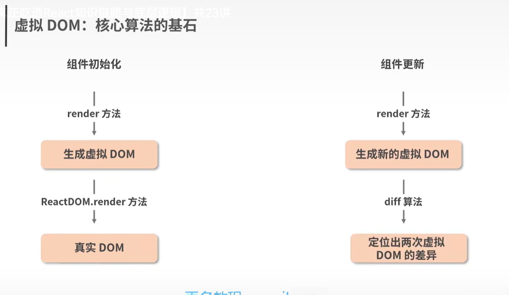
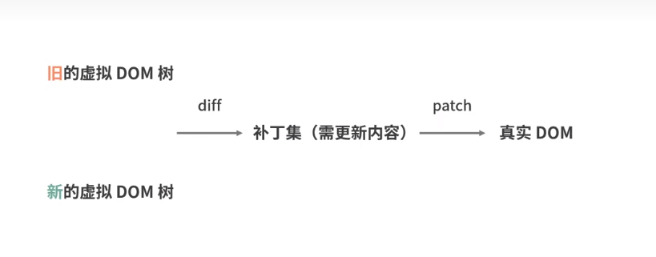

## 虚拟DOM
**定义**:本质上就是js和dom之间的一个映射缓存，在形态上表现为一个能够描述DOM结构及其属性信息的JS对象

## 虚拟DOM在不同阶段的作用
- 挂载阶段：React将结合jsx的描述，构建出虚拟DOM树，然后通过ReactDOM.render实现虚拟DOM到真实DOM的映射(触发渲染流水线)
- 更新阶段：页面的变化会先作用于虚拟DOM，虚拟DOM将在JS层借助算法先比对出具体有哪些真实的DOM需要被改变，然后再将这些改变作用于真实DOM
## 虚拟DOM是如何解决问题的?

虚拟DOM和Redux一样，不依附于任何具体的框架
## 虚拟DOM的价值？
- 研发效率/体验问题
- 跨平台问题
- 解决批量更新带来的频繁操作dom引起的回流重绘问题，虚拟dom是一次commit
## ReactDiff算法的要点
1. Diff算法只会同层进行
2. 类型一致的节点才有继续diff的必要性
3. key属性的设置，可以帮助我们尽可能重用同一层级的节点

## React何时重用节点(针对setCount的情况)
- 首次挂载的时候，会创建整棵WorkInProgress树，此时的current树只有FiberRoot节点以及rootFiber节点,
- 第一次更新的时候，workInProgress树的rootFiber.alternate不为空，会复用一个节点，然后剩余的子节点都不存在，没有alternate属性指向current树，所以第一次更新的时候，只会复用一个节点，其他节点都会重新创建
- 第二次更新的时候，此时workInProgress树和current树alternate相互连接，此时构建workInProgress树的时候就会去尝试复用对应的alternate的current中的节点。