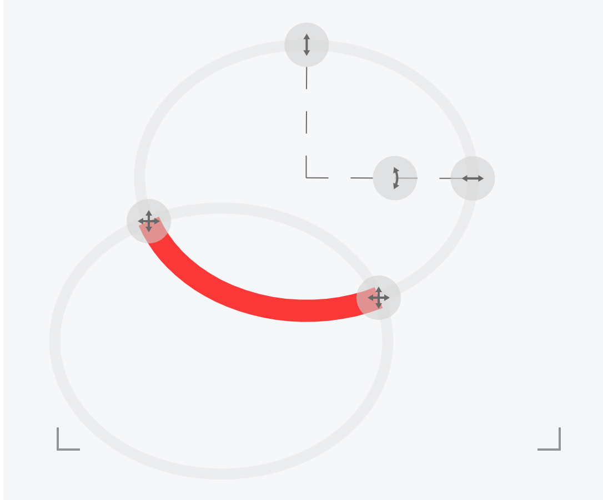

## xmlns属性
http://www.w3.org/2000/svg是W3C为SVG定义的固定命名空间标识符。它告诉浏览器或解析器，这个元素及其子元素应按照SVG规范来解析和渲染。
```html
<svg xmlns="http://www.w3.org/2000/svg">
    </svg>
```

浏览器兼容性：

现代浏览器：在 HTML5 文档中内联 SVG 时可能允许省略

旧浏览器/特定环境：必须声明才能正确渲染（尤其是 IE）

通常推荐加上

## svg的使用方式
1. 通过img标签，引入svg文件
2. 直接在html中写入svg标签

## 如何缩放SVG图像
SVG中的viewBox属性定义了SVG内部的坐标系统和可见区域，它是一个由四个值（min-x, min-y, width, height）组成的矩形区域。 你可以将其理解为一个虚拟的“画布窗口”，定义了用户空间中的哪个部分将被映射到SVG元素的物理显示区域（视口）上

如果我们设置min-x,min-y为0,0，那么对应的坐标系和svg初始值是一样的
```html
	<svg
			width="200"
			height="200"
			viewBox="0 0 200 200"
			style={{ border: "1px solid black" }}
		>
			<rect x="10" y="10" width="20" height="20" fill="brown" />
		</svg>
```
如果设置min-x,min-y为(-100,-100)，则rect矩阵展示的位置将会位于右下角
```html
	<svg
			width="200"
			height="200"
			viewBox="-100 -100 200 200"
			style={{ border: "1px solid black" }}
		>
			<rect x="10" y="10" width="20" height="20" fill="brown" />
		</svg>
```

## 绘制不规则图形的方案
1. path

二次贝塞尔曲线,使用绘制命令Q
```html
<svg width="300" height="150" style={{ background: "#f8f8f8" }}>
			<path
				d="M20,100 Q150,10 280,100"
				stroke="tomato"
				strokeWidth="3"
				fill="none"
			/>
		</svg>
```
三次贝塞尔曲线
其中M20,100表示移动到(20,100),控制点有(100,10)和(200,10),终点为（280,100）
```html
		<svg width="300" height="150" style={{ background: "#f8f8f8" }}>
			<path
				d="M20,100 C100,10 200,10 280,100"
				stroke="tomato"
				strokeWidth="3"
				fill="none"
			/>
		</svg>
```

2. polyline
它是一组点（通常是折线）的连接。它绘制的是开放路径，即首尾点不自动连接
```html
	<svg width="300" height="150" viewBox="0 0 300 150">
			<polyline
				points="20,30 80,100 140,30 200,100"
				fill="none"
				stroke="tomato"
				strokeWidth="3"
			/>
		</svg>
```
3. polygon
它是一组点（通常是折线）的连接。它绘制的是开放路径，即首尾点不自动连接

```html
	<svg width="300" height="150" viewBox="0 0 300 150">
			<polygon
				points="20,100 80,30 140,100 200,30"
				fill="lightblue"
				stroke="blue"
				strokeWidth="3"
			/>
		</svg>
```
4. path
svg中最强大的工具
```html
		<svg width="600" height="400">
				<path
					d="
    M150,200 
    C100,150 80,100 120,80
    C160,60 200,90 220,70
    C240,50 280,60 300,100
    C320,140 280,180 250,200
    C220,220 180,240 150,250
    C120,260 80,250 60,220
    C40,190 50,150 80,130
    C110,110 140,130 150,160
    Z
  "
					fill="#ffc53d"
					stroke="#d48806"
					stroke-width="2"
				/>
			</svg>
```

## svg中的css
位置属性和定义形状的属性必须保留在 HTML 中。但颜色、描边和字体属性可以移至 CSS

svg中特殊的css属性
```html
		<svg width="600" height="400" viewBox="-100 -100 600 400">
			<line className={style.limb} x1="-25" y1="50" x2="0" y2="-15" />
		</svg>
```
```css
.limb {
	stroke: #cd803d;
	stroke-width: 35px;
	stroke-linecap: round;
}

```

```html
	<svg width="200" height="200" viewBox="-100 -100 200 200">
			<path
				d="
        M -70 0
        L 70 0
        L 30 -50"
				fill="none"
				className={style.limb}
			/>
		</svg>

```

```css
.limb {
	stroke: #cd803d;
	stroke-width: 35px;
	stroke-linecap: round;
	stroke-linejoin: round;
}

```

## 如何使用svg绘制圆弧
使用A命令绘制圆弧，A指令有几个参数：rx(圆弧x轴的半径),ry（圆弧y轴的半径）,rotation(圆弧旋转的度数，值为0~360),large-arc-flag(大弧标记,值为0或1，0画的是小圆弧，1画大圆弧)，sweep-flag(反向画弧，值为0或1，从开始点到结束点是在下面画还是上面画),x(结束点的横坐标),y（结束点的纵坐标）
```html
<svg
  width="200"
  height="200"
  viewBox="-100 -100 200 200"
>
  <path
    d="
      M -40 -40
      A 70 70 0 0 0 40 40"
    fill="none"
    stroke="red"
    stroke-width="5"
  />
</svg>
```
