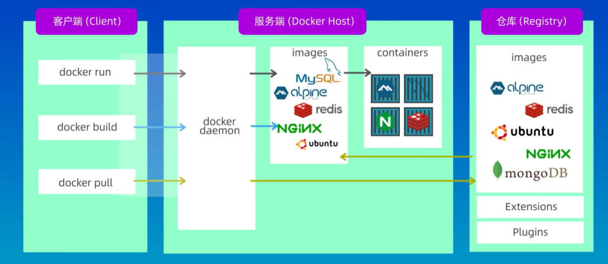
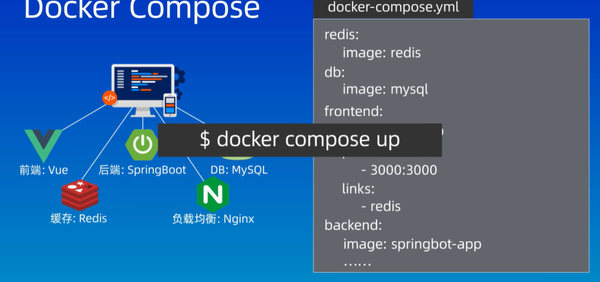

## 基本原理和概念
- 仓库集中存储和管理Docker镜像，Docker容器就是Docker镜像的实例

`docker daemon是服务端的守护线程`

## 容器化过程

1. 创建一个DockerFile
2. 使用DockerFile创建镜像
3. 使用镜像创建和运行容器
## Docker相关命令

- docker images:查看所有镜像
- docker build -t 镜像名称 .:在当前目录下构建一个镜像
- docker run 镜像名称：运行镜像
- doker pull 镜像名称：拉取docker镜像
- docker ps：查看容器的运行情况
- docker compose up:安装各种依赖和配置运行环境
- docker start 容器id：启动容器
- docker restart 容器id:重启容器
- docker pause 容器id：暂停容器中所有进程，使用docker pause命令之后如果想要使容器恢复运行，则使用docker unpause 容器id
- docker stop 容器：停止容器
- docker rm 容器:删除容器
## DockerCompose

- docker-components.yml

