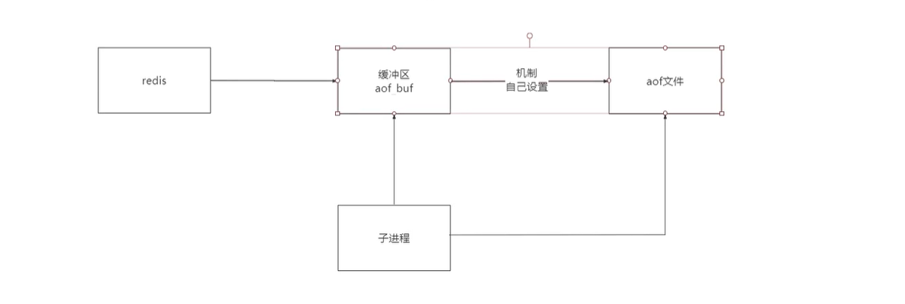
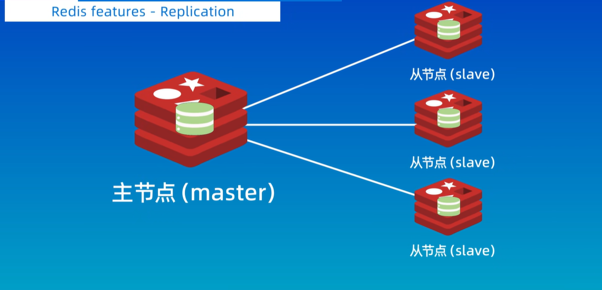

## 使用Docker来使用redis
- 使用redis必须使用docker创建并运行redis对应容器,比如:docker run -d -p 6379:6379 -v 配置文件路径 -v 外部配置文件路径:/etc/redis/redis.conf  --name 容器名称 redis redis-server 内部配置文件路径 
    - 其中/etc/redis/redis.conf指的就是内部配置文件路径
    - 其中--name redis表示手动设置配置文件中的配置，也可以通过--appendonly yes这样配置其他选项
- 如果要进入到redis-cli客服端，则需要使用docker exec -it 容器id或者容器名称 redis-cli,如果之前还设置了用户密码，则在redis-cli中使用auth 用户密码命令方可进入
- 默认中文会以十六进制的形式展示，如果想要展示中文，可以在使用docker exec命令的使用添加参数--raw
- docker exec -it 容器 /bin/bash：用于进入正在运行的 Docker 容器并打开一个交互式的 Bash 终端。
## redis-cli相关命令
- 在容器的bash下，可以通过redis-cli命令进入到redis-client，默认使用redis-cli命令连接到的是6380对应的redis服务端，如果要指定端口，可以通过redis-cli -p 端口号连接到对应的redis服务器。
- set key value
- setnx key value:设置键值对，如果键已经存在，则不做任何处理，否则新建键值对
- get key
- del key：删除key和对应的value
- exists key:判断key对应的value是否存在
- flushall:删除所有的键值对
- keys *:查看所有的键
- keys *me:查看所有以me结尾的键
- quit：退出redis客服端
- clear ：清空控制台
- ttl key:查看key键过期时间
- expire key 过期时间：给键值对设置过期时间，也可以通过setex key value 过期时间来设置过期时间和值
## 列表
- lpush letter a:表示向数组letter中push一个“a”字符串，注意，每次lpush都是将最新的元素从左到右添加，所以是从头部添加，如果想要从尾部添加，可以使用rpush命令
- lpush letter a b c d e:从左到右依次向数组letterpush多个元素
- lpop和rpop命令：表示分别从列表的头部或者尾部将元素删除
- lpop 数组名称 数字：表示用来删除多个元素
- lrange 数组名称 开始索引 结束索引：获取列表的一个片段
- llen 数组名称：用来查看数组的长度
- ltrim 数组名称 开始索引 结束索引：保留数组中[startIndex,endIndex]中的元素，其他为止的元素都删除
## 集合
Set中的元素是不可以重复的，set命令都是以s开头

- sadd 集合名称 元素：向集合中添加一个元素
- smembers 集合名称：查看集合中所有元素
- sismember 集合名称 元素：查看元素是否在集合中
- srem 集合名称 元素：删除集合中的某个元素
## 有序集合
有序集合的命令都是以z开头,有序集合中的每个值必须关联一个浮点数(分数)，用来进行排序

- zadd 集合名称 数字 值:向集合中添加一个元素，并指定它关联的浮点数
- zrange命令：获取片段，只会输出元素
- zrange 集合名称 开始索引 结束索引 withscores:获取片段，不仅获取到元素，还会获取到对应的分数
- 如果想要查看某个值的分数：zscore 集合名称 值
- zrank 值：查看从小到大的值的排名
- zrevrank 值：查看从大到小的值的排名
## 哈希
哈希都是以h开头的命令

- hset 哈希表名称 key value
- hget 哈希表名称 key
- hgetall 哈希表名称
- hdel 哈希表名称 key
## 发布订阅

- subscribe 频道名称：订阅某个频道
- publish  频道名称 消息内容：指定频道并发布消息
## 消息队列(Stream)
stream的命令都是以x开头,因为发布订阅无法持久化，无法保存历史记录，消息队列就可以用来解决这个问题。

- xadd 消息频道名称　＊　key value (*表示自动生成消息的id，也可以手动指定id)
- xlen 消息队列名称：查看当前消息频道对应的消息数量
- xrange 消息队列名称 - +:查看当前消息频道对应的所有消息
- xdel 消息队列名称 消息id：删除消息
- xtrim 消息队列名称 maxlen 0：删除当前消息频道下的所有消息。
- xread count 消息数量 block 阻塞时间 streams 消息队列名称 开始下标：表示从开始下标读取消息队列中指定数量的消息，如果没有读取出来则阻塞指定的时间。(如果想要获取从现在开始之后的消息，可以将开始下标改为$)
- xgroup create 消息队列名称 组名称 组id,用于创建消费组
- xinfo groups 消息队列名称：用来查看消费组的信息
- xgroup creatconsumer 消息队列名称 组名称 消费者名字:用于创建消费者
- xreadgroup group 组名称 消费者名字 count 消息数量 block 阻塞时间 streams 消息队列名称 >(>表示读取最新的消息)

## 地理空间
- geoadd 空间类型 经度 维度 地理位置名称，比如：
```
geoadd city 13.342 22.324 beijing
```
- geopos 空间类型 地理位置名称
- geodist 空间类型 地理位置1 地理位置2：用于计算地理位置之间的距离，默认单位是米，如果想要获取千米级别的单位，可以在最后加上KM
- geosearch命令:比如geosearch city frommember shanghai byradius 300 km，用来搜索距离上海300km之内的城市

### 应用场景
- 附近的人
## HyperLogLog
基数统计：统计一个集合中不重复元素的个数。
### 应用场景
- 统计一个页面每天被多少个不同账号访问

## 位图(bitmap)
- setbit dianzan 0 1:这个意思就是在偏移量为0的位置设置值为1,注意值只能够设置成为0或者1
- getbit dianzan 0:获取某个偏移量对应的值
- bitcount dianzan:用于统计某个位图中所有值中1的个数
- bitpos dianzan 0:获取第一个出现零的位置(也就是偏移量)

### 应用场景
- 用户签到情况，0表示未签到，1表示签到
- 统计活跃用户
- 统计用户是否在线

## 位域(bitfiled)
- bitfield player:1 set u8 #0 1:例如这里表示给player:1玩家设置一个位域，u8表示无符号8位整数，#0表示第0个位置，1表示玩家等级
- get player:1:查看玩家1的信息

## redis事务
multi命令开启一个事务，开启一个事务之后，所有的命令都会被放入到一个队列中，最后通过exec命令用来执行任务中的所有任务。
> 在redis中，事务并不能够保证所有的命令都会执行成功。

```javascript
//举个例子
multi
set k1 v1
set k2 v2
exec
```

## 持久化
因为redis是一个基于内存的数据库，如果服务器重启或者断电，那么之前的所有的数据就会都丢失，所以需要进行持久化
### 方案
- RDB:在指定时间间隔内，将内存中的数据快照写入磁盘(某一个时间点上数据的完整副本),RDB持久化过程是由子进程负责，会将数据写入到临时文件，待持久化结束之后，再用这个临时文件替换上次持久化的文件，整个过程中主进程不需要任何io操作，保证极高的性能，阻塞只发生在fork阶段，一般来说时间很短。
- AOF：AOF文件，维护了一个缓冲区，每次redis更新的命令都会记录在缓冲区，然后再从缓冲区写到AOF文件中，下一次开启时将AOF文件中的指令全部重新执行一遍。
### RDB方案
#### bgsave命令
通过主进程去fork一个子进程，让子进程创建临时文件
#### save命令
通过redis主进程去创建临时文件
#### 手动配置
在redis.conf配置文件中设置，比如save 900 1,表示如果在900s之后，如果至少有一个key发生了变化，则生成dump.rdb内存快照，对于这种save规则可以设置多个。 
### AOF方案
在redis.conf配置文件中设置appendonly:yes即可，否则默认采用的就是RDB的方式
- appendFsync:no:当缓冲区满了之后再将指令写入到AOF文件,然后清空缓存区
- appendFsync:always:每次更新操作，都进行一次IO操作
- appendFsync:everysec:每隔一秒进行IO操作，折中操作

#### AOF重写机制
解决AOF文件满了的情况
- 手动触发：bgrewriteaof命令
- 自动触发(配置文件)
    - auto-aof-rewrite-min-size:AOF文件最小重写大小，只要当AOF文件大小大于该值的时候才可能冲洗，4.0默认配置64mb，在生产环境下一般设置为5~10GB左右
    - auto-aof-rewrite-pecrentage
## 主从复制
是指将一台redis服务器的数据复制到其他redis服务器


- 数据是单向的，只能够主节点复制到从节点
- 一般来说，主节点负责写操作，从节点负责读操作
- 主节点会将自己的数据变化通过异步的方式发送到从节点，然后从节点更新数据，这样就达到了数据一致性的目的
