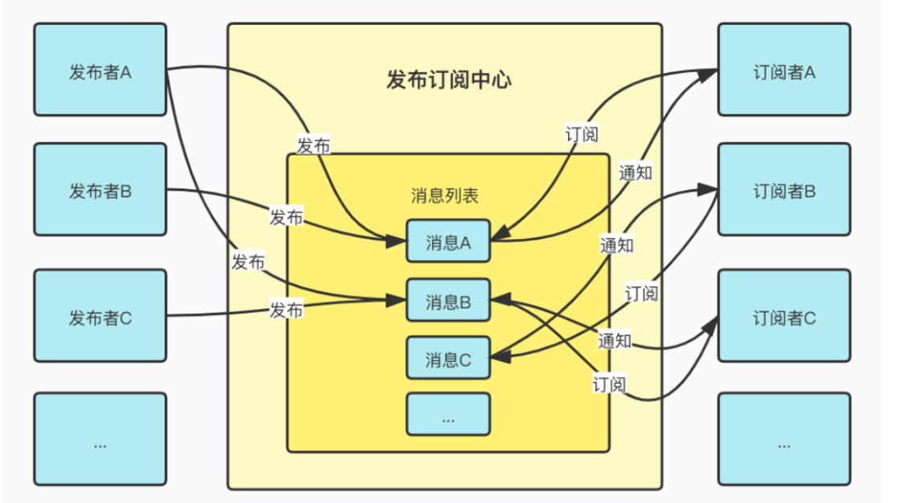

## 工厂模式
用于创建对象，将创建对象的共性使用函数进行封装

- 简单工厂模式
- 抽象工厂模式
## 策略模式
定义：要实现一个功能，有多种方案可以选取，我们定义策略，将它们封装起来，并且使它们之间可以相互转换。
```javascript
/**
 * 表单提交验证——策略模式
 * 1.校验用户名是否合法
 * 2.校验密码是否合法
 */
var strategies = {
    checkUserName(username) {
        return username !== "";
    },
    checkPwd(firstPwd,secondPwd) {
        return firstPwd === secondPwd && firstPwd !== "";
    }
}
var Validate = function () {
    this.cache = [];
    /**
     * @param {string} strategy
     * @param {Function} callback 
     */
    this.add = function (strategy,...args) {
        this.cache.push(function () {
            return strategies[strategy](...args);
        });
    }
    this.check = function () {
        for (let i = 0; i < this.cache.length; i++){
            let valiFn = this.cache[i];
            if (!valiFn()) {
                return false;
            }
        }
        return true;
    }
}
const v = new Validate();
v.add("checkUserName", "");
v.add("checkPwd", "1", "2")
const result = v.check();
console.info(result);//false

```
## 单例模式
实现单例模式需要注意以下几个点：

1. 如何确定Class只有一个实例
2. 如何简便的访问Class的唯一实例
3. Class如何控制是实例化的过程
4. 如何将Class的实例数量控制为1
```javascript
const SingleTon = function () {
  let singleSB = null;
  function SB() {
  }
  return {
    getInstance() {
      if (!singleSB) {
        singleSB = new SB();
      }
      return singleSB
    }
  }
}()
const s1 = SingleTon.getInstance();
const s2 = SingleTon.getInstance();
console.info(s1 === s2)//true

```
## 观察者模式
```javascript
//被观察者
function Subject() {
    this.observers = [];//观察者队列
}
Subject.prototype = {
    //订阅
    subscribe(observer) {
        this.observers.push(observer);
    },
    //取消订阅
    unSubscribe(observerToRemove) {
        this.observers = this.observers.filter(observer => observer !== observerToRemove);
    },
    //触发事件,通知观察者
    send() {
        this.observers.forEach(observer => {
            observer?.call();
        })
    }
}
const subject = new Subject();
//观察者1
function observer1() {
    console.info("observer1 has receive message");
}
//观察者2
function observer2() {
    console.info("observer2 has receive message");
}
subject.subscribe(observer1);
subject.subscribe(observer2);
subject.send();
```
## 中介者模式
中介者包装了一系列对象相互作用的方式，使的这些对象之间不必直接相互作用，而是由中介者协调它们之间的交互，中介者模式和观察者模式有一定的相似性，都是一对多的关系，也都是集中式通信，不同的是中介者模式处理的是同级对象之间的交互，而观察者模式处理的是观察者与被观察者之间的交互。
```javascript
//聊天室成员类
function Member(name) {
    this.name = name;
    this.chatroom = null;
}
/**
 * 发送消息
 */
Member.prototype.send = function (message,toMember) {
    this.chatroom.send(this, toMember, message);
}
//接收消息
Member.prototype.receive = function (fromMember,message) {
    console.info(`${fromMember.name}发送的消息:${message}`);
}
//聊天室类
function ChatRoom(name) {
    this.members = {};
}
//添加成员
ChatRoom.prototype.addMember = function (member) {
    this.members[member.name] = member;
    member.chatroom = this;
}
//转发消息
ChatRoom.prototype.send = function (fromMember, toMember, message) {
    toMember.receive(fromMember, message);
}

```
## 访问者模式
访问者模式能够让我们在不改变一个对象结构的前提下能够给对象增加新的逻辑，新的逻辑保存在一个独立的访问者对象中。访问者模式通常用于拓展一些第三方库和工具。
```javascript
//接口类
class Shape {
  acept() { };
}

class Circle extends Shape {
  constructor(radius) {
    super();
    this.radius = radius;
  }
  acept(visitor) {
    visitor.visitCircle(this);
  }
}


class Rectangle extends Shape {
  constructor(width, height) {
    super();
    this.width = width;
    this.height = height;
  }
  acept(visitor) {
    visitor.visitRectangle(this);
  }
}
//接口类
class Visitor {
  visitCircle() { };
  visitRectangle() { };
}

class ShapeVisitor extends Visitor {
  #totalAreas = 0;
  constructor() {
    super();
  }
  /**
   * 
   * @param {Circle} circle 
   */
  visitCircle(circle) {
    const { radius } = circle;
    this.#totalAreas += Math.PI * radius * radius;
  }
  /**
   * 
   * @param {Rectangle} rectangle 
   */
  visitRectangle(rectangle) {
    this.#totalAreas += rectangle.width * rectangle.height;
  }

  get totalAreas() {
    return this.#totalAreas;
  }
}

let circle = new Circle(1);
let rectangle = new Rectangle(2, 2);
let visitor = new ShapeVisitor();

circle.acept(visitor);
rectangle.acept(visitor);

console.info(visitor.totalAreas);
```
## 发布——订阅模式


发布-订阅是一种消息范式(实际上它并不是经典设计模式中的一员),消息的发布者不会直接将消息发送给特定的订阅者，而是通过消息通道广播出去，然后订阅者通过订阅获取到想要的信息。Nodejs中的EventEmitter就是采用了这种模式。

注意：发布订阅和观察者模式是有区别的，观察者模式的角色只有两个:观察者和被观察者，而发布订阅的角色是有三个的，包括发布者、订阅者以及发布订阅中心。
```javascript
class PubSub{
    constructor() {
        this.messages = {};//记录每个发送事件要发送的数据
        this.events = {};//记录每个订阅的回调,每个订阅可以对应多个不同的回调
    }
    //发布中心
    publish(name,messages) {
        if (name in this.messages) {
            this.messages[name].push(messages);
        } else {
            this.messages[name] = [messages];
        }
    }
    //订阅中心
    subscribe(name,callback) {
        if (this.events[name]) {
            const cbs = this.events[name];
            cbs.push(callback);
        } else {
            this.events[name]=[callback]
        }
    }
    //触发回调，发送数据
    notify() {
        for (let type of Object.keys(this.events)) {
            this.messages[type].forEach(messages => {
                this.events[type].forEach(callback => callback(messages));
            })
        }
    }
}
class Publisher{
    constructor(name, context) {
        this.name = name;
        this.context = context;
    }
    publish(type,...messages) {
        this.context.publish(type, messages);
    }
}
class Subscriber{
    constructor(name, context) {
        this.name = name;
        this.context = context;
    }
    subscribe(type,callback) {
        this.context.subscribe(type, callback);
    }
}
const pubsub = new PubSub();
const publisher1 = new Publisher("publisher1", pubsub);
const publisher2 = new Publisher("publisher2", pubsub);
const subscribe1 = new Subscriber("subscribe1", pubsub);
const subscribe2 = new Subscriber("subscriber2", pubsub);
publisher1.publish("test1", 'publisher1发送的消息', '2');
publisher2.publish("test2", "publisher2发送的消息");
//订阅者1号订阅了test1和test2
subscribe1.subscribe("test1", function (res) {
    console.info(res);//[ 'publisher1发送的消息', '2' ]
});
subscribe1.subscribe("test2", function (res) {
    console.log(res);//[ 'publisher2发送的消息' ]
})

subscribe2.subscribe("test1", function (res) {
    console.info(res);//[ 'publisher1发送的消息', '2' ]
})
pubsub.notify();
//总结，发布订阅模式就是在观察者上多了一层中间层来管理，可以实现多对多之间的通信。
```
## 装饰器模式
个人理解：为了给某个对象添加新的功能或者特性，而不会对对象的原有功能造成影响
```javascript
/**
 * 实际情景:比如中国人只会说汉语，通过装饰器，可以说英语等其他语言。。。
 */
//装饰器
var Decorator = function (chinese) {
    let sayChinese = chinese.sayChinese;
    this.sayChinese = sayChinese;
    this.sayEnglish = function () {
        console.info("我会说English");
    }
    this.say = function () {
        this.sayChinese();
        this.sayEnglish();
    }
}
var Chinese = function (name) {
    this.name = name;
}
Chinese.prototype.sayChinese = function () {
    console.info("我会说hanyu");
}
const zhangsan= new Chinese("张三");
const decorator = new Decorator(zhangsan);
decorator.say();

```
## 代理模式
代理模式为我们提供了一种代理以控制这个对象的访问，具体执行的功能还是这个对象本身。比如说，我们发邮件，通过代理模式，那么代理者可以控制，决定发还是不发，但具体发的执行功能，是外部对象所决定，而不是代理者决定。(下面的栗子非常的巧妙)
```javascript
//本体
var domImage = function () {
    var imageEle = document.createElement("img");
    document.body.appendChild(imageEle);
    return {
        setSrc(src) {
            imageEle.setAttribute("src", src);
        }
    }
}();
//代理
var ProxyImage = function () {
    var image = new Image();
    image.onload = function () {
        domImage.setSrc(this.src);//图片加载完成之后设置真实的图片src 
    }
    return {
        setSrc(src) {
            domImage.setSrc("./loading.gif");//预先设置图片src为loading图
            image.src = src;
        }
    }
}();
//外部调用
ProxyImage.setSrc("./product.png");
```

