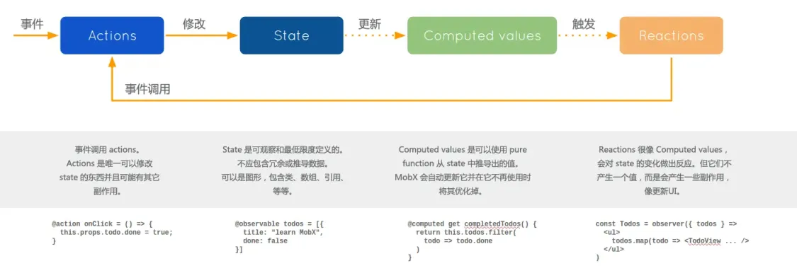

## Mobx原理
- observable和autorun两个重要函数
- observable负责监听属性的变化（使用new Proxy实现），如果属性变化，就会去通知观察者，去更新reaction，也就是视图(observer(function(){}，observer实际上就是会调用autorun函数)
- autorun指的就是观察者，在首次执行的时候，如果用到了observable监听的属性，就会将此autorun的参数加入到观察者队列

## Zustand原理

