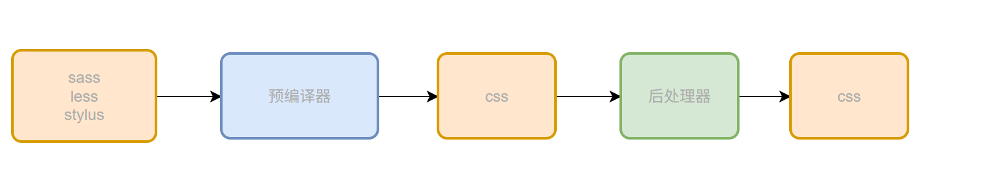
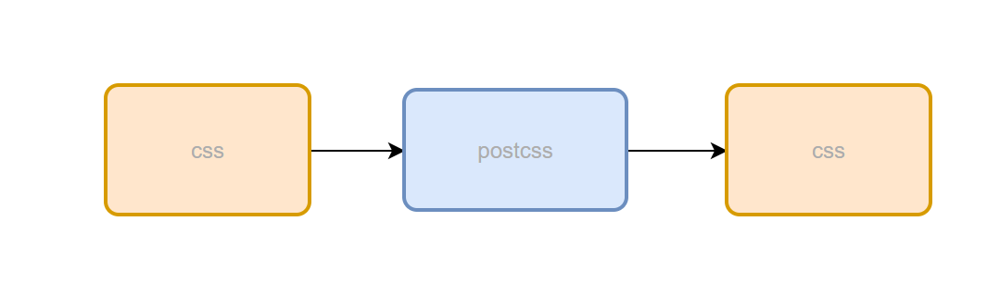

## 原生css语言的问题
1. 语法缺失：（循环、判断、字符串拼接）
2. 功能缺失：（颜色函数、数学函数、自定义函数）

## css预编译器
1. sass
2. less
3. stylus

## css后处理器
- autoprefixer:添加浏览器厂商前缀
- cssnano:css压缩、优化工具，webpack的插件css-minimizer-webpack-plugin内置了
- purgecss:css无用代码清除工具，对应webpack插件purgecss-webpack-plugin
- css module:css作用域隔离方案，vite开箱即可使用，webpack需要配置
```javascript
 // webpack.config.js
  module.exports = {
    module: {
      rules: [
        {
          test: /\.module\.css$/,
          use: [
            'style-loader',
            {
              loader: 'css-loader',
              options: {
                modules: true,   // 开启 CSS Modules
                localIdentName: '[name]__[local]__[hash:base64:5]', // 类名格式
              },
            },
          ],
        },
      ],
    },
  };
```
## postcss
类似babel，可以接入各种插件
