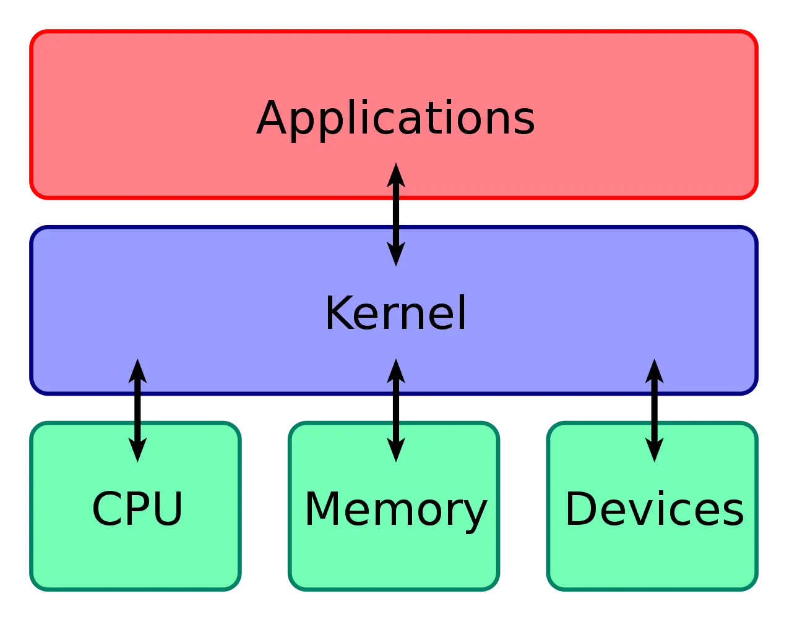

# linux内核vswindows内核
## 内核
内核作为应用连接硬件设备的桥梁，应用程序只需关心与内核交互，不用关心硬件的细节。

内核一般拥有如下能力：
- 管理进程，线程，决定哪个进程、线程使用 CPU，也就是进程调度的能力
- 管理内存，决定内存的分配和回收，也就是内存管理的能力；
- 管理硬件设备，为进程与硬件设备之间提供通信能力，也就是硬件通信能力
- 管理硬件设备，为进程与硬件设备之间提供通信能力，也就是硬件通信能力

Linux 内核设计的理念：
1. 多任务：多个个任务可以并发或者并行执行
- 对于单核 CPU 时，可以让每个任务执行一小段时间，时间到就切换另外一个任务，从宏观角度看，一段时间内执行了多个任务，这被称为并发。
- 对于多核 CPU 时，多个任务可以同时被不同核心的 CPU 同时执行，这被称为并行
2. 对称多处理：代表着每个 CPU 的地位是相等的，对资源的使用权限也是相同的，多个 CPU共享同一个内存，每个 CPU 都可以访问完整的内存和硬件资源
3. ELF可执行文件链接格式，它是 Linux 操作系统中可执行文件的存储格式

### 内核的分类
- 宏内核：包含多个模块，宏内核的特征是系统内核的所有模块，比如进程调度、内存管理、文件系统、设备驱动等，都运行在内核态，整个内核像一个完整的程序；
- 微内核：有一个最小版本的内核，一些模块和服务则由用户态管理；
- 混合内核：是宏内核和微内核的结合体，内核中抽象出了微内核的概念，也就是内核中会有一个小型的内核，其他模块就在这个基础上搭建，整个内核是个完整的程序；

Linux 的内核设计是采用了宏内核，Window 的内核设计则是采用了混合内核。