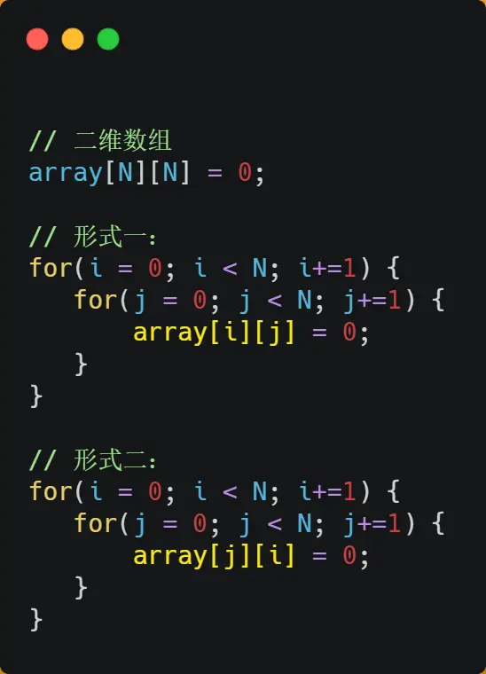

## 冯诺伊曼模型
运算器、控制器、存储器、输入设备、输出设备


## 硬盘内存
当CPU需要访问内存中的某个数据的时候，如果寄存器有这个数据，cpu从寄存器取数据即可，如果没有，就查L1高速缓存，L1没有，就查L2,L2没有就查L3,都没有就去内存中查(其中L1,L2,L3也就是CPU高速缓存)


---
> 其中L1,L2,L3又叫做CPU Cache(高速缓存)
程序执行的时候，会先将内存中的数据加载到共享的L3 cache中，再加载到每个核心独有的L2 Cache中，然后进入到最快的L1 Cache，最后才会被CPU读取

---

## 摩尔定律
CPU的访问速度每18个月就会翻倍

## 什么是字
- “字”不是固定长度，而是由 CPU 决定的。
- 一个“字”是CPU 一次能处理的数据长度。

| CPU 位数   | 一个字的长度       |
| -------- | ------------ |
| 8 位 CPU  | 1 字节（8 bit）  |
| 16 位 CPU | 2 字节（16 bit） |
| 32 位 CPU | 4 字节（32 bit） |
| 64 位 CPU | 8 字节（64 bit） |

## SRAM和DRAM
- SRAM（Static Random Access Memory），中文叫做静态随机存取存储器，是一种 高速、易失性（断电即失） 的半导体存储器，数据在供电期间始终保持，不需要像 DRAM 那样不断刷新，通常6个晶体管

- DRAM,动态随机存取存储器，需要动态刷新，1电容 + 1晶体管

## CPU Cache的数据结构和读取过程
CPU cache是由很多cache line组成的，cache line是cpu从内存中读取数据的基本单位，在 CPU Cache 中的，这样一小块一小块的数据，称为 Cache Line（缓存块）,cpu cache是cpu和内存之间的中间层。

CPU 怎么知道要访问的内存数据，是否在 Cache 里？
<br>
直接映射：举个例子，内存共被划分为 32 个内存块，CPU Cache 共有 8 个 CPU Cache Line，假设 CPU 想要访问第 15 号内存块，如果 15 号内存块中的数据已经缓存在 CPU Cache Line 中的话，则是一定映射在 7 号 CPU Cache Line 中，因为 15%8=7


上面例子很容易发现多个内存块的地址会映射到同一个cpu cache line，所以为了区别不同的内存块，在对应的 CPU Cache Line 中我们还会存储一个组标记（Tag）


如果内存中的数据已经在 CPU Cache 中了，那 CPU 访问一个内存地址的时候，会经历这 4 个步骤：
1. 根据内存地址中索引信息，计算在 CPU Cache 中的索引，也就是找出对应的 CPU Cache Line 的地址；
2. 找到对应 CPU Cache Line 后，判断 CPU Cache Line 中的有效位，确认 CPU Cache Line 中数据是否是有效的，如果是无效的，CPU 就会直接访问内存，并重新加载数据，如果数据有效，则往下执行；
3. 对比内存地址中组标记和 CPU Cache Line 中的组标记，确认 CPU Cache Line 中的数据是我们要访问的内存数据，如果不是的话，CPU 就会直接访问内存，并重新加载数据，如果是的话，则往下执行；
4. 根据内存地址中偏移量信息，从 CPU Cache Line 的数据块中，读取对应的字。

## 如何写出CPU跑得更快的代码？
缓存命中率越高的话，代码的性能就会越好，CPU 也就跑的越快。例如1+1=2这个运算，+是指令缓存，而1是数据缓存，所以我们要分开来看「数据缓存」和「指令缓存」的缓存命中率

### 如何提升数据缓存的命中率
下图中形式一的效率远高于形式二，这是因为形式一是按照内存顺序访问的，当arr[0][0]不存在于cpu cache中时，由于cpu会一次性从内存加载一个cache line的大小的数据到cpu cache中，arr[0][0],arr[0][1]...,如果是方式二，cpu就会多次从内存中加载数据到cpu cache中，因为它的访问是跳跃性的、不连续的，多次加载内存中的数据而导致效率下降，而方式一加载一次内存中的数据之后，后续访问的元素都是从cpu cache中加载

遇到这种遍历数组的情况时，按照内存布局顺序访问，将可以有效的利用 CPU Cache 带来的好处，这样我们代码的性能就会得到很大的提升

### 如何提升指令缓存的命中率
如果分支预测可以预测到接下来要执行 if 里的指令，还是 else 指令的话，就可以「提前」把这些指令放在指令缓存中，这样 CPU 可以直接从 Cache 读取到指令，于是执行速度就会很快


<br>
先上结论：先排序后遍历赋值的效率更高
<br>

这是因为排完序之后前几次命中if小于50的概率比较高，所以会将if中的逻辑array[i]=0缓存到cache中

## CPU缓存一致性
随着时间的推移，CPU 和内存的访问性能相差越来越大，于是就在 CPU 内部嵌入了 CPU Cache（高速缓存），CPU Cache 离 CPU 核心相当近，因此它的访问速度是很快的，于是它充当了 CPU 与内存之间的缓存角色。
<br>
事实上，数据不光是只有读操作，还有写操作，那么如果数据写入 Cache 之后，内存与 Cache 相对应的数据将会不同，这种情况下 Cache 和内存数据都不一致了，于是我们肯定是要把 Cache 中的数据同步到内存里的。
<br><br>
问题来了，那在什么时机才把 Cache 中的数据写回到内存呢？为了应对这个问题，下面介绍两种针对写入数据的方法

### 写直达
<p>保持内存与 Cache 一致性最简单的方式是，<strong>把数据同时写入内存和 Cache 中</strong>，这种方法称为<strong>写直达（<em>Write Through</em>）</strong>。</p>


上面为啥还要判断数据是否在Cpu cache中，然后再写入cpu cache，举个简单的例子，x=10如果之前cpu cache缓存了这个变量的地址，而后修改了这个变量，所以cpu cache中是可以命中这个地址的，而后我们需要修改这个地址对应的数据


### 写回
<p>既然写直达由于每次写操作都会把数据写回到内存，而导致影响性能，于是为了要减少数据写回内存的频率，就出现了<strong>写回（<em>Write Back</em>）的方法</strong>。</p>
<p>在写回机制中，<strong>当发生写操作时，新的数据仅仅被写入 Cache Block 里，只有当修改过的 Cache Block「被替换」时才需要写到内存中</strong>，减少了数据写回内存的频率，这样便可以提高系统的性能。</p>


<p>为什么缓存没命中时，还要定位 Cache Block？这是因为此时是要判断数据即将写入到 cache block 里的位置，是否被「其他数据」占用了此位置，如果这个「其他数据」是脏数据，那么就要帮忙把它写回到内存。</p>

### 缓存一致性问题
<p>现在 CPU 都是多核的，由于 L1/L2 Cache 是多个核心各自独有的，那么会带来多核心的<strong>缓存一致性（<em>Cache Coherence</em>）</strong> 的问题，如果不能保证缓存一致性的问题，就可能造成结果错误。</p>

<ul><li>第一点，某个 CPU 核心里的 Cache 数据更新时，必须要传播到其他核心的 Cache，这个称为<strong>写传播（<em>Write Propagation</em>）</strong>；</li> <li>第二点，某个 CPU 核心里对数据的操作顺序，必须在其他核心看起来顺序是一样的，这个称为<strong>事务的串行化（<em>Transaction Serialization</em>）</strong>。</li></ul>

- 对于第一点要解决的问题很简单，第二点就是加锁(加锁保证每个核心访问公共变量的时候，获取的就是最新的值)

```python
import threading

lock = threading.Lock()
count = 0  # 共享变量

def add():
    global count
    for _ in range(1000000):
        with lock:  # 获取锁
            count += 1  # 安全访问共享变量

# 多线程执行
thread1 = threading.Thread(target=add)
thread2 = threading.Thread(target=add)

thread1.start()
thread2.start()
thread1.join()
thread2.join()

print("最终 count =", count)

```

#### 总线嗅探
写传播的原则就是当某个 CPU 核心更新了 Cache 中的数据，要把该事件广播通知到其他核心。最常见实现的方式是总线嗅探

举个简单的case:
当 A 号 CPU 核心修改了 L1 Cache 中 i 变量的值，通过总线把这个事件广播通知给其他所有的核心，然后每个 CPU 核心都会监听总线上的广播事件，并检查是否有相同的数据在自己的 L1 Cache 里面，如果 B 号 CPU 核心的 L1 Cache 中有该数据，那么也需要把该数据更新到自己的 L1 Cache

#### MESI协议

### 伪共享问题
这种因为多个线程同时读写同一个 Cache Line 的不同变量时，而导致 CPU Cache 失效的现象称为伪共享，举个例子，比如下图：核心1和核心2都要使用到a,b两个变量，这两个变量在同一个cpu cache line上，而核心1修改后，核心2也要修改，就是导致核心1修改后的数据要写回内存

解决方案：
1. 字节填充
```java
class PaddedCounter {
    // 前置填充，占据一个 cache line
    long p1, p2, p3, p4, p5, p6, p7;

    // 真正要用的变量
    volatile long value = 0;

    // 后置填充
    long p8, p9, p10, p11, p12, p13, p14;
}
//这样的方式可以让两个不同的变量位于不同的cpu cache line上，就不会有伪共享的问题，思路就是空间换时间
```
2. 继承+填充的方式
```java
// 第一级：前置填充
class LhsPadding {
    protected long p1, p2, p3, p4, p5, p6, p7;
}

// 第二级：实际值
class Value extends LhsPadding {
    protected volatile long value = 0L;
}

// 第三级：后置填充
class RhsPadding extends Value {
    protected long p8, p9, p10, p11, p12, p13, p14;
}

```
- 避免手动把所有填充字段都塞在一个类里；

- 在继承层次中更清晰地表达出“前后填充”的意图；

- 让 JIT 编译器优化时保留这种结构。

## 软中断
在计算机中，中断是系统用来响应硬件设备请求的一种机制，操作系统收到硬件的中断请求，会打断正在执行的进程，然后调用内核中的中断处理程序来响应请求

举个例子：

<p>网卡收到网络包后，通过 DMA(设备绕过 CPU，直接读写内存) 方式将接收到的数据写入内存，接着会通过<strong>硬件中断</strong>通知内核有新的数据到了，于是内核就会调用对应的中断处理程序来处理该事件，这个事件的处理也是会分成上半部和下半部。</p>
<p>上部分要做的事情很少，会先禁止网卡中断，避免频繁硬中断，而降低内核的工作效率。接着，内核会触发一个<strong>软中断</strong>，把一些处理比较耗时且复杂的事情，交给「软中断处理程序」去做，也就是中断的下半部，其主要是需要从内存中找到网络数据，再按照网络协议栈，对网络数据进行逐层解析和处理，最后把数据送给应用程序。</p>

所以说，中断处理程序的上部分和下半部可以理解为：

- 上半部直接处理硬件请求，也就是硬中断：主要处理耗时短的工作，特点是快速执行
- 下半部分是有内核触发，也就是软中断：主要是上半部分未完成的事情，通常是耗时比较长的事情
