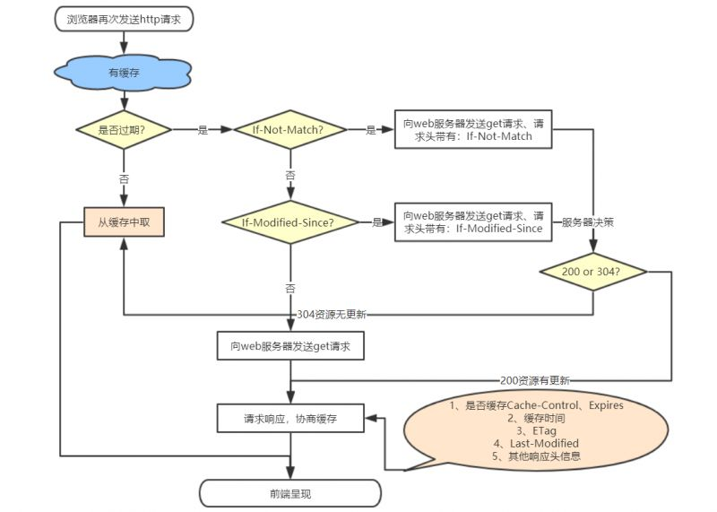

## HTTP缓存
常见的HTTP缓存只能缓存get请求响应的资源，对于其他类型的响应则无能为力

http缓存都是从第二次请求开始的
- 第一次请求资源的时候，服务器返回资源，并在response headers头上回传资源的缓存参数
- 第二次请求资源的时候，浏览器就会判断这些请求参数
- 命中强缓存就直接200
- 否则就将请求参数加到request header头中传给服务器
- 看是否命中协商缓存
- 命中则返回304
- 否则服务器将会返回新的资源

| 缓存类型 | 强缓存 | 协商缓存 |
|---|---|---|
| 缓存存储位置 | 本地浏览器 | 本地浏览器 |
| http状态码 | 200 | 304 |
| 谁来决定 | Pragma<br>Cache-Control<br>Expires | Last-Modified/If-Modified-Since(<br>ETag/If-None-Match |
| 操作是否有效 | 1. Ctrl+F5强制刷新 无效<br>2. F5刷新 无效<br>3. 地址栏回车 有效<br>4. 页面链接跳转 有效<br>5. 新tab页面 有效<br>6. 浏览历史记录栈，前进后退 有效 | 1. Ctrl+F5强制刷新 无效<br>2. F5刷新 有效<br>3. 地址栏回车 有效<br>4. 页面链接跳转 有效<br>5. 新tab页面 有效<br>6. 浏览历史记录栈，前进后退 有效 |
> 比如强缓存刷新无效：浏览器就会先走协商缓存，向服务端发起请求，缓存没过期还是会走本地缓存的文件，否则服务器返回新的文件
**分类**：
- 根据是否需要重新向服务器发起请求来分类：可分为强缓存和协商缓存
- 根据是否可以被单个或者多个用户使用来分类，可分为私有缓存以及共享缓存

### 强缓存
强缓存在缓存数据未失效的情况下(即Cache-Control的max-age没有过期或者说Expires的缓存时间没有过期),那么就会直接使用浏览器的缓存数据，不会再对浏览器发送任何请求，强制缓存生效的时候，http状态码是200,这中方式页面的加载速度是最快的，性能也是最好的
但是如果这个期间，如果服务器端资源修改了，页面是拿不到的，因为它不会向服务端发送请求，因为走的是强缓存，这个时候我们Ctrl+F5刷新一下就行了

注意：Pragma和Cache-Control共存的时候，Pragma的优先级是比Cache-Control高的
在Chrom浏览器中返回的200状态会有两种情况:
- from memory cache:(从内存中获取/一般缓存更新频率较高的js、图片，字体等资源)
- from disk cache(从磁盘中获取/一般缓存更新频率较低的js、css等资源)

这两种情况是chrome自身的一种缓存策略，这也是为什么chrome浏览器响应的快的原因

#### 过期方案对比
- expires:服务器响应字段，响应内容是当前国际标准时间，下一次浏览器发送请求之前，检查当前时间是否超过了expires缓存截止时间，如果没有超过，继续使用缓存
- cache-control:maxage,记录了一个时间戳，并且响应了一个Date字段，表示响应时候的国际标准时间,下一次浏览器请求时，判断当前时间和Date+maxage时间的大小，如果没有超过，继续使用缓存。

### 协商缓存
强缓存如果生效，就不会再和服务器发生交互，而协商缓存不管是否生效，都会和服务器发生交互

#### 优先级
1. 如果强缓存和协商缓存同时存在，同时强缓存还在生效期间，则协商缓存不生效
2. 如果强缓存中max-age和Expires同时存在，则Cache-Control中的max-age会覆盖Expires
3. 协商缓存中如果ETag和Last-Modified(http/1.1)同时存在时，则ETag会覆盖Last-Modified(http/1.0)这个值
> Last-Modified只能精确到秒。如果资源在一秒内被修改了多次（比如同一秒内改完又改），服务器返回的 Last-Modified,还是同一个时间，浏览器判断"没变"，拿不到真正的最新内容。(If-Modified-Since请求头字段表示上一次的 Last-Modified 值)
### Cache-Controller的指令
- no-cache:禁用强缓存，直接进入协商缓存
- no-store:禁用所有缓存，每次向服务端发送请求获取最新资源

> 一般html短缓存或者不缓存，这样每次请求到的html中引入的其他文件内容都是最新的，比如前端代码更新了，客户端也可以下一次访问页面的时候缓存最新的资源，但是如果要让html也走缓存，可以采用如下这种方式，service woker/web worker这个文件不缓存，html走缓存，如果资源更新了，修改这个woker文件，重新拉取最新html

```javascript
  const VERSION = 'v3';   // 发布新版本时改这里

  self.addEventListener('install', (event) => {
    event.waitUntil(
      caches.open('my-cache-v3')      // 新版本号对应新缓存
        .then((cache) => cache.addAll([
          '/index.html',
          '/app.js',                  // 主动去服务器下载最新的
          '/app.css'
        ]))
    );
  });

  self.addEventListener('activate', (event) => {
    // 清理旧版本的缓存
    event.waitUntil(
      caches.keys().then((keys) =>
        Promise.all(keys.filter((k) => k !== 'my-cache-v3').map((k) => caches.delete(k)))
      )
    );
  });
```