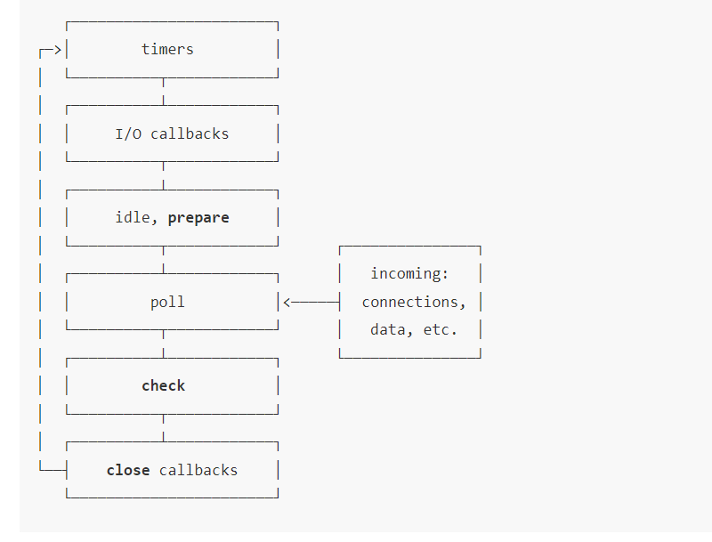

# 浏览器事件循环
## 浏览器的进程

每一个tab有对应一个渲染进程，浏览器主进程、GPU 进程、网络进程各自只有一个，由所有 Tab 共享

## 过程

1. 在最开始的时候，浏览器会进入一个无限循环
2. 每一次循环会检查消息队列中是否有任务存在，如果有，就取出第一个任务执行，执行完之后进入到下一次循环，如果没有，则进入休眠状态
3. 其他所有线程（包括其他进程的线程）可以随时向任务队列添加任务，新任务会添加到任务队列的末尾，在添加新任务的时候，如果主线程是休眠状态，则会将其唤醒继续循环拿取任务

整个过程被称为事件循环（协调调用栈和任务队列，是用来处理异步任务的一种机制，保证js在单线程下也能处理任务）

## 异步

浏览器主线程承担着极其重要的作用，除了执行任务，还有渲染页面。如果浏览器主线程长时间处于【阻塞】状态，那么浏览器就会卡死，所以浏览器采用异步的方式处理任务

浏览器一帧的完整流程大致是(如果16.6ms这一帧内没有完成，比如js执行耗时长，将会在下一帧完成整个渲染流水线)：
[ input事件处理 → requestAnimationFrame回调 → 样式计算 → 布局(重排) → 重绘 → 合成 → 空闲时间 ]<br/>
|<------------------------------ 16.6ms (60fps) ---------------------------->|

## 任务有优先级吗？

任务没有优先级，但是消息队列有优先级

- 每个任务都有一个任务类型，同一个类型的任务必须在同一个队列，不同类型的任务可以分属为不同的队列
- 浏览器必须准备一个微任务队列，微任务中的任务优先其他任务执行

在目前的chrome浏览器中，至少包含了如下队列：

- 延时队列：用于存放定时器到达后的回调任务，优先级【中】
- 交互队列：用于存放用户操作之后产生的事件处理任务，优先级【高】，也可以看作宏任务队列
- 微任务队列：用户存放需求最快执行的任务，优先级【最高】

## js的定时器能够做到精准计时吗？

不能：

1. 计算机硬件没有原子钟
2. 收到事件循环的影响，计时器的回调函数只会在主线程空闲的时候执行，因此带来了偏差

# Node中的事件循环
## 进程和线程
js是一门单线程的语言，指的是一个进程里面只有一个主线程，进程是CPU资源分配的最小单位，而线程是CPU调度的最小单位

## 事件循环的6个阶段

以下每个阶段对应一个队列
- timer阶段：这个阶段执行timer(setTimout、setInterval)的回调
- I/O callbacks阶段，处理一些上一轮循环中少数未执行的I/O回调
- idle、prepare阶段：仅Node.js内部使用
- poll阶段：获取新的I/O事件，适当的条件下Node.js会阻塞在这里
- check阶段：执行setImmediate()的回调
- close callbacks阶段：执行socket的close事件回调
日常开发中绝大部分异步任务都是在timers、poll、check这三个阶段执行

### poll阶段
  poll 阶段开始<br>
     │<br>
     ├─ 队列里有回调吗？<br>
     │   有 → 同步执行队列里的回调，直到队列空或达到上限<br>
     │   空 → 往下判断<br>
     │<br>
     ├─ 有 setImmediate 吗？<br>
     │   有 → 直接去 check 阶段（执行 setImmediate）<br>
     │   没有 → 往下判断<br>
     │<br>
     ├─ 有到期的定时器吗？<br>
     │   有 → 去 timer 阶段<br>
     │   没有 → 阻塞在这里，等新的 I/O 事件到来<br>
     │<br>
     └─ 等来新 I/O 事件 → 执行它的回调<br>

以下代码打印结果按照数字顺序输出
```javascript
const fs = require("fs");
const path = require("path");

console.log("1. 同步代码");

// 定时器 → 进 timer 阶段
setTimeout(() => console.log("3. setTimeout 回调"), 0);

// setImmediate → 进 check 阶段
setImmediate(() => console.log("4. setImmediate 回调"));

// I/O 操作 → 在 poll 阶段等待
fs.readFile(path.join(__dirname, "./demo.html"), () => {
  console.log("5. 文件读取完成（poll 阶段）");

  // 注意：在 I/O 回调里，setImmediate 一定先于 setTimeout
  setTimeout(() => console.log("7. 里面 setTimeout"), 0);
  setImmediate(() => console.log("6. 里面 setImmediate"));
});

console.log("2. 同步代码结束");
```
如果有微任务，微任务会进入到微任务队列，在执行这6个阶段的队列任务之前，如果微任务队列中有任务，先执行微任务
```javascript
  const fs = require('fs');
  const path = require('path');

  console.log('1. 同步代码开始');

  // —— 微任务区 ——
  process.nextTick(() => console.log('3. nextTick'));
  Promise.resolve().then(() => console.log('4. Promise 微任务'));

  // —— 宏任务区：定时器 ——
  setTimeout(() => {
    console.log('5. setTimeout 回调');
    // 在宏任务里再塞微任务
    process.nextTick(() => console.log('6. setTimeout 里的 nextTick'));
  }, 0);

  // —— 宏任务区：check 阶段 ——
  setImmediate(() => console.log('7. setImmediate 回调'));

  // —— 宏任务区：I/O ——
  fs.readFile(path.join(__dirname, './demo.html'), () => {
    console.log('8. 读文件回调（poll 阶段）');
    process.nextTick(() => console.log('9. 读文件里的 nextTick'));
  });

  console.log('2. 同步代码结束');
```

### setTimeout和setImmediate区别
二者非常相似，区别主要在于调用时机不同
- setImmediate设计在poll阶段完成时执行，即check阶段
- setTimeout设计在poll阶段为空闲时，且设定时间到达之后执行，但它在timer阶段执行
- 在poll任务执行完的回调中，同一段代码中，一定是setImmediate先执行，setTimout后执行。因为poll阶段执行完一定是check阶段

### process.nextTick
微任务，优先级高于Promise.prototype.then
```javascript
setTimeout(() => {
	console.log(4)
	new Promise((resolve=>resolve(5))).then(console.log);
}, 0);

process.nextTick(()=>{
	console.log(1);
	process.nextTick(()=>{
		console.log(2);
		process.nextTick(()=>{
			console.log(3);
		});
	})
})
```