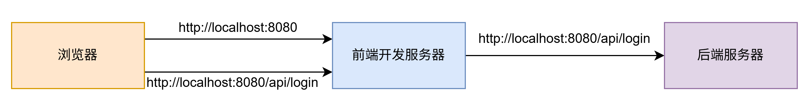

## 同源策略
浏览器有一个重要的安全策略，称之为同源策略，其中，源=协议+主机+端口，两个源相同，称之为同源，两个源不同，称之为跨源或者跨域

**同源策略是指，若页面的源和页面运行过程中加载的源不一致的时候，出于安全考虑，浏览器会对跨域的资源访问进行一些限制**

同源策略对ajax的跨域限制最为严格，默认情况下，它不允许ajax访问跨域资源

有多种方式解决跨域问题，常见的有：

1. 代理：适用于生产环境不发生跨域，开发环境发生跨域
2. CORS
3. JSONP

除了ajax，其他资源的限制也有，比如iframe通过parent.document、window.parent等方式访问父页面只能同源的页面才能访问其他iframe的dom和js环境（跨域通信需要使用到postMessage等方式）以及cookie的访问只能本域名，Storage的访问只能本域名

### 为什么需要同源？
- 为了防止恶意网站可以访问到其他网站的本地数据
- 为了防止iframe中的恶意网站可以访问到其他网站的数据
- 为了防止恶意网站在自己网站有能够访问到其他网站的权利，以免通过cookie免登，拿到数据

### CORS
CORS是基于http1.1的一种跨域解决方案，全称：跨域资源共享，解决的事js能不能读到响应数据的问题

#### 简单请求
只可能有GET + POST +HEAD三种请求类型。而且必须满足下面的两个特征，（POST请求也不全是简单请求）
1. 不能有自定义头字段 ，只能有以下几种：
- Accept
- Accept-Language
- Content-Type
- Content-Language

2. Content-Type的值只能是以下三种：
- text/plain
- multipart/form-data 上传文件用的
- application/x-www-form-urlencoded 表单提交的数据类型，一般的post请求的数据类型。

除此之外都是复杂请求

##### 简单请求的交互规范
1. 请求头中会自动添加Origin字段，告诉服务器，是哪个源地址在跨域请求
2. 服务器响应头部应该包含Access-Control-Allow-Origin，如果服务器允许请求跨域访问，需要在响应头中添加Access-Control-Allow-Origin的字段，该字段可以是*，也可以是具体的源

#### 预检请求
如果不是简单请求，浏览器需要发送预检请求。也就是说这个请求会发送两次，第一次是一个OPTIONS请求，是个预检请求，第二次才是真正的请求。

1. 浏览器发送预检请求，询问服务器是否允许，包含如下内容：
	- 包含请求头，不包含请求体
	- 请求方法为OPTIONS
	- 请求头中包含：
		- Origin:请求的源
		- Access-Control-Request-Method:后续真实请求将使用的方法
		- Access-Control-Request-Headers:后续真实请求会改动的请求头
2. 服务器允许，需要响应下面的消息内容：
	- Access-Control-Allow-Origin:表示允许的源
	- Access-Control-Allow-Methods:后续真实的请求方法
	- Access-Control-Allow-Headers:允许改动的请求头
	- Access-Control-Max-Age:告诉浏览器，多少秒内，对于同样的请求源，方法，头，不再需要发送预检请求了
3. 浏览器发送真实请求
4. 服务器响应真实请求

完成预检之后，后续的处理和简单请求相同

#### 附带身份凭证的请求
默认情况下，ajax的跨域请求并不会携带cookie，前端可以通过简单配置实现携带cookie
```javascript
var xhr=new XMLHttpRequest();
xhr.withCredentials=true;
```
当一个请求需要附带cookie的时候，无论是简单请求还是预检请求，都会在请求头中加上cookie字段

服务器响应必须加上响应头Access-Control-Allow-Credentials:true,否则浏览器仍然视为跨域，对于携带身份凭证的请求，服务器不得设置Access-Control-Allow-Origin的值为*，这也是为什么不推荐使用*的原因

#### CORS下js访问响应头
跨域访问时，js只能拿到一些最基础的响应头，比如：Cache-Control,Content-Language、Content-Type，Expires、LastModified、Pragma，如果要访问其他头，需要服务器设置Access-Control-Expose-Headers,让服务器把允许浏览器访问的头加入白名单，这样js就能访问指定的响应头了

### JSONP
JSONP只能发送GET请求
```javascript
/**
 * @desc jsonp请求，在跨域情况下可以使用json请求实现get请求的实现。
 * @param {{url:string,callbackName:string}} params1
 * @returns
 */
const jsonp = ({ url, callbackName }) => {
  return new Promise((resolve, reject) => {
    const scriptElement = document.createElement("script");
    scriptElement.src = url;
    document.body.append(scriptElement);
    /**
     * 和服务端协商好(比如响应头为ContentType:text/javascript)，服务端返回一个名称为callbackName的全局函数并且执行
     * 所以这里直接绑定到window对象上。
     */
    window[callbackName] = (data) => {
      resolve(data);
      document.removeChild(scriptElement); // 如果数据已经返回，则从页面中移出此script标签。
    };
		scriptElement.onerror=e=>reject(e);//处理一下响应错误
  });
};
```