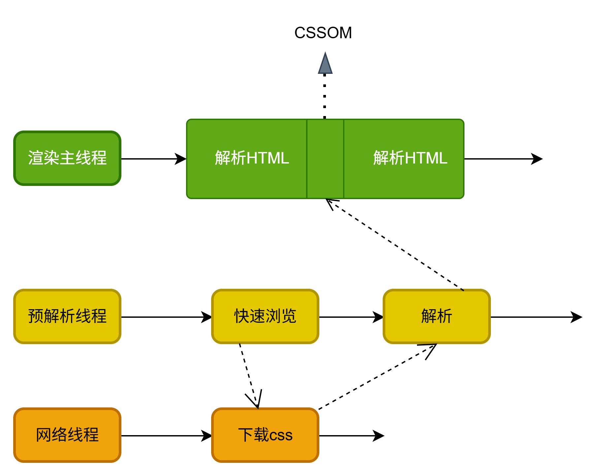
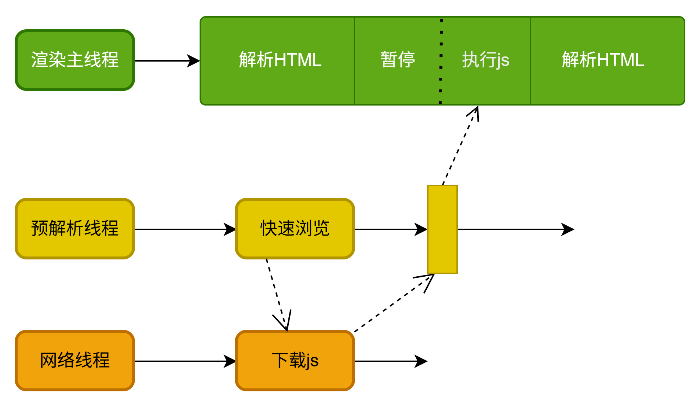

## 渲染原理
经典面试题：页面输入url，回车后出现页面发生了什么？主要分成两大部分，第一是网络，第二就是渲染

### 渲染管道
html解析->样式计算->布局->分层->绘制(前面是渲染进程主线程的工作)->分块->光栅化->画(后面基本是渲染进程合成线程工作)

#### html解析
解析html生成DOM树,解析css生成CSSOM(css object model)树
1. html解析过程中遇到css代码怎么办？
- 为了提高解析效率，浏览器会启动一个预解析器(一个线程)率先下载（也会下载js文件）和解析css，这就是css解析不会阻塞html解析的根本原因
- html解析过程中，同时在生成DOM树

2. html解析过程中遇到js怎么办？
渲染主线程遇到js时必须暂停一切行为（默认行为），等待下载后执行完之后才能继续（为什么会暂停？因为js可能更改dom）

预解析线程可以分担一点下载js的任务


#### 样式计算
 给每一个 DOM 节点算出最终生效的样式（computed style），同时解决层叠、继承、默认值等问题
 1. 属性收集：浏览器遍历CSSOM,把每个规则收集起来，按照选择器和来源分类
  - 浏览器默认样式（user-agent stylesheet）
  - 开发者写的 CSS（author stylesheet）
  - 用户自定义样式（user stylesheet，很少见）
2. 选择器匹配：浏览器拿到一个 DOM 节点，从右往左遍历选择器规则，快速匹配哪些规则命中这个节点
```css
  .box h1 span { color: blue; }
```
比如上面这个选择器：先从右到左找所有 span → 再检查这些 span 的祖先是否有 h1 → 再检查是否有 .box。 为什么从右往左？ 因为右边是最具体的元素（span），先找到最少的候选集合，再往上过滤祖先，效率更高。

3. 层叠：同一个元素、同一个属性可能有多条规则命中，浏览器用层叠机制确定最终用哪个值。如果计算出来之后的优先级一致，则采用代码书写顺序谁近采用谁的就近原则
4. 继承：如果一个属性没有直接被指定值，浏览器会检查它是不是可继承属性，如果是则从父节点继承
5. 默认值回退：如果属性既没有被设置，也不可以继承，则使用初始值

#### 布局
布局会依次遍历DOM树中的每一个节点，计算每个节点的几何信息，例如节点的宽高、相对包含块的位置，大部分时候，DOM树和布局树不是一一对应的，比如display:none的节点没有几何信息，因此不会生成布局树，又比如使用了伪元素节点，但是它们有几何信息，所以会生成到布局树中，还有匿名行盒以及匿名块盒会导致DOM树以及布局树无法一一对应

#### 分层
分层的好处在于，将来某一个层发生改变之后，仅会对该层进行后续处理，从而提升效率。滚动条、堆叠上下文、transform、opacity等样式都会或多或少影响分层结果，也可以通过will-change属性更大程度上影响分层结果
#### 绘制
为每一层生成如何绘制的指令

#### 分块
分块会将每一层分为多个小区域（页面分层之后区域还是很大，我们可以分块之后，将视口附近的区域画了），分块的工作是交给多个线程（合成线程会启动多个线程）同时进行的

#### 光栅化
光栅化就是将每个块变成位图（通过绘制指令计算每个像素点对应的颜色），优先处理靠近视口的块，此过程会进行GPU加速（GPU进程会开启多个线程来光栅化，因为GPU这种计算比CPU更快），光栅化的结果就是一块一块的位图

#### 画
合成线程计算出每个位图在屏幕上的位置，交给GPU进程（GPU进程调用的是电脑GPU硬件的系统图形接口）进行最终呈现。为什么要中转交给GPU进程画？这是因为渲染进程是运行在沙盒中的，无法直接操作操作系统，而GPU进程可以。、
> transform的变化其实就是只在“画”这一步骤进行，做了矩阵变换，为什么说transform效率高，因为transform变化不在主线程，而是合成线程
```html
<body style="height:2000px">
	<button>死循环</button>
</body>
<script>
	const btn = document.querySelector("button");
	btn.addEventListener("click", () => {
		const prevTime = Date.now();
		while (Date.now() - prevTime < 5 * 1000) {

		}
		console.log('hhh');//点击按钮之后，5s后打印，滚动页面并不会卡住
	})
</script>
```
为什么上面渲染主线程被阻塞5s了，滚动没被卡住，这是因为当前页面的滚动效果只是滚动，没有改变任何元素的尺寸和几何信息，只是相对视口位置发生了变化，重新画就行了，只涉及到合成线程
## 重排(reflow)
reflow的本质就是重新计算layout树，浏览器重新计算元素的几何属性，并将其安放到正确位置，这是一个重排重绘
- 当一个元素外观发生了变化，没有引起布局的变化，重新把元素外观绘制出来的过程叫做重绘，所以重绘跳过了创建布局树和分层的阶段
- 重绘不一定引起重排，重排一定会引起重绘（重排也叫做回流）
- 为了避免连续多次操作导致布局树反复计算，浏览器会合并这些操作，比如多次设置一个dom的几何信息会合并这些操作，当js代码全部完成后再进行统一计算，所以，改动属性造成的reflow是异步完成的，也正因如此，js获取布局属性的时候，就可能导致无法获取到最新的布局信息，浏览器权衡利弊之下，最终决定获取属性立即reflow
```javascript
dom.style.margin="8px";
dom.style.width="100px";
//以上设置属性触发一次reflow
dom.clientWidth;//触发一次flow：读取的时候浏览器主线程去重新绘制了，所以js代码这块是同步执行的，读取的是最新的
```

## 重绘（repaint）
repaint的本质就是重新根据分层信息计算了绘制指令，如下方式直接导致重绘，不会导致重排
- 改颜色
- 改阴影
- 改背景
- 改边框样式


